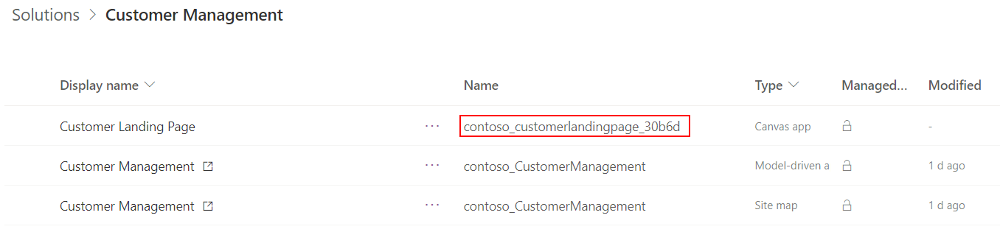

# Advanced navigate examples for custom page (preview)

[!INCLUDE [cc-beta-prerelease-disclaimer](../../includes/cc-beta-prerelease-disclaimer.md)]

This topic provides more advanced examples of navigating between model and custom pages.

  > [!IMPORTANT]
  > - This is a preview feature, and isn't available in all regions.
  > - [!INCLUDE[cc_preview_features_definition](../../includes/cc-preview-features-definition.md)]

## Navigating from a custom page

This section includes more advanced navigations when on a custom page.  

## Navigating from a model page to a custom page

### Finding the logical page name

Each of the following example takes the logical name of the page canvas app as an argument.  The logical name is the **Name** value for the page in solution explorer. 

> [!div class="mx-imgBorder"]
> 

### Open from a grid page primary field link as a full page with record id

This example uses the recordId parameter within the NavigateTo function to provide the custom page with the record to use.  Within the custom page, the Param function retrieves the value and uses Lookup function to retrieve the record.

1. Create a web resource of type JScript like the following and update the **name** parameter to be the logical page name  

    ```javascript
    function run(selectedItems)
    {
        let selectedItem = selectedItems[0];
        
        if (selectedItem) {		
            let pageInput = {
                pageType: "custom",
                name: "<logical page name>",
                entityName: selectedItem.TypeName,
                recordId: selectedItem.Id,
            };
            let navigationOptions = {
                target: 1
            };
            Xrm.Navigation.navigateTo(pageInput, navigationOptions)
                .then(
                    function () {
                        // Handle success
                    }
                ).catch(
                    function (error) {
                        // Handle error
                    }
                );
        }
    }
    ```

1. Customize the entity ribbon CommandDefinition for OpenRecordItem to call the function above and include the **CrmParameter** with the value **SelectedControlSelectedItemReferences**

    ```xml
        <JavaScriptFunction FunctionName="run" Library="$webresource:cr62c_OpenCustomPage">
            <CrmParameter Value="SelectedControlSelectedItemReferences" />
        </JavaScriptFunction>
    ```

1. In the custom page, override the **App**'s **OnStart** property to use the Param function to get the recordId and lookup the record

    ```powerappsfl
    App.OnStart=Set(RecordItem, 
        If(IsBlank(Param("recordId")),
            First(<entity>),
            LookUp(<entity>, <entityIdField> = GUID(Param("recordId"))))
        )
    ```

    > [!NOTE]
    > After changing OnStart property, will need to run OnStart from App context menu. This function is only run one within a session

1. Then the custom page can use the **RecordItem** parameter as a record. Below is how to use it in an EditForm.

    ```powerappsfl
    EditForm.Datasource=<datasource name>
    EditForm.Item=RecordItem
    ```

## Related topics

[Model-driven app custom page overview](model-app-page-overview.md)

[Navigate basic examples for custom page](navigate-page-examples.md)

[navigateTo (Client API reference)](../../developer/model-driven-apps/clientapi/reference/xrm-navigation/navigateto.md)

[Navigate function (Power Apps expression function)](../canvas-apps/functions/function-navigate.md) 