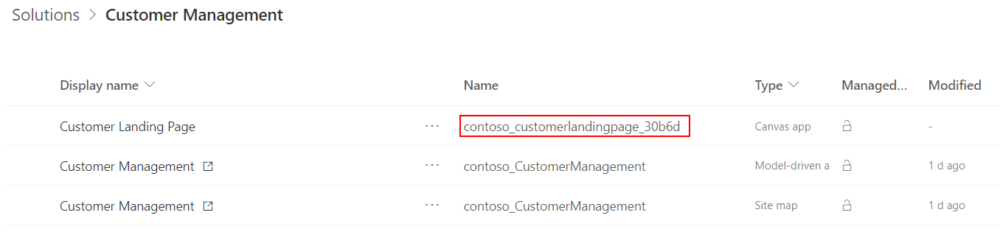

# Navigating to and from a custom page (preview)

[!INCLUDE [cc-beta-prerelease-disclaimer](../../includes/cc-beta-prerelease-disclaimer.md)]

This topic provides examples of navigating from a model-driven app page using the Client API to a custom page. It also includes examples of navigating from a custom page to other custom pages or a model page.

outlines the steps to use the Client API to open a custom page as a full page, dialog, or pane.  It provides examples of **custom** as a pageType value in [navigateTo (Client API reference)](../../developer/model-driven-apps/clientapi/reference/xrm-navigation/navigateto.md).

  > [!IMPORTANT]
  > - This is a preview feature, and isn't available in all regions.
  > - [!INCLUDE[cc_preview_features_definition](../../includes/cc-preview-features-definition.md)]


## Navigating from a custom page

Custom Page Fx [Navigate function](../canvas-apps/functions/function-navigate.md) has been updated to allow navigating to either model pages or custom pages.  These functions only apply when the custom page is running within a model-driven app.  During custom page authoring or previewing in canvas designer, these functions have no effect.

Navigate examples that use an entity must have it added as a Datasource in the page.

### Navigate to another custom page
A custom page can navigate to another custom page by passing the custom page display name as the first parameter.

```powerappsfl
Navigate( '<custom page>'  )
```

### Navigate to the default view for an entity
When Navigate is passed an entity as the first argument, it will open the user's default view page.

```powerappsfl
Navigate( Accounts )
```

### Navigate to a specific system view for an entity
When Navigate is passed an entity's Views enum, it will  open the specific system view for the entity.

```powerappsfl
Navigate( 'Accounts (Views)'.'My Active Accounts' )
```

### Navigate to the default form for an entity
When Navigate is passed a CDS record as the first argument, it will open the default entity form with the record.

```powerappsfl
Navigate( Gallery1.Selected )
```

### Navigate to the default form for an entity in create mode

When Navigate is passed a CDS record created from Defaults, it will open the default entity form with the table record as new record.  Defaults function takes an entity name to create the record.

```powerappsfl
Navigate( Defaults( Accounts ) )
```

### Navigate back to the prior page or close a dialog

When Back function is called in a custom page, it will close the current page and return to the priority model or custom page in the model-driven app.  If the custom page has multiple screens then see [Navigation advanced examples for custom page](navigate-page-advanced-examples.md) for advanced guidance.

```powerappsfl
Back( )
```

## Navigating from a model page to a custom page

### Finding the logical page name

Each of the following Client API examples take the logical name of the custom page as an argument.  The logical name is the **Name** value for the page in solution explorer. 

> [!div class="mx-imgBorder"]
> 

### Open as an inline full page without context

Within a model-driven app Client API event, call the following code and update the **name** parameter to be the logical page name.

```javascript
// Inline Page
var pageInput = {
    pageType: "custom",
    name: "<logical custom page name>",
};
var navigationOptions = {
    target: 1
};
Xrm.Navigation.navigateTo(pageInput, navigationOptions)
    .then(
        function () {
            // Called when page opens
        }
    ).catch(
        function (error) {
            // Handle error
        }
    );
```

### Open as an inline full page with a record context

This example uses the recordId parameter within the NavigateTo function to provide the custom page with the record to use.  Within the custom page, the Param function retrieves the value and uses Lookup function to retrieve the record.

```javascript
// Inline Page
var pageInput = {
    pageType: "custom",
    name: "<logical custom page name>",
    entityName: "<logical table name>",
    recordId: "<record id>",
};
var navigationOptions = {
    target: 1
};
Xrm.Navigation.navigateTo(pageInput, navigationOptions)
    .then(
        function () {
            // Called when page opens
        }
    ).catch(
        function (error) {
            // Handle error
        }
    );
```

### Open as a centered dialog

Within a model-driven app Client API event, call the following code and update the **name** parameter to be the logical custom page name.  This mode supports the sizing parameters similar to the [Main Form Dialogs](../../developer/model-driven-apps/customize-entity-forms.md#open-main-form-in-a-dialog-using-client-api).

```javascript
// Centered Dialog
var pageInput = {
    pageType: "custom",
    name: "<logical custom page name>",
};
var navigationOptions = {
    target: 2, 
    position: 1,
    width: {value: 50, unit:"%"},
    title: "<dialog title>"
};
Xrm.Navigation.navigateTo(pageInput, navigationOptions)
    .then(
        function () {
            // Called when the dialog closes
        }
    ).catch(
        function (error) {
            // Handle error
        }
    );
```

### Open as a side dialog

Within a model-driven app Client API event, call the following code and update the **name** parameter to be the logical custom page name.

```javascript
// Side Dialog
var pageInput = {
    pageType: "custom",
    name: "<logical page name>",
};
var navigationOptions = {
    target: 2, 
    position: 2,
    width: {value: 500, unit: "px"},
    title: "<dialog title>"
};
Xrm.Navigation.navigateTo(pageInput, navigationOptions)
    .then(
        function () {
            // Called when the dialog closes
        }
    ).catch(
        function (error) {
            // Handle error
        }
    );
```

### Known issues

- Navigate function does not have support for opening a model or custom page to a dialog. All navigates from a custom page open inline
- Navigate function does not support opening
    - Dashboard collection or specific dashboard
    - Specific model form 
- Custom page can only open into the current session’s current app tab in a multi-session model-driven app


## Related topics

[Model-driven app custom page overview](model-app-page-overview.md)

[Add a custom page to your model-driven app](add-page-to-model-app.md)

[Navigation advanced examples for custom page](navigate-page-advanced-examples.md)

[navigateTo (Client API reference)](../../developer/model-driven-apps/clientapi/reference/xrm-navigation/navigateto.md)

[Navigate function (Power Apps expression function)](../canvas-apps/functions/function-navigate.md) 