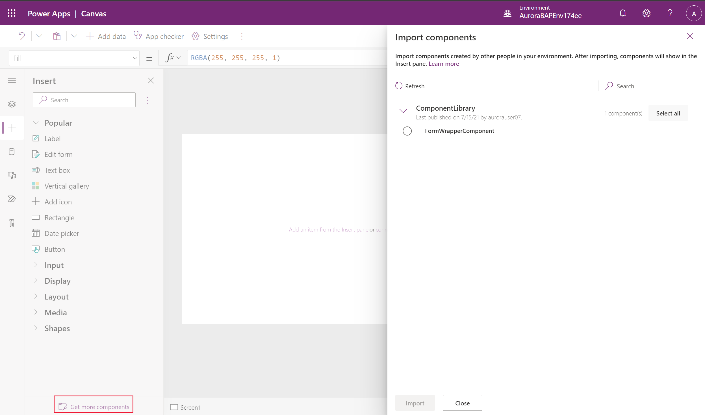

# Add canvas components to a custom page for your model-driven app 

[!INCLUDE [cc-beta-prerelease-disclaimer](../../includes/cc-beta-prerelease-disclaimer.md)]

This article outlines the use of low-code canvas components to build custom UX for a custom page by utiliizing shared canvas component library capability. For code first custom UX extensibility, see [Add code components to a custom page for your model-driven app.](/powerapps/maker/model-driven-apps/page-code-components) 

  > [!IMPORTANT]
  > - This is a preview feature, and may not be available in all regions.
  > - [!INCLUDE[cc_preview_features_definition](../../includes/cc-preview-features-definition.md)]

  > [!NOTE]
  > Custom page currently supports a [limited set of controls](/powerapps/maker/model-driven-apps/design-page-for-model-app#supported-controls-in-custom-page) and only the currently supported controls should be used to create canvas components for the custom page.

Canvas components provide app makers the ability to create custom components in a low-code fashion. These components can not only then be reused across custom pages and applications, but also can be centrally updated, packaged, and moved using Microsoft Dataverse solutions. More information: [Create a component for canvas apps](/powerapps/maker/canvas-apps/create-component) 

Since custom page authoring is limited to only one page, canvas components can only be authored inside a [component library](/powerapps/maker/canvas-apps/component-library). This is different from the standalone canvas apps, which additionally have the ability to create components at the app level.

## Create a canvas component using the component library

You can create a new [component library](/powerapps/maker/canvas-apps/component-library) or edit an existing one either from the **Solutions** area or the  **Component Libraries** tab in the **Apps** area. More information: 

## Create a canvas component for use in a custom page

This section explains how to create a canvas component that you can use in a custom page.

### Enable modern controls for the component library

First, enable the **Modern controls** setting in the canvas app designer. To do this, go to **File** > **Settings** > **Upcoming features** > **Experimental**.

Make sure that only the [supported set of controls](/powerapps/maker/model-driven-apps/design-page-for-model-app#supported-controls-in-custom-page) are used to create components for custom page. 

### Create a canvas component

Once the modern controls are enabled, you can now [create desired components](/powerapps/maker/canvas-apps/create-component.md) inside the library and publish them once the components are ready.

### Import and use a canvas component in a custom page

Custom pages can use the components from the canvas component library created or imported in the current environment. You can select **Get more components** at the bottom of the add control left navigation area.

The canvas component is available under the **Library components** section and can be added to the custom page.

### Component updates to the custom page

When the component is added to the custom page via the component library, it maintains the reference to the library. When the library owner publishes the newer library version with updated components, the custom page inline with the canvas app displays an update available message. This message is displayed when the custom page is opened for editing.

Select **Review** to review the updates, and then select **ok** to get the component refreshed with the latest changes from the canvas library.

> [!NOTE]
> Individual custom pages present in a model-driven app should be opened individually for editing inside canvas app studio to get the latest updates from the shared component library.

You can now publish the custom page and model-driven app to get the latest changes reflected.

### Additional canvas component resources

You can evaluate and use canvas component samples from Microsoft and other Power Apps community developers, which are hosted on the [Canvas app components gallery](https://powerusers.microsoft.com/t5/Canvas-Apps-Components-Samples/bd-p/ComponentsGallery).

### See also

[Model-driven app custom page overview](model-app-page-overview.md)

[Add a custom page to your model-driven app](add-page-to-model-app.md)

[Using PowerFx in custom page](page-powerfx-in-model-app.md)

[Overview of Power Apps connectors](../canvas-apps/connections-list.md)

[Add data connection in canvas designer](../canvas-apps/add-data-connection.md)
