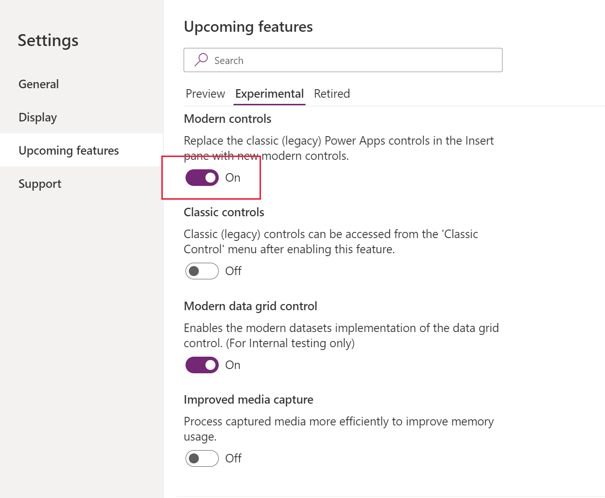

# Add canvas components to a custom page for your model-driven app 

[!INCLUDE [cc-beta-prerelease-disclaimer](../../includes/cc-beta-prerelease-disclaimer.md)]

This topic outlines the use of canvas components using canvas component library for a custom page. 

  > [!IMPORTANT]
  > - This is a preview feature, and may not be available in all regions.
  > - [!INCLUDE[cc_preview_features_definition](../../includes/cc-preview-features-definition.md)]

  > [!NOTE]
  > Custom page currently supports only a [limited set of controls](/powerapps/maker/model-driven-apps/design-page-for-model-app#supported-controls-in-custom-page) and only these  supported controls should be used to create canvas components for the custom page. 

Canvas components provides app makers an ability to create custom components in a low code fashion. These components can not only then be reused across custom pages and applications but also can be centrally updated, packaged and moved in the Dataverse solutions. See [create a component for canvas apps](/powerapps/maker/canvas-apps/create-component) for more details on how to create a component. Since custom page authoring is limited to only one page, canvas components can only be authored inside a [component library](/powerapps/maker/canvas-apps/component-library). This is different from the standalone canvas apps which additionally has ability to create components at the app level.

## Create a canvas component using component library 
You can create a new [component library](/powerapps/maker/canvas-apps/component-library) or edit an existing one either from the Solutions area or Maker portal.  Browse to [make.powerapps.com](https://make.powerapps.com), select **Apps**, and then select **Component Libraries**:

## Create canvas component for use in custom page 
### Enabling modern controls for component library 
You would need to enable modern controls in component library for use inside custom page. Please make sure that only the [supported set of controls](/powerapps/maker/model-driven-apps/design-page-for-model-app#supported-controls-in-custom-page) is used to create components for custom page. You can enable the modern controls in the canvas component library settings for use in custom pages. 

   > 

### Creating a canvas component 
Once the modern controls are enabled in the studio, you can now [create desired components](/powerapps/maker/canvas-apps/create-component.md) inside the library and publish it once component is ready.

### Importing and using canvas component in the custom page
Custom pages can use the components from the library in the environment. Click on "Get more components" buttton at the bottom of the add control left navigation area. 

Newly added canvas component is now available under "Library components" section and can be added to the custom page. 

### Component updates to the custom page
When the component is added to the custom page via library, it maintains the reference to the library. When the library owner publishes the newer library version with updated components, custom page like canvas app shows the update available message when custom page is opened for editing.

You can review the updates and click ok to get component refreshed with the up to date changes from canvas library. 

  > [!NOTE]
  >  Individual custom pages present in model app should be opened individualy for editing inside studio to get the latest updates from the shared component library.

You can now publish the custom page and model app to get the latest changes reflected.

### Additional canvas component resources
You can also evalaute and use canvas component samples from Microsoft and other Power Apps community developers hosted on [canvas components gallery](https://powerusers.microsoft.com/t5/Canvas-Apps-Components-Samples/bd-p/ComponentsGallery)

## Upcoming changes to canvas component for custom pages

* Code component support for the canvas libraries

## Related topics

[Model-driven app custom page overview](model-app-page-overview.md)

[Add a custom page to your model-driven app](add-page-to-model-app.md)

[Using PowerFx in custom page](page-powerfx-in-model-app.md)

[Overview of Power Apps connectors](../canvas-apps/connections-list.md)

[Add data connection in canvas designer](../canvas-apps/add-data-connection.md)
