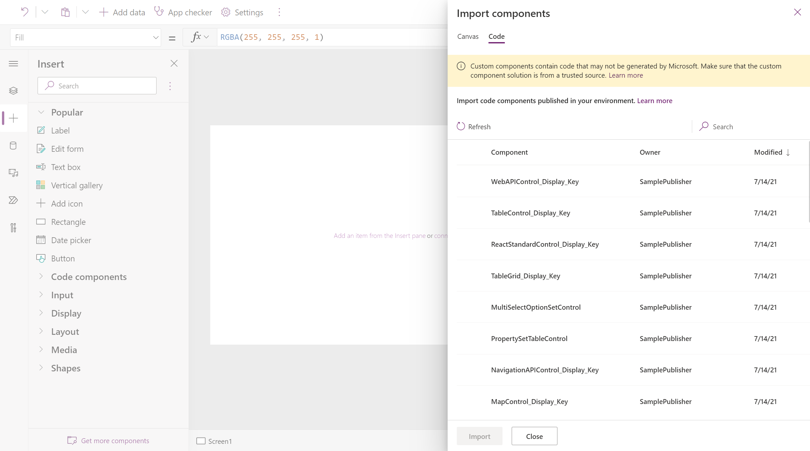
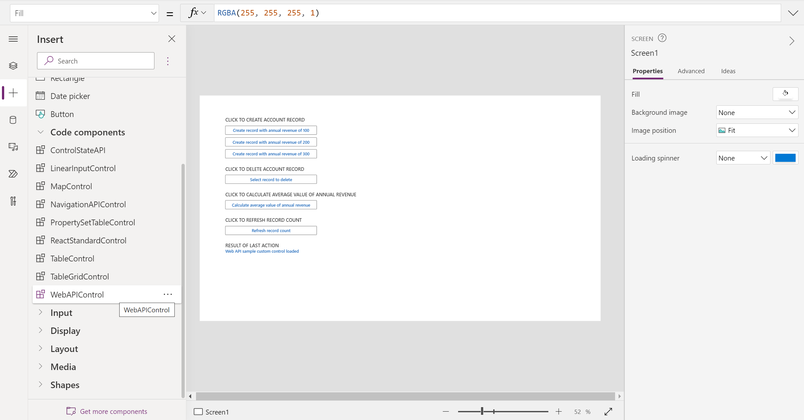

# Add code components to a custom page for your model-driven app 

[!INCLUDE [cc-beta-prerelease-disclaimer](../../includes/cc-beta-prerelease-disclaimer.md)]

This topic outlines the use of code components which are built by professional developers using Power Apps component framework within a custom page. For low code custom UX extensibility please see [add canvas components to a custom page for your model-driven app.](/powerapps/maker/model-driven-apps/page-canvas-components) 

  > [!IMPORTANT]
  > - This is a preview feature, and may not be available in all regions.
  > - [!INCLUDE[cc_preview_features_definition](../../includes/cc-preview-features-definition.md)]

  > [!NOTE]
  > Custom page supports all component framework APIs which are currently supported on canvas applications. Additionally certain model-driven only APIs like Web API and navigation have published app support for the custom pages. These APIs can be used in the code component for use in custom page and will function on the final published app. For individual API support status on each platform please see: [Power Apps component framework API reference](/powerapps/developer/component-framework/reference/)

Code components provides professional developers an ability to create custom code components for use within the Power Apps. This pro-code extensibility mechanism provides first class ALM supported way to seamlessly extend the control-set available to all makers across the organization. These components can not only then be reused across custom pages, canvas and model-driven apps but also can be centrally updated, packaged and moved via standard Dataverse solutions. See [Power Apps component framework overview](/powerapps/developer/component-framework/overview) for more details on how to create a code component. 

## Enabling support for Power Apps component framework for custom pages 
In order to use code components inside custom page, Power Apps component framework feature which is off by default for canvas apps needs to be enabled. You can find detailed instrcutions at [Code components for canvas apps.](/powerapps/developer/component-framework/component-framework-for-canvas-apps#enable-the-power-apps-component-framework-feature)

   > 

## Create code component for use in custom page 
### Creating and importing code component in Dataverse 
Code components for custom page follow the same pattern as they do in canvas page. Code components being code first approach, need to be implemented first before they can be added to the custom page. Please see [Create your first component](/powerapps/developer/component-framework/implementing-controls-using-typescript) for step by step instrauctions. You can also [Try OOB sample components](/powerapps/developer/component-framework/use-sample-components#try-the-sample-components) to jump start. Once the code component is coded, it can be packaged into a solution and added to Dataverse which makes it available for use in all custom pages inline with model-driven and canvas apps. You can find more details on this process at [Code components application lifecycle management (ALM).](/powerapps/developer/component-framework/code-components-alm) 

### Importing and using code component in the custom page
In the given environmen, custom pages can use all the code components which were previously added to Dataverse via solutions. Click on "Get more components" buttton at the bottom of the add control left navigation area. You will see a code tab on Import components dialog showing all code components present in the enviroment. 

  > [!NOTE]
  > If the code tab does not show up in the Import component dialog, please conform that the Power Apps component framework feature setting for canvas apps is enabled and also ensure that you are working on the latest studio authoring version.

Newly added code component is now available under "Code components" section and can be added to the custom page.

### Testing the code component inside studio and published app
Like canvas apps, code components are interactive and can be tested in the custom page studio authoring environments. However certain APIs like Web APIs and Navigation which only have the custom page runtime support when invoked will show the warning that the API is not implemented. 

You can dismiss this error and publish the custom page. Add this custom page to the Model App and publish the app to see the custom page web API in action.
Image below shows the OOB [Web API sample control](/powerapps/developer/component-framework/sample-controls/webapi-control) and [Navigation API control](/powerapps/developer/component-framework/sample-controls/navigation-api-control) added to custom page working inside a published model app.

### Additional code component resources
You can also use other [OOB sample controls](/powerapps/developer/component-framework/use-sample-components#try-the-sample-components) from Microsoft or try some from the [Power Apps community gallery](/powerapps/developer/component-framework/community-resources)

> 

## Related topics

[Model-driven app custom page overview](model-app-page-overview.md)

[Add a custom page to your model-driven app](add-page-to-model-app.md)

[Using PowerFx in custom page](page-powerfx-in-model-app.md)

[Overview of Power Apps connectors](../canvas-apps/connections-list.md)

[Add data connection in canvas designer](../canvas-apps/add-data-connection.md)
