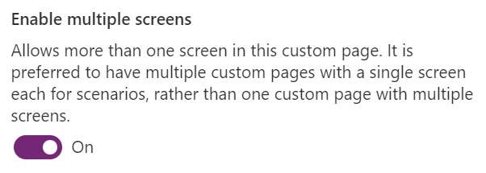

# Use Power Fx in a custom page for your model-driven app

This article outlines how the common [Microsoft Power Fx](../canvas-apps/formula-reference.md) functions work differently between a standalone canvas apps and a custom page. This is because a custom page is a component within the model-driven app. Other Microsoft Power Fx formulas continue to behave in the same way.

> [!IMPORTANT]
> - The base functionality of custom pages has moved to general availability in all regions.  However some specific capabilities or new capabilities are still in public preview and are marked with _(preview)_.
> - [!INCLUDE[cc_preview_features_definition](../../includes/cc-preview-features-definition.md)] 
> - Custom pages are a new feature with significant product changes and currently have a number of known limitations outlined in [Custom Page Known Issues](model-app-page-issues.md).

## Add notifications to a custom page

A notification can be shown to the user in a custom page by calling the [Notify function](../canvas-apps/functions/function-showerror.md).  When the notification messages appear, they're docked above the default page to stay visible until disabled. If a timeout interval is provided, the notification message will disappear after the timeout interval. It is recommended not to use a timeout interval of 10, as this is no longer considered as a timeout interval. More information: [Notify function](../canvas-apps/functions/function-showerror.md).

```powerappsfl
Notify( "Custom page notification message" )
```

> [!div class="mx-imgBorder"]
> 

```powerappsfl
Notify( "Custom page notify warning message", NotificationType.Warning )
```

> [!div class="mx-imgBorder"]
> 

## Navigating to a custom page

This section provides examples of navigating from a model-driven app form to a custom page, navigating from a custom page to other custom pages or model-driven app form using Power Fx.

### Navigating from a custom page

The [Navigate function](../canvas-apps/functions/function-navigate.md) allows the users to navigate either from model-driven app forms or custom pages.  This function is only applicable when the custom page is running within a model-driven app.  During custom page authoring or previewing in canvas designer, this function have no effect.

Examples that use a table should be added as a data source in the page.

### Navigate to another custom page

To navigate from one custom page to another, pass the display name of the custom page as the first parameter.

```powerappsfl
Navigate( CustomPage2  )
```

### Navigate to the default view of the table

To navigate to the default view of the table, passed table name as the first parameter.

```powerappsfl
Navigate( Accounts )
```

### Navigate to specific system view of the table

To navigate to a specific system view of the table, pass the GUID of the view.

```powerappsfl
Navigate( 'Accounts (Views)'.'My Active Accounts' )
```

### Navigate to the default form of the table

To navigate to the default form of the table, pass the record as the first parameter.

```powerappsfl
Navigate( Gallery1.Selected )
```

### Navigate to a specific form of a table (preview)

To navigate to a specific form for the record, pass the page in the second parameter.

```powerappsfl
Navigate( Gallery1.Selected, { Page: 'Accounts (Forms)'.Account  } )
```

### Navigate to the default form of the table in create mode 

To navigate to the default form of the table in create mode, pass a Dataverse record created from the [Defaults](../canvas-apps/functions/function-defaults.md) function. This opens the default form with the record as a new record. The **Defaults** function takes the table name to create the record.

```powerappsfl
Navigate( Defaults( Accounts ) )
```

### Navigate to the default form of the table in create mode with field defaulted (preview)

To navigate to a new record with some fields defaulted, use **Patch** function to set fields on the default record for the table. 

```powerappsfl
Navigate(
	Patch(
		Defaults(Accounts), { 'Account Name': "My company", Phone: "555-3423" } ) 
  )
```

### Navigate back to the prior page or close a dialog

To navigate back to the last page or to close a dialog, the [Back](../canvas-apps/functions/function-navigate.md) function is called in a custom page. The **Back** function closes the current page and returns to the last model-driven app or custom page in the model-driven app. If the custom page has multiple screens, see the article [Navigating back when custom page has multiple screens](#navigating-back-when-custom-page-has-multiple-screens).

```powerappsfl
Back( )
```

### Navigating back when custom page has multiple screens

The default configuration for a custom page is to have one screen. In this case, the **Back** function call will close the custom page unless the custom page is the last in the page stack in model-driven app. The last page is kept open.

An app maker can enable multiple screens in a custom page. These should be considered like full page controls within the custom page that can be stacked. Opening a custom page has no means of specifying the screen to use.  When a custom page contains multiple screens the maker is responsible for managing the screen stacking.  Calling the **Navigate** function to a screen will add to the screen stack with the custom page.  Each **Back** function call will remove a screen from the screen stack.  When there is only one screen on the screen stack, the custom page is closed.

### Enabling multiple screens

By default a custom page uses a single screen to encourage separation of the app into a screen per page.  This can be switched by enabling **Settings** > **Display** > **Enable multiple screens**.

> [!div class="mx-imgBorder"]
> 

## Confirm function

The `Confirm` function displays a dialog box on top of the current screen. Two buttons are provided: a confirm button and a cancel button, which default to localized versions of "OK" and "Cancel", respectively. The user must confirm or cancel before the dialog box is dismissed and the function returns. Besides the dialog button, cancel can also be selected with the Esc key or other gestures that are platform specific.

The `Message` parameter is displayed in the body of the dialog box. If the message is very long, it will either be truncated or a scroll bar provided.

Use the `OptionsRecord` parameter to specify options for the dialog box. Not all options are available on every platform and are handled on a best effort basis. 

> [!NOTE]
> The options in the table below aren't currently available with canvas apps.

|Option Field  |Description  |
|---------|---------|
|ConfirmButton     |The text to display on the *confirm* button, replacing the default, localized "OK" text.         |
|CancelButton     |The text to display on the *cancel* button, replacing the default, localized "Cancel" text.         |
|Title     |The text to display as the *title* of the dialog box. A larger, bolder font than the message font may be used to display this text. If this value is very long, it will be truncated.         |
|Subtitle     |   The text to display as the *subtitle* of the dialog box. A larger, bolder font than the message font may be used to display this text. If this value is very long, it will be truncated.      |

`Confirm` returns true if the confirm button was selected, false otherwise.

### Syntax

**Confirm**( Message [, OptionsRecord ] )
- `Message` - Required. Message to display to the user.
- `OptionsRecord` - Optional. Provide advanced options for the dialog. Not all options are available on every platform and are handled on a best effort basis. At this time, in canvas apps, none of these options are supported.

### Known issues

- The `Navigate` function doesn't have support for opening a model or custom page to a dialog. All navigation from a custom page opens inline.
- Navigate function doesn't support opening:
    - A dashboard collection or a specific dashboard.
    - A specific model-driven app form. 
- A custom page can only open into the current session’s current app tab in a multi-session model-driven app.

### See also

[Navigating to and from a custom page using client API](../../developer/model-driven-apps/clientapi/navigate-to-custom-page-examples.md)

[Model-driven app custom page overview](model-app-page-overview.md)