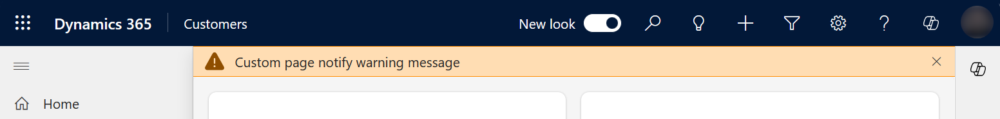

# Using PowerFx in custom page for your model-driven app (preview)

[!INCLUDE [cc-beta-prerelease-disclaimer](../../includes/cc-beta-prerelease-disclaimer.md)]

This topic outlines how the common Power Fx functions work within a custom page.  They can be different than Power Fx in a standalone canvas app because the custom page is a component with the model-driven app.

  > [!IMPORTANT]
  > - This is a preview feature, and isn't available in all regions.
  > - [!INCLUDE[cc_preview_features_definition](../../includes/cc-preview-features-definition.md)]

## Add custom page notifications

A custom page notification can be shown to the user by calling the [Notify function](../canvas-apps/functions/function-showerror.md) to make a page message bar appear.  When the notify messages appear, they're docked above the page default to stay visible until disabled.  Unless a timeout interval is provided, the message will disappear after the timeout interval.  Avoid using a timeout interval of 10, it is currently treated as no timeout.

```powerappsfl
Notify( "Custom page notification message" )
```

> [!div class="mx-imgBorder"]
> 

```powerappsfl
Notify( "Custom page notify warning message", NotificationType.Warning )
```

> [!div class="mx-imgBorder"]
> 

## Navigating from a custom page

A custom page navigation uses the Navigate and Back functions.

## Related topics

[Model-driven app custom page overview](model-app-page-overview.md)

[Navigating to and from a custom page in your model-driven app](navigate-page-examples.md)