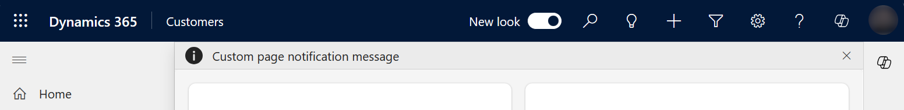

# Use PowerFx in a custom page for your model-driven app (preview)

[!INCLUDE [cc-beta-prerelease-disclaimer](../../includes/cc-beta-prerelease-disclaimer.md)]

This article outlines how the common Power Fx functions work within a custom page. Power Fx formulas in a custom page can be different than Power Fx in a standalone canvas app. This is because custom pages are a component within the model-driven app.

  > [!IMPORTANT]
  > - This is a preview feature, and isn't available in all regions.
  > - [!INCLUDE[cc_preview_features_definition](../../includes/cc-preview-features-definition.md)]

## Add custom page notifications

A custom page notification can be shown to the user by calling the [Notify function](../canvas-apps/functions/function-showerror.md) to make a page message bar appear.  When the notify messages appear, they're docked above the page default to stay visible until disabled. Unless a timeout interval is provided, the message will disappear after the timeout interval. Avoid using a timeout interval of 10, it is currently treated as no timeout.

```powerappsfl
Notify( "Custom page notification message" )
```

> [!div class="mx-imgBorder"]
> 

```powerappsfl
Notify( "Custom page notify warning message", NotificationType.Warning )
```

> [!div class="mx-imgBorder"]
> 

## Navigating a custom page

This section provides examples of navigating from a model-driven app page to a custom page and examples of navigating from a custom page to other custom pages or model-driven app page using Power Fx.

### Navigating from a custom page

Custom Page Fx [Navigate function](../canvas-apps/functions/function-navigate.md) has been updated to allow navigating to either model pages or custom pages.  These functions only apply when the custom page is running within a model-driven app.  During custom page authoring or previewing in canvas designer, these functions have no effect.

Navigate examples that use a table must have it added as a Datasource in the page.

### Navigate to another custom page

A custom page can navigate to another custom page by passing the custom page display name as the first parameter.

```powerappsfl
Navigate( '<custom page>'  )
```

### Navigate to the default view for a table

When Navigate is passed a table as the first argument, it will open the user's default view page.

```powerappsfl
Navigate( Accounts )
```

### Navigate to a specific system view for a table

When Navigate is passed a table's Views enum, it will  open the specific system view for the table.

```powerappsfl
Navigate( 'Accounts (Views)'.'My Active Accounts' )
```

### Navigate to the default form for a table

When Navigate is passed a Microsoft Dataverse record as the first argument, it will open the default table form with the record.

```powerappsfl
Navigate( Gallery1.Selected )
```

### Navigate to the default form for a table in create mode

When Navigate is passed a Dataverse record created from the Defaults function, it will open the default table form with the table record as a new record. The Defaults function takes a table name to create the record.

```powerappsfl
Navigate( Defaults( Accounts ) )
```

### Navigate back to the prior page or close a dialog

When the Back function is called in a custom page, it closes the current page and returns to the priority model-driven app or custom page in the model-driven app. If the custom page has multiple screens, then see [Navigation advanced examples for custom page](navigate-page-advanced-examples.md) for advanced guidance.

```powerappsfl
Back( )
```

### See also

<!-- Link to dev related article -->

[Model-driven app custom page overview](model-app-page-overview.md)

[Navigating a custom page](page-powerfx-in-model-app.md#navigating-a-custom-page)