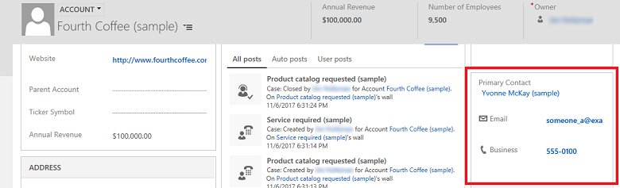
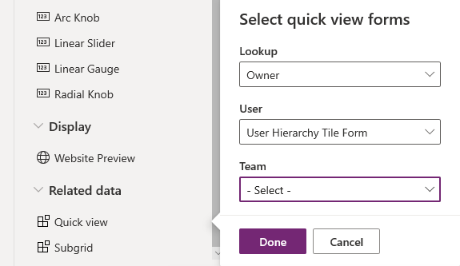
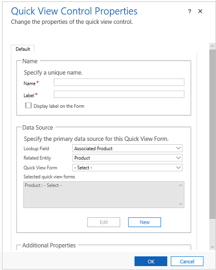

# Model-driven app quick view control properties

[!INCLUDE [cc-data-platform-banner](../../includes/cc-data-platform-banner.md)]

A quick view control on a model-driven app form displays data from a row that is selected in a lookup on the form. The data displayed in the control is defined using a quick view form. The data displayed is not editable, but when the primary column is included in the quick view form, it becomes a link to open the related row. More information: [Create and edit quick view forms](create-edit-quick-view-forms.md)  

> [!div class="mx-imgBorder"] 
>   

1.  Sign in to [Power Apps](https://make.powerapps.com/?utm_source=padocs&utm_medium=linkinadoc&utm_campaign=referralsfromdoc).  

2.  Expand **Data**, select **Tables**, select the table that you want, and then select the **Forms** tab.  

3.  Select a form, which **Type** is **Main**.

4.  In the form designer, select **Add Component**.

5.  In the left navigation pane, select **Quick view**.

6.  In the **Select quick view forms** dialog box, select a **Lookup** column included in the form, and then select a quick view form for the related tables. The related tables shown depend on the **Lookup** column you choose.  

    > [!div class="mx-imgBorder"] 
    > 

7.  Select **Done** to close the **Select quick View forms** dialog box. The quick view form appears on the form, and the properties of the quick view appear in the Properties pane.

|Property|Description|  
|--------------|-----------------|  
|**Label**|**Required**: A label to display for the quick view form.|  
|**Name**|**Required**: The unique name for the quick view form that is used when referencing it in scripts.|  
|**Hide label**|Displays the label on the form.| 
|**Quick view forms**|Lists the quick view forms that you selected for the related tables. 
|**Select forms**|Select or change the selected quick view forms for the related tables. The related tables shown depend on the **Lookup** column you choose.|  
|**Components**|Properties to configure for the component. A quick view control component has no properties to configure, and by default is shown whether someone is using a web browser, Dynamics 365 for phones, or Dynamics 365 for tablets.

## Quick view control properties in classic form designer

1.  Sign in to [Power Apps](https://make.powerapps.com/?utm_source=padocs&utm_medium=linkinadoc&utm_campaign=referralsfromdoc).  

2.  Expand **Data**, select **Tables**, select the table that you want, and then select the **Forms** tab. 

3.  In the list of forms, open the form of type **Main**.

4.  On the command menu, select **Switch to classic**.

5.  Then on the **Insert** tab, select **Quick View Form** to view quick view control properties.

    > [!div class="mx-imgBorder"] 
    > 
  
|Property|Description|  
|--------------|-----------------|  
|**Name**|**Required**: The unique name for the quick view form that is used when referencing it in scripts.|  
|**Label**|**Required**: A label to display for the quick view form.|  
|**Display label on the Form**|Displays the label on the form.|  
|**Lookup Column**|Choose one of the lookup columns included in the form.|  
|**Related table**|This value depends on the **Lookup Column** you choose. It is usually the primary table for the 1:N table relationship for the lookup.   If the table includes a **Potential Customer** lookup that can accept either an account or contact, in the **Quick View Form** column you can choose a quick view form for both account and contact by changing this value and then choosing another quick view form.|  
|**Quick View Form**|If the **Related table** has any quick view forms you can select them here. Otherwise, select **New** to create one.   Select **Edit** to change the selected quick view form.|  
|**Additional Properties**|You can specify the default rendering style by selecting the check box.|

>[!NOTE] 
> When you add a multi-line text column to a quick view form, the form will have a height of one regardless of how the column control height is set. This ensures proper rendering of the form while maintaining density. Notice that multi-line text columns on other form types, such as main forms, work differently as the form automatically expands based on the amount of text. 

## Next steps

[Use the Main form and its components](use-main-form-and-components.md)
 

[!INCLUDE[footer-include](../../includes/footer-banner.md)]