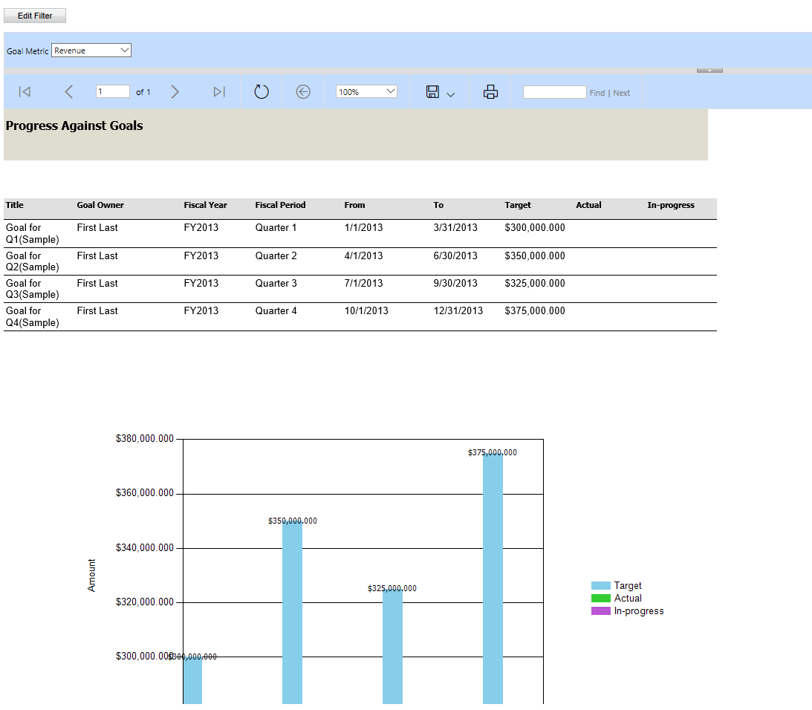

# Reporting overview for model-driven apps

[!INCLUDE [cc-data-platform-banner](../../includes/cc-data-platform-banner.md)]

## Introduction

[Dataverse](model-driven-app-glossary.md#dataverse) as a platform supports interaction with many millions of records, filtered down to the relevant security roles, and as such presenting data in a way that permits the correct record to be found in a reliable fashion is an important feature.

Model-driven apps provide a range of reporting options to enable users to understand the data associated with their business area more easily.  

Some types of reporting are very straightforward to implement, and others require more advanced techniques.

## Simple reporting techniques

All of the techniques below are native to Dataverse, and as such they provide a very simple method by which application lifecycle management can be applied.

### Table views

At the most basic level table [views](model-driven-app-glossary.md#view) offer a very straightforward native experience in which records are presented in a tabular fashion.  It is easy to overlook the power of views, however the fact that a table can have **multiple views** all of which have individual sorting and filtering applied to them can offer a very simple set of review options.

### Charts

[Charts](model-driven-app-glossary.md#chart) allow app users to view the data presented in a view in a range of ways, which include bar, pie and line charts.  Once again, a table can have multiple charts associated with it, and the charts themselves provide interactivity that enables a user to select a bar and the view will filter accordingly.

The extract below shows views and charts being used to create a straightforward user experience.

:::image type="content" source="../../maker/model-driven-apps/media/reporting-charts-and-views.gif" alt-text="Solution explorer":::

### Forms

[Forms](model-driven-app-glossary.md#form) can often be thought of as a method of entering data for a [record](model-driven-app-glossary.md#record), however they are an excellent way of providing the user columns of metadata associated with a record.  Similar to views, a table can have multiple forms.  This permits forms to be developed that are most suited to the business needs of the individual concerned.

## Working with SQL Server Reporting style reports

SSRS reports allow pixel perfect paginated reports to be created that can be rendered on screen and distributed in a range of ways such as PDF, CSV, Excel and so on. They are introduced using the classic editor and are solution aware, which helps with application lifecycle management.  [Learn more about SSRS reports](add-reporting-to-app.md)

> [!div class="mx-imgBorder"] 
> 

## Power BI Reporting

Power BI is a trememdously powerful and interactive reporting tool. Power BI dashboards and reports can be introduced into model-driven apps in a range of ways.  Unlike some of the other techniques suggested Power BI reports are not themselves solution aware, so a little more effort is required to ensure that development, test and production scenarios can be maintained.

Additionally, unless direct query techniques are used record level security will need to be re-introduced into any reporting.

There are 3 techniques for introducing Power BI into your model driven apps.

|Technique|Notes|Power BI Object|
|---------|--------------|------------|
|[Embed a Power BI report in a model-driven system form](embed-powerbi-report-in-system-form.md)|This allows a Power BI report to be presented within a table form and this can be performed in the context of the current record.|Report|
|[Create or edit a Power BI embedded system dashboard](create-edit-powerbi-embedded-page.md)|This is technique that an administrator can use to introducing a Power BI dashboard|Dashboard|
|[How app users can add or edit Power BI visualizations on their dashboards](../../user/add-powerbi-dashboards.md)|This allows a full Power BI dashboard to be introduced, however it is introduced by the user, not an administrator.|Dashboard|

:::image type="content" source="../../maker/model-driven-apps/media/embed-powerbi/embed-powerbi-report-in-system-form-unfiltered.png" alt-text="Example of embedded Power BI without contextual filtering":::

## Excel integration

Microsoft Excel integration that allows users to easily build self-service reports using the features such as [PowerView](https://support.office.com/article/power-view-overview-and-learning-5380e429-3ee0-4be2-97b7-64d7930020b6), [PowerPivot](https://support.office.com/article/power-pivot-overview-and-learning-f9001958-7901-4caa-ad80-028a6d2432ed), and [PowerQuery](https://support.office.com/article/power-query-overview-and-learning-ed614c81-4b00-4291-bd3a-55d80767f81d).

## Next Steps

[Create a system chart for a table](create-edit-system-chart.md) 
[Reporting considerations](reporting-considerations.md) 
[Working with views](create-edit-views.md) 
[Working with forms](create-and-edit-forms.md) 
[Learn more about SSRS reports](add-reporting-to-app.md) 
[Power BI Overview](use-power-bi.md) 

[!INCLUDE[footer-include](../../includes/footer-banner.md)]