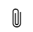

# Add the rich text editor control to a model-driven app

The rich text editor control provides the app user with a WYSIWYG editing area for formatting text. The control's input and output format is HTML. The control allows copied rich text, such as from a web browser or Word, to be pasted into the control.

Some of the format options available are:

- Bold, italic, underline, and strikethrough
- Text color, highlight color
- Font type and size
- Numbered lists and bulleted lists
- Hyperlinks
- Tables
- Images

For a full list of default options, see [Use the rich text editor toolbar](#use-the-rich-text-editor-toolbar).<br></br>

 

## Add or replace a text column for rich text editing

Create a new text column and configure the control, or replace an existing text column. The rich text editor control can be used with single or multi-line text columns.

### Simple configuration

To enable the rich text editor with default values on any new or existing text column, you can set the **Format** option to **Rich text** using the following steps. More information on default values: [Use the default web resource for organization-wide changes](#use-the-default-web-resource-for-organization-wide-changes)


1. Sign in to [Power Apps](https://make.powerapps.com/?powerappsEntities.enableColumnFormatUpdate=true&powerappsEntities.enableModernColumn=true). 

   > [!NOTE]
   > If you have an existing rich text field, you can use the API to change the format to `Richtext`. More information: [Data type format conversions](/powerapps/developer/data-platform/data-type-format-conversions)

1. On the left navigation pane, select **Solutions**. [!INCLUDE [left-navigation-pane](../../includes/left-navigation-pane.md)]
1. Open the solution that you want, open the table that you want, and then select the **Columns** area.
1. Select **+Add** > **Column**, enter a name for your column, select a text **Data** type, and then select the **Rich text** format option.
1. Save the column. You can now add the new column to any existing or new form for this table.

### Advanced configuration

The rich text editor control comes with a rich set of configuration options that make it possible to customize its appearance, features, and behavior. To enable the rich text editor with a specific configuration on a new or existing column, complete the following steps.

1. Sign in to [Power Apps](https://make.powerapps.com/?utm_source=padocs&utm_medium=linkinadoc&utm_campaign=referralsfromdoc). 
1. On the left navigation pane, select **Solutions**. [!INCLUDE [left-navigation-pane](../../includes/left-navigation-pane.md)]
1. Open the solution that you want, open the table that you want, and then select the **Forms** area.
1. Select the form, and then select **Edit form** > **Edit form in new tab**.
1. On the form designer canvas, add or create a text column or select an existing text column, such as the custom multi-line text column used in this article.
1. On the right column properties pane, expand the **Components** section, select **+ Component**, and then select **Rich Text Editor Control**.
1. On the **Add rich text editor control** pane, select from the following options, and then select **Done**:  
   - **Bind to table column**: We don’t recommend that you enable this option because this property doesn’t support binding to a different table column.
   - **Static value**: If you want to customize the rich text editor appearance, features, and behavior, enter the relative URL to the JavaScript web resource that contains the properties you want. More information: [Create and use advanced configuration for the rich text editor control](#create-and-use-advanced-configuration-for-the-rich-text-editor-control)
   - **Web**, **Phone**, and **Tablet**: Enable all if you want all client apps to have the ability to use rich text in the column.

      
1. **Save**, and then **Publish** the form.

## Create and use advanced configuration for the rich text editor control

To create and use advanced configuration for the rich text editor control, follow these steps:

1. Create a JavaScript (.js) file that contains the JSON format text file with the `defaultSupportedProps` structure and configuration you want. More information: [More sample rich text editor configurations](#more-sample-rich-text-editor-configurations) and [Rich text editor properties](#rich-text-editor-properties)
1. In Power Apps, create a **JavaScript (JS)** type web resource using the JSON file created in step 1. More information: [Create or edit model-driven app web resources to extend an app](create-edit-web-resources.md)
1. Add the relative URL for the JavaScript web resource (for example */WebResources/contoso_toolbartoprte*) in the **Static value** field on the **Add rich text editor control** pane. More information: [Add or replace a text column for rich text editing](#add-or-replace-a-text-column-for-rich-text-editing)

   > [!TIP]
   > - The web resource URL is located next to the **URL** field on the web resource definition you created in the previous step.
   > - Although you can use the absolute URL for the **Static value**, by using the relative URL, the web resource will continue to work after it has been imported into another environment as a solution.
   > :::image type="content" source="media/web-resource-url.png" alt-text="URL for JavaScript web resource":::
1. **Save**, and then **Publish** the form.

## Best practices for using the rich text editor

Consider the following when using the rich text editor: 

- The best performance is achieved when the HTML content size is 1 MB or less. When your HTML content size exceeds 1 MB, you may notice slower response times for loading and editing content. By default, image content is referenced from the content HTML but isn't stored as part of the HTML content, so in the default configuration, images don't negatively impact performance. 

- Rich text fields store HTML tags, which are required for formatting along with user entered data. When setting the maximum size for your field, make sure to assign a large enough size for both the HTML tags and user-entered data. 

- By default, the rich text editor uploads images to the Azure Blob storage store and isn't stored as part of the field. Images are stored in the same field as base64 when the submitter doesn’t have permissions to the `msdyn_richtextfiles` entity. Base64 content is large, so you generally don't want to store images as base64.

-  If you have a system administrator or basic user security role, the user personalization feature works by default. If you don't have these roles, you must have create, read, and write privileges added to the msdyn_customcontrolextendedsettings table for the plugin to work.

## How configuration is applied to the rich text editor

The experience and capabilities of the rich text editor are controlled with configuration. The default configuration for the rich text editor control has property and values that are intended to meet normal rich text needs but they can be adjusted. Configuration properties and values can be applied to a specific rich text editor control instance. There can be up to three levels of configuration that can be applied to each rich text editor instance. The logic used for applying properties and values are as follows:

1. The non-editable global configuration file RTEGlobalConfiguration_Readonly.json is loaded.
1. The editable global configuration file RTEGlobalConfiguration.json is loaded.
   - The properties in this configuration _replace*_ the same named properties in the prior configuration file.
1. The instance specific configuration file, if it exists, is loaded. See **Advanced configuration** for more information on instance level configuration.
   - The properties in this configuration _replace*_ the same named properties in either of the prior configuration files.  

   > [!NOTE]
   > All properties are replaced **except** for extraPlugins, which are merged. Merging extraPlugins allows the use of a wide range of plugins in  RTEGlobalConfiguration.json using externalPlugins and out-of-box provided plugins. Then, only the necessary plugins can be activated by adding them to the extraPlugins values in the instance specific configuration.

A rich text-enabled column has a limited set of configuration that can be configured for read-only or disabled state. You can learn more about this configuration from the "readOnlySettings" property description. 

## Rich text editor properties

The JSON file is composed of properties set as name and value pairs. There are two types of configurations: the `defaultSupportedProps` section, and individual configuration settings that provide various functionality. 

The `defaultSupportedProps` is a set of properties for the plug-ins, and includes support for all the CKEditor configurations. More information: [Visualization of the rich text editor configuration file](#visualization-of-the-rich-text-editor-configuration-file). The `defaultSupportedProps` isn’t limited to only plug-in properties documented from CKEditor, but also allows you to set properties for more plug-ins that you add or create. More information about CKEditor plug-ins: [Plug-ins available](https://ckeditor.com/cke4/addons/plugins/all)

The individual configuration settings allow you to change how your editor behaves and functions.

## Visualization of the rich text editor configuration file

The following two images visually identify the two configuration sections. For the full configuration file, go to [Use the default web resource for organization-wide changes](#use-the-default-web-resource-for-organization-wide-changes).

**defaultSupportedProps**


More information: [defaultSupportedProps](#defaultsupportedprops)
:::image type="content" source="media/defaultsupportedprops-visualization.png" alt-text="defaultsupportedprops configuration visualization.":::

**Individual configuration settings**


More information: [Individual configuration settings](#individual-configuration-settings)
:::image type="content" source="media/individual-config-visualization.png" alt-text="Individual configuration settings visualization.":::

### defaultSupportedProps

You can configure all of the CKEditor-supported properties under this property. A few of the commonly used and custom configurations are described in the table. For complete documentation about CKEditor configurations, see [CKEditor.config](https://ckeditor.com/docs/ckeditor4/latest/api/CKEDITOR_config.html). The rich text editor currently uses CKEditor version 4.17.1.


<table>
  <tr>
    <th>Attribute</th>
    <th>Description</th>
    <th>Default value</th>
  </tr>
  <tr>
<td>
  height
</td>

<td>

  Sets the initial height of the content editor. The default is 185 px.
</td>
<td>

  ```"height": 185```
</td>

</tr>
	<tr>
<td>
  stickyStyle
</td>

<td>

  Sets the actual default font size and style.<br></br> The stickyStyle plugin creates a wrapper around your content using the element specified by "stickyStyles_defaultTag", which is initially configured as "div", and can be changed to "p" or any alternate tag.
</td>
<td>

  ```
  "stickyStyle": {
     "font-size": "9pt",
     "font-family": "'Segoe UI','Helvetica Neue',sans-serif"
},
"stickyStyles_defaultTag": "div"
  ```
</td>
</tr>

<tr>
<td>
  font_defaultLabel
</td>

<td>

  Sets the default label that is displayed in the toolbar for font style. The default is Segoe UI. The default label is only visual and isn't functional, and stickyStyle configuration applies the functional font and size.
</td>
<td>

  ```"font_defaultLabel": "Segoe UI"```
</td>

</tr>

<tr>
<td>
  fontSize_defaultLabel
</td>

<td>

  Sets the default label that is displayed in the toolbar for font size. The default is 9. The default label is only visual and isn't functional, and stickyStyle configuration applies the functional font and size.
</td>
<td>

  ```"fontSize_defaultLabel": "9"```
</td>
</tr>

<tr>
<td>
  toolbarLocation
</td>

<td>

  The location of the user interface where the toolbar renders. Supported values are *top* and *bottom*. The default is bottom.
</td>
<td>

  ```"toolbarLocation": "bottom"```
</td>
</tr>
	
<tr>
<td>
  toolbar
</td>

<td>
  A list of the loaded toolbar buttons.
</td>
<td>

  ```
"toolbar": [
    [ "CopyFormatting" ],
    [ "Font" ],
    [ "FontSize" ],
    [ "Bold" ],
    [ "Italic" ],
    [ "Underline" ],
    [ "BGColor" ],
    [ "TextColor" ],
    [ "BulletedList" ],
    [ "NumberedList" ],
    [ "Outdent" ],
    [ "Indent" ],
    [ "Blockquote" ],
    [ "JustifyLeft" ],
    [ "JustifyCenter" ],
    [ "JustifyRight" ],
    [ "Link" ],
    [ "Unlink" ],
    [ "Subscript" ],
    [ "Superscript" ],
    [ "Strike" ],
    [ "Image" ],
    [ "BidiLtr" ],
    [ "BidiRtl" ],
    [ "Undo" ],
    [ "Redo" ],
    [ "RemoveFormat" ],
    [ "Table" ]
  ]
```
  
</td>
</tr>
	
<tr>
<td>
  plugins
</td>

<td>

  Comma-separated list of plug-ins to be used in an editor instance. The actual plug-ins that are loaded might still be affected by two other settings: *extraPlugins* and *removePlugins*. <br></br> Updating this setting might remove the plug-ins from the toolbar. If you set this property to an empty string, the editor loads without the toolbar. <br></br> If you want to add one or more plug-ins to the toolbar, we recommend that you use *extraPlugins*. If you want to remove one or more from the default list, use *removePlugins*.     
</td>
<td>

  ```"plugins": [["button,toolbar,dialogui,dialog,autogrow,notification,clipboard,textmatch,fakeobjects,link,autolink,basicstyles,bidi,blockquote,panelbutton,panel,floatpanel,colorbutton,colordialog,listblock,richcombo,menu,contextmenu,copyformatting,enterkey,entities,popup,find,floatingspace,font,format,htmlwriter,horizontalrule,indent,indentblock,indentlist,justify,lineutils,openlink,list,liststyle,maximize,undo,menubutton,notificationaggregator,xml,ajax,pastetools,pastefromword,pastetext,preview,table,quicktable,removeformat,resize,selectall,showborders,sourcearea,specialchar,stylescombo,tab,tabletools,tableresize,tableselection,widgetselection,widget,wysiwygarea,textwatcher"]]```
</td>
</tr>

<tr>
<td>
  extraPlugins
</td>

<td>

  A comma-separated list of other plug-ins to be loaded. This setting makes it easier to add new plug-ins without touching the plugins setting. <br></br> There are many plug-ins that are required for other plug-ins to work. For example, the dialog plug-in is required for the link plug-in. The rich text editor automatically adds those, and you can't override them by updating this property. This setting appends new plug-ins to the previous list. <br></br> If you want to remove any of the presets, we recommend that you use the *removePlugins* property.
</td>
<td>

  ```"extraPlugins": "accessibilityhelp,autogrow,autolink,basicstyles,bidi,blockquote,button,collapser,colorbutton,colordialog,confighelper,contextmenu,copyformatting,dialog,editorplaceholder,filebrowser,filetools,find,floatpanel,font,iframerestrictor,indentblock,justify,notification,panel,panelbutton,pastefromword,quicktable,selectall,stickystyles,superimage,tableresize,tableselection,tabletools,uploadfile,uploadimage,uploadwidget"```
</td>
</tr>

<tr>
<td>
  removePlugins
</td>

<td>

  A list of plug-ins that must not be loaded. This setting makes it possible to avoid loading some plug-ins defined in the plugins/extraPlugins setting without having to touch them.
  
</td>
<td>

  ```"removePlugins": "a11yhelp,codemirror,magicline,scayt,showborders"```
</td>
</tr>

<tr>
<td>
  superimageImageMaxSize
</td>

<td>

  The maximum size in megabytes (MB) allowed for embedded images when using the superimage plugin. The default is 5.
</td>
<td>

  ```"superimageImageMaxSize": 5```
</td>

</tr>

<tr>
<td>
  disallowedContent
</td>

<td>

  Lets you disallow elements that you don't want to have in your content. You're able to disallow entire elements or by attributes, classes, and styles. For more information about the CKEditor "disallowedContent" configuration, see [ Disallowed Content Rules](https://ckeditor.com/docs/ckeditor4/latest/guide/dev_disallowed_content.html#disallowed-content-rules).
</td>
<td>

  ```"disallowedContent": "form[action]; *[formaction]; script; *[on*]"```
</td>

</tr>


<tr>
<td>
  linkTargets
</td>

<td>

  Allows you to configure which link target options are available for users when they create links.
</td>
<td>
Link targets
	
- ```notSet``` : No target set for the document in the anchor tag
	
- ```frame``` : Opens the document in the specified frame
	
- ```popupWindow``` : Opens the document in a popup window
	
- ```_blank``` : Opens the document in a new window or tab
	
- ```_top``` : Opens the document in the full body of the window
	
- ```_self``` : Opens the document in the same window or tab where the link is activated
	
- ```_parent``` : Opens the document in the parent frame

<br><br>
	
Example:
	
```"linkTargets": ["notSet", "_blank"]```

</td>

</tr>
</table>


### Individual configuration settings

You can configure other configuration settings that affect how your editor functions.


<table>
  <tr>
    <th>Attribute</th>
    <th>Description</th>
    <th>Default value</th>
  </tr>
	
<tr>
<td>
  attachmentEntity
</td>

<td>

  By setting this property and specifying a different table, you can avoid using the default table for files so that you can enforce more security if needed. <br></br>
   More information: [File columns (Microsoft Dataverse) - Power Apps](/power-apps/developer/data-platform/file-attributes)
 
  
  
</td>
<td>

Syntax:
 ```
  "attachmentEntity": {
	"name": "<<name of the image table>>",
	"fileAttributeName": "<<attribute name of the blob reference>>"
}
  ```
	
Example:
	
  ```
  "attachmentEntity": {
	"name": "msdyn_mystorageforcustomizedsecurity",
	"fileAttributeName": "msdyn_customfilestorage"
}
  ```
	
Default:
	
  ```
  "attachmentEntity": {
	"name": "msdyn_richtextfiles",
	"fileAttributeName": "msdyn_fileblob"
}
  ```
</td>

</tr>
  <tr>
<td>
  disableContentSanitization
</td>

<td>
  By default, content sanitization is disabled to allow successful copying and pasting of rich text content from external sources. When enabled, the content sanitization removes some of the custom attributes or tags. This configuration applies only to edit mode. Read-only or disabled state rendering is always sanitized.

</td>
<td>

  ```"disableContentSanitization": true```
</td>

</tr>
<tr>
<td>
  disableDefaultImageProcessing
</td>

<td>
  By default, images are uploaded using the client API. When as an image is added to the editor, it's uploaded to the platform. To store images as base64 strings directly in the column configured to use the rich text editor control set this value to true. 
	
   > [!TIP]
   > If images are viewed externally, such as through email, we recommend that you not use default image processing. Default image processing uploads images to the `attachmentEntity` defined in the configuration, and an external user might lack privileges to view the content. Instead, an alternative upload, base64 strings can be used with ```"disableDefaultImageProcessing": true```.
	
</td>
<td>

  ```"disableDefaultImageProcessing": false```
</td>

</tr>

<tr>
<td>
  disableImages
</td>

<td>

  Setting this property to true disables images. This property has highest priority. When this property is set to true, regardless of the imageEntity property value, images are disabled. By default, images are enabled.
</td>
<td>

  ```"disableImages": false```
</td>
	</tr>
<tr>
<td>
  externalPlugins
</td>

<td>

  By using this property, you can write your own plug-ins and use them in the rich text editor control.
  
</td>
<td>

No default value as this is how you can extend your functionality by adding other plugins not originally provided. The path value can be an absolute or relative URL.

Example:
```
"externalPlugins": [
    {
      "name": "<<Plugin Name>>",
      "path": "<<Plugin’s folder path>>”
    }
  ]
  ```
  
Example:

  ```
  "externalPlugins": [
    {
      "name": "EmbedMedia",
      "path": "/WebResources/msdyncrm_/myplugins/embedmedia/"
    }
  ]
  ```
  
</td>
	</tr>
<tr>
<td>
  imageEntity
</td>

<td>

  By setting this property and specifying a different table, you can avoid using the default table for images so that you can enforce more security if needed. <br></br>
  More information: [Image columns (Microsoft Dataverse) - Power Apps](/power-apps/developer/data-platform/image-attributes)
  
 
  
  
</td>
<td>

Syntax:
 ```
  "imageEntity": {
	"imageEntityName": "<<name of the image table>>",
	"imageFileAttributeName": "<<attribute name of the blob reference>>"
}
  ```
	
Example:
	
  ```
  "imageEntity": {
	"imageEntityName": "msdyn_mystorageforcustomizedsecurity",
	"imageFileAttributeName": "msdyn_customimagestorage"
}
  ```
	
Default:
	
  ```
  "imageEntity": {
	"imageEntityName": "msdyn_richtextfiles",
	"imageFileAttributeName": "msdyn_imageblob"
}
  ```
</td>
</tr>

<tr>
<td>
  readOnlySettings
</td>

<td>

By setting this property, you can configure other behaviors for the column when viewed in a read-only or disabled state. 

</td>
<td>

Example:
	
  ```
  "readOnlySettings": {
	"height": 500,
	"showFullScreenExpander": true
}
  ```
	
Default:
	
  ```
  "readOnlySettings": {
}
  ```
</td>
</tr>

<tr>
<td>
  readOnlySettings
</td>

<td>

By setting this property, you can allow more content to be displayed. 

</td>
<td>

Example:
 ```
  "sanitizerAllowlist": {
	"attributes": ["data-id-wrapper"],
	"cssProperties": ["filter","list-style-type"],
	"domains": ["([a-z0-9]+[.])*.youtube.com","www.randomsite.com"],
	"protocols": ["file","ftp"],
	"tags": ["input"]
}
  ```
	
Default:
	
  ```
  "sanitizerAllowlist": {
	"attributes": [],
	"cssProperties": [],
	"domains": [],
	"protocols": [],
	"tags": []
}
  ```
  
</td>
</tr>

<tr>
<td>
  showAsTabControl
</td>

<td>

By setting this property, you can display more commands above the editor window. 

Must be set to true to enable the following attributes:
- showFullScreenExpander
- showHtml
- showPreview
- showPreviewHeaderWarning

</td>
<td>

  ```"showAsTabControl": false```
  
</td>
</tr>
	
<tr>
<td>
  showFullScreenExpander
</td>

<td>

  This property adds the full screen expand/collapse functionality, which allows you to expand and use the editor in full-screen mode. <br></br>
  
  Depends on showAsTabControl set to true.
  
</td>
<td>

  ```"showFullScreenExpander": false```
</td>
</tr>

<tr>
<td>
  showHtml
</td>

<td>

This property adds the option to display and edit the html content directly. <br></br>

Depends on showAsTabControl set to true.

</td>
<td>

  ```"showHtml": false```
  
</td>
</tr>

<tr>
<td>
  showPreview
</td>

<td>

  This property adds the option to preview the editor content rendered as html. Previewing lets you see how your content displays if you share and render the content as HTML outside of the editor. <br></br>

Depends on showAsTabControl set to true.

  
</td>
<td>

  ```"showPreview": false```
</td>
</tr>

<tr>
<td>
  showPreviewHeaderWarning
</td>

<td>

  This property allows you to show/hide the warning message that is displayed when previewing content.<br></br>

Depends on showAsTabControl and showPreview set to true.

</td>
<td>

  ```"showPreviewHeaderWarning": false```
</td>

<tr>
<td>
  allowSameOriginSandbox
</td>
<td>
  This property enables the content within the rich text editor to be treated as from the same origin as the rendering app. 

  > [!CAUTION]
  > Use this property with caution. Only use trusted external content because any untrusted external content could be allowed access to internal resources. <br></br>
  
  Default value is false.
</td>
<td>

  ```"allowSameOriginSandbox": false```
</td>
</tr>

</tr>
</table>

## Commonly used rich text editor configurations

The following are common configurations for the rich text editor. These sample configurations can be used to enable specific types of rich text experiences. For each sample, you create a JSON web resource or modify the default web resource configuration. More information: [Create and use advanced configuration for the rich text editor control](#create-and-use-advanced-configuration-for-the-rich-text-editor-control) and [Use the default web resource for organization-wide changes](#use-the-default-web-resource-for-organization-wide-changes)

### Set the default font to Calibri with font-size 11 pt
Set your default font and size to match the Microsoft Windows defaults. This example shows which settings you use to implement this change in your experience.

Set these ```defaultSupportedProps``` properties in your configuration file. Each value should be followed by a ```,``` (```comma```) unless it's the last value:
(More information: [defaultSupportedProps](#visualization-of-the-rich-text-editor-configuration-file))
 ```

    "font_defaultLabel": "Calibri"
    
    "fontSize_defaultLabel": "11"
    
    "stickyStyle": {
      "font-size": "11pt",
      "font-family": "Calibri/Calibri, Helvetica, sans-serif;"
    }

 ```
 
 ### Make line breaks (Enter key) create a &lt;br&gt; instead of &lt;p&gt;
 The default behavior for the enter key creates paragraph blocks with the &lt;p&gt; HTML tag (also used when interpreting pasted content). Paragraph blocks are used in HTML to group information. In some cases, when creating new or pasting information from Microsoft Word or other content editor, due to how each browser interprets the formatting for the paragraph block tag (&lt;p&gt;) slightly differently, you might want to use the &lt;br&gt; HTML tag instead of paragraph blocks. The vertical spacing for &lt;br&gt; HTML tags in certain cases can be more visually consistent across a variety of browsers and experiences. This example shows you how to change from &lt;p&gt; to &lt;br&gt;.
 
Set this ```defaultSupportedProps``` property in your configuration file. Each value should be followed by a ```,``` (```comma```) unless it's the last value:
(More information: [defaultSupportedProps](#visualization-of-the-rich-text-editor-configuration-file))
 ```

    "enterMode": 2

 ```
 
### All content pasted or created is HTML 5 compliant
The rich text editor control works best with HTML 5 content, although HTML 4 tags and formatting can also be used successfully. In some cases, the mixture of both HTML 4 and HTML 5 tags can create usability challenges when selecting and setting fonts and sizes. Use of "allowedContent" can ensure all your content is HTML 5. This example allows all supported HTML 5 tags. Any non-compliant tags are converted to their HTML 5 equivalent. 

Set this ```defaultSupportedProps``` property in your configuration file. Each value should be followed by a ```,``` (```comma```) unless it's the last value:
(More information: [defaultSupportedProps](#visualization-of-the-rich-text-editor-configuration-file))
 ```

    "allowedContent": "a(*)[*]{*};abbr(*)[*]{*};address(*)[*]{*};area(*)[*]{*};article(*)[*]{*};aside(*)[*]{*};audio(*)[*]{*};b(*)[*]{*};base(*)[*]{*};bdi(*)[*]{*};bdo(*)[*]{*};blockquote(*)[*]{*};body(*)[*]{*};br(*)[*]{*};button(*)[*]{*};canvas(*)[*]{*};caption(*)[*]{*};cite(*)[*]{*};code(*)[*]{*};col(*)[*]{*};colgroup(*)[*]{*};data(*)[*]{*};datalist(*)[*]{*};dd(*)[*]{*};del(*)[*]{*};details(*)[*]{*};dfn(*)[*]{*};dialog(*)[*]{*};div(*)[*]{*};dl(*)[*]{*};dt(*)[*]{*};em(*)[*]{*};embed(*)[*]{*};fieldset(*)[*]{*};figcaption(*)[*]{*};figure(*)[*]{*};footer(*)[*]{*};form(*)[*]{*};h1(*)[*]{*};h2(*)[*]{*};h3(*)[*]{*};h4(*)[*]{*};h5(*)[*]{*};h6(*)[*]{*};head(*)[*]{*};header(*)[*]{*};hr(*)[*]{*};html(*)[*]{*};i(*)[*]{*};iframe(*)[*]{*};img(*)[*]{*};input(*)[*]{*};ins(*)[*]{*};kbd(*)[*]{*};label(*)[*]{*};legend(*)[*]{*};li(*)[*]{*};link(*)[*]{*};main(*)[*]{*};map(*)[*]{*};mark(*)[*]{*};meta(*)[*]{*};meter(*)[*]{*};nav(*)[*]{*};noscript(*)[*]{*};object(*)[*]{*};ol(*)[*]{*};optgroup(*)[*]{*};option(*)[*]{*};output(*)[*]{*};p(*)[*]{*};param(*)[*]{*};picture(*)[*]{*};pre(*)[*]{*};progress(*)[*]{*};q(*)[*]{*};rp(*)[*]{*};rt(*)[*]{*};ruby(*)[*]{*};s(*)[*]{*};samp(*)[*]{*};section(*)[*]{*};select(*)[*]{*};small(*)[*]{*};source(*)[*]{*};span(*)[*]{*};strong(*)[*]{*};style(*)[*]{*};sub(*)[*]{*};summary(*)[*]{*};sup(*)[*]{*};svg(*)[*]{*};table(*)[*]{*};tbody(*)[*]{*};td(*)[*]{*};template(*)[*]{*};textarea(*)[*]{*};tfoot(*)[*]{*};th(*)[*]{*};thead(*)[*]{*};time(*)[*]{*};title(*)[*]{*};tr(*)[*]{*};track(*)[*]{*};u(*)[*]{*};ul(*)[*]{*};var(*)[*]{*};video(*)[*]{*};wbr(*)[*]{*};"

 ```


## More sample rich text editor configurations


### Add the full screen expander

Set these ```Individual configuration settings``` properties in your configuration file. Each value should be followed by a ```,``` (```comma```) unless it's the last value:
(More information: [Individual configuration settings](#visualization-of-the-rich-text-editor-configuration-file))
 ```
 
  "showAsTabControl": true
  
  "showFullScreenExpander": true
  
 ```

:::image type="content" source="media/cke-screen-expander.png" alt-text="Screen expander control.":::

### Add the HTML source view tab

Set these ```Individual configuration settings``` properties in your configuration file. Each value should be followed by a ```,``` (```comma```) unless it's the last value:
(More information: [Individual configuration settings](#visualization-of-the-rich-text-editor-configuration-file))
 ```

  "showAsTabControl": true
  
  "showHtml": true

 ```

:::image type="content" source="media/cke-html-source.png" alt-text="HTML tab control.":::

### Add a simple toolbar with font size, bold, italic, underline, and highlight

Set this ```defaultSupportedProps``` property in your configuration file. Each value should be followed by a ```,``` (```comma```) unless it's the last value:
(More information: [defaultSupportedProps](#visualization-of-the-rich-text-editor-configuration-file))
 ```

    "toolbar": [ { "items": [ "FontSize", "Bold", "Italic", "Underline", "BGColor" ] } ]

 ```

:::image type="content" source="media/cke-simple-editor.png" alt-text="Controls for a simple editor.":::

### Remove the toolbar to make a rich text rendering surface

Set this ```defaultSupportedProps``` property in your configuration file. Each value should be followed by a ```,``` (```comma```) unless it's the last value:
(More information: [defaultSupportedProps](#visualization-of-the-rich-text-editor-configuration-file))
 ```

    "toolbar": []

 ```

:::image type="content" source="media/cke-no-toolbar.png" alt-text="No toolbar.":::

### Add a new font list and set Brush Script MT as the default font with a default size of 20 px

Set these ```defaultSupportedProps``` properties in your configuration file. Each value should be followed by a ```,``` (```comma```) unless it's the last value:
(More information: [defaultSupportedProps](#visualization-of-the-rich-text-editor-configuration-file))
 ```

    "font_names": "Brush Script MT/'Brush Script MT', cursive;Calibri/Calibri, Helvetica, sans-serif;Calibri Light/'Calibri Light', 'Helvetica Light', sans-serif;"
    
    "font_defaultLabel": "Brush Script MT"
    
    "fontSize_sizes": "8/8px;12/12px;20/20px;32/32px"
    
    "fontSize_defaultLabel": "20"
    
    "stickyStyle": {
      "font-size": "20px",
      "font-family": "'Brush Script MT', cursive"
    }

 ```

:::image type="content" source="media/cke-default-font.png" alt-text="Set a new default font.":::

### Position the toolbar at the top of the rich text editor

Set this ```defaultSupportedProps``` property in your configuration file. Each value should be followed by a ```,``` (```comma```) unless it's the last value:
(More information: [defaultSupportedProps](#visualization-of-the-rich-text-editor-configuration-file))
 ```

    "toolbarLocation": "top"

 ```

:::image type="content" source="media/cke-toolbar-top.png" alt-text="Toolbar positioned at the top of the rich text editor.":::

### Start the editor at 30-px height and then autogrow to fit content

Set these ```defaultSupportedProps``` properties in your configuration file. Each value should be followed by a ```,``` (```comma```) unless it's the last value:
(More information: [defaultSupportedProps](#visualization-of-the-rich-text-editor-configuration-file))
 ```

    "autoGrow_onStartup": false
    
    "autoGrow_maxHeight": 0
    
    "autoGrow_minHeight": 30
    
    "height": 30

 ```

:::image type="content" source="media/cke-autogrow.png" alt-text="Typing into the rich text area will increase it to fit the content.":::

### Fix the height of the editor at 500 px

Set these ```defaultSupportedProps``` properties in your configuration file. Each value should be followed by a ```,``` (```comma```) unless it's the last value:
(More information: [defaultSupportedProps](#visualization-of-the-rich-text-editor-configuration-file))
 ```

    "removePlugins": [ "autogrow" ]
    
    "height": 500

 ```

:::image type="content" source="media/cke-fixed-height.png" alt-text="With a fixed height, the editor remains at the same height. When enough content is added, a scroll bar appears.":::


### Create a plain text surface that removes all html tags except for the "br" tag

Set these ```defaultSupportedProps``` properties in your configuration file. Each value should be followed by a ```,``` (```comma```) unless it's the last value:
(More information: [defaultSupportedProps](#visualization-of-the-rich-text-editor-configuration-file))
 ```

    "enterMode": 2
    
    "shiftEnterMode": 2
    
    "allowedContent": "*"
    
    "disallowedContent": "*"
    
    "forcePasteAsPlainText": true
    
    "toolbar": []
    
    "removePlugins": "contextmenu,liststyle,openlink,tableresize,tableselection,tabletools"

 ```
 
 
Set this ```Individual configuration settings``` property in your configuration file. Each value should be followed by a ```,``` (```comma```) unless it's the last value:
(More information: [Individual configuration settings](#visualization-of-the-rich-text-editor-configuration-file))
 ```

  "disableImages": true

 ```
 
:::image type="content" source="media/rte-plain-text-surface.png" alt-text="Creating a plain text surface makes the strips html.":::

### Remove the context menu so right-clicking works with the default browser's spell check

Enabling this functionality removes the contextual right-click editing capability.

Set this ```defaultSupportedProps``` property in your configuration file. Each value should be followed by a ```,``` (```comma```) unless it's the last value:
(More information: [defaultSupportedProps](#visualization-of-the-rich-text-editor-configuration-file))
 ```

    "removePlugins": "contextmenu,liststyle,openlink,tableresize,tableselection,tabletools"

 ```

:::image type="content" source="media/rte-right-click-config.png" alt-text="Remove the context menu so right-clicking works with the default browser spell check.":::

## Use the default web resource for organization-wide changes

The default RTE web resource is available with the display name RTEGlobalConfiguration.json. This configuration is used for all instances of the RTE control and can be used to make organization-wide changes. This includes RTE used in timeline rich-text notes, knowledge management, and single and multi-line fields that are configured to use the RTE control. 
By default, RTEGlobalConfiguration.json is empty. Based on your business requirements, you can specify the values you want to customize in this file. Use the non-editable RTEGlobalConfiguration.json as a sample to add the parameters in the required structure format.

An example of the custom values you can add to the RTEGlobalConfiguration.json is:

  ```
  {
     "defaultSupportedProps": {
             "height": 300,
	     "toolbarLocation" : "top"
      }
   }   
  ```


## Find the current setting for a rich text editor configuration

1. In a Microsoft Edge or Google Chrome web browser, run your model-driven app and open a form that has the rich text editor control, such as an account row.
2. Press **Ctrl** while clicking the rich text editor control area, and then select **Inspect**.
3. In the inspection pane, select the **Console** tab, and then select the parent **Main.aspx** page in the drop-down list box on the command bar.

   :::image type="content" source="media/cke-select-parent-main.png" alt-text="Select the Console tab and then select the parent main.aspx page from the drop-down list box.":::

4. Select **Clear console** on the inspection pane command bar.

   :::image type="content" source="media/cke-clear-console.png" alt-text="Clear console command.":::

5. In the inspection pane console, enter **CKEDITOR.config.** to display the different configurations.

   :::image type="content" source="media/cke-configs.png" alt-text="List of CK Editor configurations.":::

6. Select a configuration, such as **autoGrow_minHeight**, to display the current setting.

## Use the rich text editor toolbar

The rich text editor toolbar provides features and functionality that allows you to work with rich text format in notes and email.    

### Formatting options

The following table describes the different formatting features and functionality options that are available in the rich text editor that you can use. 

|Icon | Name | Shortcut key | Description |
|----------------------|-------------------------|-----------------------------|-----------------------------|
|| Format Painter | Ctrl+Shift+C, Ctrl+Shift+V | Apply the look of a particular section to another section. |
| | Font | Ctrl+Shift+F | Select a font. The application considers the font that you select as the default font. Segoe UI is the default font if you don't select any.<br /><br /> **Note**: When you select any formatted content, the font name for that content displays. If your selection contains multiple fonts, the topmost font name of your selection is displayed.<br>  |
| | Font size | Ctrl+Shift+P | Change the size of your text. The application considers the font size that you select as the default font size. 12 is the default font if you don't select any.<br /><br /> **Note**: When you select any formatted content, the font size for that content displays. If your selection contains multiple font sizes, the topmost font name of your selection is displayed.|
|| Bold | Ctrl+B | Make your text bold. |
|| Italic | Ctrl+I | Italicize your text. |
|| Underline | Ctrl+U | Underline your text. |
|| Text Highlight Color |  | Make your text stand out by highlighting it in a bright color. |
|| Font Color |  | Change the color of your text. |
|| Attachment |  | Attach a file. After you've uploaded a file, you can select the link to preview the file in the **Attachment Preview** dialog. |
|| Bullets |  | Create a bulleted list. |
|| Numbering |  | Create a numbered list. |
|| Decrease Indent |  | Move your paragraph closer to the margin. |
|| Increase Indent |  | Move your paragraph farther away from the margin. |
|| Block Quote |  | Apply a block-level quotation format in your content. |
|| Align Left | Ctrl+L | Align your content with the left margin. (Commonly used for body text to make it easier to read.) |
|| Align Center | Ctrl+E | Center your content on the page. (Commonly used for a formal appearance.) |
|| Align Right | Ctrl+R | Align your content with the right margin. (Commonly used for a formal appearance.) |
|| Link |  | Create a link in your document for quick access to web pages and files.<br /><br />Pasted or typed URL text is converted into a link. For example, "http://myexample.com" becomes "<a href="http://myexample.com">http://myexample.com</a>".<br /><br /> In the **Link** dialog box, choose the type of link you'd like to insert.<br /><br />The **Link Info** tab allows you to choose the link type as well as set the link protocol and URL.<br /><br />The **Target** tab is only available for the URL link type. It specifies the location where the link opens after you select it.<br /> |
|| Unlink |  | Delete a link in your email or document.<br /><br />When you place the cursor on a link, the **Unlink** button on the toolbar becomes active. Select the button to remove the link and make it plain text. |
|| Superscript |  | Type small letters just above the line of text. |
|| Subscript |  | Type small letters just below the line of text. |
|| Strikethrough |  | Cross out text by drawing a line through it. |
|| Insert Image|	|You can insert an image by directly copying and pasting it inline in the editor, dragging and dropping it from your desktop or local folder directly into the editor, or by typing a URL. The following formats are supported: .PNG, .JPG., or .GIF.<br /><br />To insert an image inline in your article: <br />1. Drag and drop the image or copy and paste it directly into the article. <br />2. Drag any corner of the image to resize it.<br /><br />To insert an image using a URL or navigating to the local image:<br />1. Choose Insert Image.<br />2. In the **Image** property dialog, choose from the following options:<br /><ul><li>Select **Browse** to navigate to the image on your computer.</li><li>Or specify the web address of the image, and properties to define how the image will appear in the email or article.</li><br />**Note:**<ul><li>If the image is located on the external server, use the full absolute path. </li><li>If the image is located on a local server, you can use a relative path. </li><li>If you want the image to be linked to a target, add a URL for the image.</li><li>You can also specify if you want the targeted page to open in a new window, topmost window, same window, or parent window.</li></ul>
|| Left to Right |  | Change the text to left-to-right for content such as a paragraph, header, table, or list. Commonly used for bi-directional language content. This is the default setting.|
|| Right to Left |  | Change the text to right-to-left for content such as a paragraph, header, table, or list. Commonly used for bi-directional language content. The default setting is left-to-right. |
|| Undo Typing |  | Undo changes you made to the content. |
|| Redo Typing |  | Redo changes you made to the content. |
|| Clear All Formatting |  | Remove all formatting from a selection of text, leaving only the normal, unformatted text. |
|| Add a Table |  | Add a table to your content. <br /><br />After adding a table, you can do any of the following:<br /><br /><ul><li>Resize table columns by clicking and dragging your mouse to resize to the columns to the desired width.</li><li>Select one or several cells within a table and apply specific formatting, add links to the selection, or cut, copy, or paste entire rows or columns.</li><li>Right-click to access the properties. This supports features such as cell type, width and height, word wrapping, alignment, merging, and splitting cells horizontally and vertically, inserting or deleting rows and columns, row and column span, and cell and border color.</li></ul>|
|| Accessibility help | Alt+0 | Display list of accessibility shortcuts available when using the rich text editor control. |
|| Expand Toolbar |  | Displays when the toolbar is collapsed and not all options appear. Select to expand the toolbar and make all options visible. |
| | | | |


> [!Tip]
> You can access your browser's context menu by selecting **Ctrl** + right-click. This is useful if you need to use your browser's built-in spellchecker. Otherwise, you can right-click to provide contextual formatting for any element you are using.<br><br>
> Also, an alternative to your browser's built-in spellchecker is the [Microsoft Editor browser extension](https://www.microsoft.com/microsoft-365/microsoft-editor). Microsoft Editor works seamlessly with the rich text editor control, and when enabled, provides fast and easy inline grammar and spellcheck capabilities.

## Accessibility shortcuts

The following table outlines a list of accessibility shortcuts available when using the rich text editor control. You can access this list while composing content by pressing **Alt+0**.

|Type | Shortcut key | Description |
|----------------------|-------------------------|-----------------------------|
| General | Alt+F11 | Toggle full-screen view. |
| Tab navigation | Alt+Ctrl+0 | Go to editor toolbar. |
| Tab navigation | Alt+1 | Go to the rich-text editor. |
| Tab navigation | Alt+2 | Go to the HTML editor. |
| Tab navigation | Alt+3 | Go to the preview view. |
| General editor commands | Alt+F10 | Navigate to the editor toolbar. Move to the next and previous toolbar group with Tab and Shift+Tab. Move to the next and previous toolbar button with Right Arrow or Left Arrow. Press Space or Enter to activate the toolbar button. |
| General editor commands | Alt+- | Expand/Collapse the editor toolbar. |
| General editor commands | See description. | Editor dialog: Inside a dialog, press Tab to navigate to the next dialog element, press Shift+Tab to move to the previous dialog element, press Enter to submit the dialog, press ESC to cancel the dialog. When a dialog has multiple tabs, the tab list can be reached either with Alt+F10 or with Tab, following the dialog tabbing order. With a tab list focused, move to the next and previous tab with Right and Left Arrow, respectively. |
| General editor commands | See description. | Editor list box: Inside a list box, move to next list item with Tab or Down Arrow. Move to previous list item with Shift+Tab or Up Arrow. Press Space or Enter to select the list option. Press ESC to close the list box. |
| Base commands | Ctrl+Z | Undo command. |
| Base commands | Shift+Ctrl+Z | Redo command. |
| Base commands | Ctrl+B | Bold command. |
| Base commands | Ctrl+I | Italic command. |
| Base commands | Ctrl+U | Underline command. |
| Base commands | Alt+0 | Accessibility help. |
| Base commands | Esc | Cancel operation. |
| | | |

	
	
## Offline experience

The rich text editor control is available when working offline with a basic configuration. The following is a list of supported plugins and formatting options when working offline. All configuration added through web resource files aren't available while offline.
	
Images uploaded using the default configuration won't be available offline.
	
### Plugins available for offline

The following plugins are available to the rich text editor while offline.
```
ajax,autogrow,basicstyles,bidi,blockquote,button,confighelper,contextmenu,dialog,dialogui,editorplaceholder,enterkey,entities,fakeobjects,floatingspace,floatpanel,format,horizontalrule,htmlwriter,indent,indentblock,indentlist,justify,lineutils,list,listblock,maximize,menu,menubutton,notification,notificationaggregator,panel,panelbutton,popup,preview,removeformat,resize,richcombo,selectall,showborders,sourcearea,specialchar,stylescombo,tab,textmatch,textwatcher,toolbar,undo,widgetselection,wysiwygarea,xml
```

### Formatting options for offline

The following table describes the different formatting features and functionality options that are available in the rich text editor while offline. 

|Icon | Name | Shortcut key | Description |
|----------------------|-------------------------|-----------------------------|-----------------------------|
|| Bold | Ctrl+B | Make your text bold. |
|| Italic | Ctrl+I | Italicize your text. |
|| Underline | Ctrl+U | Underline your text. |
|| Bullets |  | Create a bulleted list. |
|| Numbering |  | Create a numbered list. |
|| Decrease Indent |  | Move your paragraph closer to the margin. |
|| Increase Indent |  | Move your paragraph farther away from the margin. |
|| Block Quote |  | Apply a block-level quotation format in your content. |
|| Align Left | Ctrl+L | Align your content with the left margin. (Commonly used for body text to make it easier to read.) |
|| Align Center | Ctrl+E | Center your content on the page. (Commonly used for a formal appearance.) |
|| Align Right | Ctrl+R | Align your content with the right margin. (Commonly used for a formal appearance.) |
|| Strikethrough |  | Cross out text by drawing a line through it. |
|| Left to Right |  | Change the text to left-to-right for content such as a paragraph, header, table, or list. Commonly used for bi-directional language content. This is the default setting.|
|| Right to Left |  | Change the text to right-to-left for content such as a paragraph, header, table, or list. Commonly used for bi-directional language content. The default setting is left-to-right. |
|| Undo Typing |  | Undo changes you made to the content. |
|| Redo Typing |  | Redo changes you made to the content. |
|| Clear All Formatting |  | Remove all formatting from a selection of text, leaving only the normal, unformatted text. |
| | | | |

## Frequently asked questions

Q: Why are typed characters slow to display?

A. Large content size can cause latency. More information: [Best practices for using the rich text editor](#best-practices-for-using-the-rich-text-editor). Spelling or grammar checks can also slow the typing performance.

Q: Why can't I upload an image, and why does the image preview fail to load?

A. If the image file name is long or contains many full-width characters, it may fail to upload or the preview might not be displayed. Try shortening the file name and then upload it again.

   :::image type="content" source="media/rte-image-preview.png" alt-text="Image preview failure.":::

## Known issues

- HTML markup is displayed for columns configured to use the rich text editor control that are displayed in components other than a column on a form, which don't have the format set to RichText. For example, this occurs in views, subgrids, paginated reports, and Power Pages.
> [!div class="mx-imgBorder"] 
> 
To resolve this issue, see [Simple configuration](#simple-configuration) for the steps necessary to set the **Format** option to **Rich text**.


### See also

[Create and edit columns for Microsoft Dataverse using Power Apps portal](../data-platform/create-edit-field-portal.md)


[!INCLUDE[footer-include](../../includes/footer-banner.md)]
