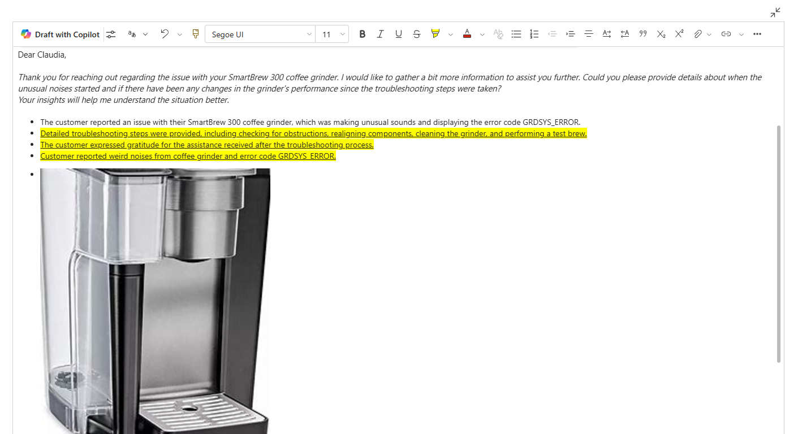
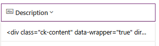

# Add the rich text editor control to a model-driven app

[!INCLUDE [cc-data-platform-banner](../../includes/cc-data-platform-banner.md)]

The rich text editor control provides the app user a WYSIWYG editing area for formatting text. The control's input and output format is HTML. The control allows copied rich text, such as from a web browser or Word, to be pasted into the control. 

Some of the format options available are:

- Bold, italic, underline, and strikethrough
- Text color, highlight color
- Font type and size
- Numbered lists and bulleted lists
- Hyperlinks
- Tables
- Images

For a full list of default options, see [Use the rich text editor toolbar](#use-the-rich-text-editor-toolbar).<br></br>


 

## Add or replace a text column for rich text editing

You can create a new text column and configure the control, or replace an existing text column. The rich text editor control can be used with single or multi-line text columns.

1. Sign in to Power Apps. Go to **Solutions**, open the solution that you want, open the table that you want, and then select the **Forms** tab. 
2. Select the form, and then select **Edit form**.
3. In the form designer on the command bar, select **Switch to classic**.
4. On the legacy form designer canvas, add or create a text column or select an existing text column, such as the account table **Description** column. On the **Home** tab, select **Change Properties**.
5. On the **Column Properties** page, select the **Controls** tab, and then select **Add control**.
6. Select **Rich Text Editor Control**, and then select **Add**.
7. Select **Web**, **Phone**, and **Tablet** if you want all client apps to have the ability to use rich text in the column. Then select **OK** to use the default rich text editor control configuration. If you want to change the rich text editor control configuration, see [Rich text editor control configuration options](#rich-text-editor-control-configuration-options).

    
8. Save and then publish the form.

## Rich text editor control configuration options

The rich text editor control comes with a rich set of configuration options that make it possible to customize its appearance, features, and behavior. To configure the rich text editor control, follow these steps:

1. Create a JSON file that includes the defaultSupportedProps structure and configuration with the changes you want. More information: [Sample rich text editor configurations](#sample-rich-text-editor-configurations) and [Rich text editor properties](#rich-text-editor-properties)
2. In Power Apps, create a Script(JScript) type web resource using the JSON file created in step 1. More information: [Create or edit model-driven app web resources to extend an app](create-edit-web-resources.md)
3. Open the **Column Properties** page for the text column with the rich text editor control, and then next to **RichTextEditorControl_URL** select **Edit**.
   > [!div class="mx-imgBorder"] 
   > 
4. Select **Bind to static value**, enter the relative URL to the JavaScript web resource in the box next to **SingleLine.URL**, and then select **OK**. The relative URL is located on the web resource definition.
5. Select **OK** to close the **Column Properties** page.
6. On the form editor command bar, select **Publish**.

## Best practices for using the rich text editor

Consider the following when using the rich text editor: 

- The best performance is achieved when the HTML content size is 1 MB or less. When your HTML content size exceeds 1 MB, you may notice slower response times for loading and editing content. By default, image content is referenced from the content HTML but isn't stored as part of the HTML content, so in the default configuration, images don't negatively impact performance. 

- Rich text fields will store HTML tags which are required for formatting along with user entered data. When setting the maximum size for your field, make sure to assign a large enough size for both the HTML tags and user-entered data. 

- By default, the rich text editor will upload images to the Azure Blob storage store and they won’t be stored as part of the field. Images will be stored in the same field as base64 when the submitter doesn’t have permissions to the msdyn_richtextfiles entity. Base64 content is extremely large, so you generally don't want to store images as base64. 

## Rich text editor properties

The JSON file is comprised of properties set as name and value pairs. There are two types of configurations: the defaultSupportedProps section, and individual configuration settings that provide various functionality. 

The defaultSupportedProps is a set of properties for the plugins, and includes support for all the the CKEditor configurations. For more information, see defaultSupportProps. The defaultSupportedProps isn’t limited to only plugin properties documented from CKEditor, but also allows you to set properties for additional plugins you add or create. For more information about plug-ins, see Use plug-ins to extend business processes. 

The individual configuration settings allow you to change how your editor behaves and functions.

### Visualization of the rich text editor configuration file

The following two images visually identify the two configuration sections. For the full configuration file, see [Use the webresource for organization-wide changes](#use-the-webresource-for-organization-wide-changes).

**defaultSupportedProps**

:::image type="content" source="media/defaultsupportedprops-visualization.png" alt-text="defaultsupportedprops configuration visualation.":::

**Individual configuration settings**

:::image type="content" source="media/individual-config-visualization.png" alt-text="Individual configuration settings visualization.":::


### defaultSupportedProps

You can configure all of the CKEditor-supported properties under this property. A few of the commonly used and custom configurations are described below. For complete documentation about CKEditor configurations, see [CKEditor.config](https://ckeditor.com/docs/ckeditor4/latest/api/CKEDITOR_config.html).

<table>
  <tr>
    <th>Attribute</th>
    <th>Description</th>
    <th>Default value</th>
  </tr>
  <tr>
<td>
  height
</td>

<td>

  Sets the initial height of the content editor. The default is 185 px.
</td>
<td>

  ```"height": 185```
</td>

</tr>
<tr>
<td>
  font_defaultLabel
</td>

<td>

  Sets the default label that is displayed in the toolbar for font style. The default is Segoe UI.
</td>
<td>

  ```"font_defaultLabel": "Segoe UI"```
</td>

</tr>

<tr>
<td>
  fontSize_defaultLabel
</td>

<td>

  Sets the default label that is displayed in the toolbar for font size. The default is 9.
</td>
<td>

  ```"fontSize_defaultLabel": "9"```
</td>

<tr>
<td>
  stickyStyle
</td>

<td>

  Sets the actual default font size and style. Additionally, you can include any other CSS properties you'd like to set as part of your default styling. <br></br> The stickyStyle plugin creates a wrapper around your content using the element specified by "stickyStyles_defaultTag", which is initially configured as "div".
</td>
<td>

  ```
  "stickyStyle": {
     "font-size": "9pt",
     "font-family": "'Segoe UI','Helvetica Neue',sans-serif"
}
  ```
</td>
<tr>
<td>
  toolbarLocation
</td>

<td>

  The location of the user interface where the toolbar will be rendered. Supported values are *top* and *bottom*. The default is bottom.
</td>
<td>

  ```"toolbarLocation": "bottom"```
</td>

<tr>
<td>
  toolbar
</td>

<td>

  A list of toolbar buttons that will be loaded.
</td>
<td>

  ```"toolbar":[["CopyFormatting"], ["Font"], ["FontSize"], ["Bold"], ["Italic"], ["Underline"], ["BGColor"], ["TextColor"], ["BulletedList"], ["NumberedList"], ["Outdent"], ["Indent"], ["Blockquote"], ["JustifyLeft"], ["JustifyCenter"], ["JustifyRight"], ["Link"], ["Unlink"], ["Subscript"], ["Superscript"], ["Strike"], ["Image"], ["BidiLtr"], ["BidiRtl"], ["Undo"], ["Redo"], ["RemoveFormat"], ["Table"]]```
  
</td>

<tr>
<td>
  plugins
</td>

<td>

  Comma-separated list of plug-ins to be used in an editor instance. Note that the actual plug-ins that are loaded might still be affected by two other settings: *extraPlugins* and *removePlugins*. <br></br> Updating this setting might remove the plug-ins from the toolbar. If you set this property to an empty string, the editor will load without the toolbar. <br></br> If you want to add one or more plug-ins to the toolbar, we recommend that you use *extraPlugins*. If you want to remove one or more from the default list, use *removePlugins*.     
</td>
<td>

  ```"plugins": "dialogui,dialog,about,a11yhelp,basicstyles,notification,button, toolbar,clipboard,panel,floatpanel,menu,contextmenu,resize,elementspath, enterkey,entities,popup,filetools,filebrowser,floatingspace,listblock, richcombo,format,horizontalrule,htmlwriter,wysiwygarea,image,indent, indentlist,fakeobjects,link,list,magicline,maximize,pastetext,pastefromword, removeformat,showborders,sourcearea,specialchar,menubutton,scayt, stylescombo,tab,table,tabletools,undo,lineutils,widgetselection,widget, notificationaggregator,uploadwidget,uploadimage,wsc"```
</td>
</tr>

<tr>
<td>
  extraPlugins
</td>

<td>

  A comma-separated list of additional plug-ins to be loaded. This setting makes it easier to add new plug-ins without touching the plugins setting. <br></br> There are many plug-ins that are required for other plug-ins to work. For example, the dialog plug-in is required for the link plug-in. The rich text editor automatically adds those, and you can't override them by updating this property. This setting will simply append new plug-ins to the previous list. <br></br> If you want to remove any of the presets, we recommend that you use the *removePlugins* property.
</td>
<td>

  ```"extraPlugins": "accessibilityhelp,autogrow,autolink,basicstyles,bidi, blockquote,button,collapser,colorbutton,colordialog,onfighelper, contextmenu,copyformatting,dialog,find,floatpanel,font,indentblock, justify,panel,panelbutton,pastefromword,quicktable,selectall, stickystyles,superimage,tableresize,tableselection,tabletools"```
</td>
</tr>

<tr>
<td>
  removePlugins
</td>

<td>

  A list of plug-ins that must not be loaded. This setting makes it possible to avoid loading some plug-ins defined in the plugins/extraPlugins setting without having to touch them.
  
</td>
<td>

  ```"removePlugins": "a11yhelp,codemirror,liststyle,magicline,scayt,showborders"```
</td>
</tr>

<tr>
<td>
  superimageImageMaxSize
</td>

<td>

  The maximum size in megabytes (MB) allowed for embedded images when using the superimage plugin. The default is 5.
</td>
<td>

  ```"superimageImageMaxSize": 5```
</td>

</tr>
</table>


### Individual configuration settings

You can configure additional configuration settings that affect how your editor functions.

<table>
  <tr>
    <th>Attribute</th>
    <th>Description</th>
    <th>Default value</th>
  </tr>
  <tr>
<td>
  disableContentSanitization
</td>

<td>

</td>
<td>

  ```"disableContentSanitization": false```
</td>

</tr>
<tr>
<td>
  disableDefaultImageProcessing
</td>

<td>

  By default, images will be uploaded using the client API. As soon as an image gets added to the editor, it will be uploaded to the platform. To process images, set this property to true.
</td>
<td>

  ```"disableDefaultImageProcessing": false```
</td>

</tr>

<tr>
<td>
  disableImages
</td>

<td>

  Setting this property to true will disable images. This property will have highest priority. This means that when this property is set to true, irrespective of the imageEntity property value, images will be disabled. By default, images are enabled.
</td>
<td>

  ```"disableImages": false```
</td>

<tr>
<td>
  externalPlugins
</td>

<td>

  By using this property, you can write your own plug-ins and use them in the rich text editor control.
  
</td>
<td>

No default value as this is how you can extend your functionality by adding additional plugins not originally provided.

Example:

```
  XMLCopy
"externalPlugins": [
    {
      "name": "<<Plugin Name>>",
      "path": "<<Plugin’s folder path>>”
    }
  ]
  ```
  
Example:

  ```
  "externalPlugins": [
    {
      "name": "EmbedMedia",
      "path": "http://mydomain.crm.dynamics.com/WebResources/msdyncrm_/myplugins/embedmedia/"
    }
  ]
  ```
  
</td>
<tr>
<td>
  imageEntity
</td>

<td>

  By setting this property, you can avoid using the default table for images so that you can enforce additional security if needed. <br></br>
  
 
  
  
</td>
<td>


 ```
  "imageEntity": {
	"imageEntityName": "<<name of the image table>>",
	"imageFileAttributeName": "<<attribute name of the blob reference>>"
}
  ```
  
  ```
  "imageEntity": {
	"imageEntityName": "msdyn_richtextfiles",
	"imageFileAttributeName": "msdyn_imageblob"
}
  ```
</td>

<tr>
<td>
  showAsTabControl
</td>

<td>

By setting this property, you can display additional commands above the editor window. 

Must be set to true to enable the following attributes:
- showFullScreenExpander
- showHtml
- showPreview
- showPreviewHeaderWarning

</td>
<td>

  ```"showAsTabControl": false```
  
</td>

<tr>
<td>
  showFullScreenExpander
</td>

<td>

  This property adds the full screen expand/collapse functionality, which allows you to expand and use the editor in full screen mode. <br></br>
  
  Depends on showAsTabControl set to true.
  
</td>
<td>

  ```"showFullScreenExpander": false```
</td>
</tr>

<tr>
<td>
  showHtml
</td>

<td>

This property adds the option to display and edit the html content directly. <br></br>

Depends on showAsTabControl set to true.

</td>
<td>

  ```"showHtml": false```
  
</td>
</tr>

<tr>
<td>
  showPreview
</td>

<td>

  This property adds the option to preview the editor content rendered as html. Previewing lets you see how your content will display if you share and render the content as HTML outside of the editor. <br></br>

Depends on showAsTabControl set to true.

  
</td>
<td>

  ```"showPreview": false```
</td>
</tr>

<tr>
<td>
  showPreviewHeaderWarning
</td>

<td>

  This property allows you to show/hide the warning message that is displayed when previewing content.<br></br>

Depends on showAsTabControl and showPreview set to true.

</td>
<td>

  ```"showPreviewHeaderWarning": false```
</td>

</tr>
</table>


## Sample rich text editor configurations

The following sample rich text editor configuration code sample data can be used to enable specific types of rich text experiences. For each sample, you create a JSON web resource. More information: [Rich text editor control configuration options](#rich-text-editor-control-configuration-options)

### Add the full screen expander

 ```
{ "showAsTabControl": true, "showFullScreenExpander": true }
 ```

:::image type="content" source="media/cke-screen-expander.png" alt-text="Screen expander control.":::

### Add the HTML source view tab

 ```
{ "showAsTabControl": true, "showHtml": true }
 ```

:::image type="content" source="media/cke-html-source.png" alt-text="HTML tab control.":::

### Add a simple toolbar with font size, bold, italic, underline, and highlight

 ```
 { "defaultSupportedProps": {"toolbar":[{ "items": ["FontSize", "Bold", "Italic", "Underline", "BGColor"]}]  }}
 ```

:::image type="content" source="media/cke-simple-editor.png" alt-text="Controls for a simple editor.":::

### Remove the toolbar to make a rich text rendering surface

 ```
{ "defaultSupportedProps": {"toolbar":[]  }}
 ```

:::image type="content" source="media/cke-no-toolbar.png" alt-text="No toolbar.":::

### Add a new font list and set Brush Script MT as the default font with a default size of 20 px

 ```
 { "defaultSupportedProps": {"font_names":"Brush Script MT/'Brush Script MT', cursive;Calibri/Calibri, Helvetica, sans-serif;Calibri Light/'Calibri Light', 'Helvetica Light', sans-serif;", "font_defaultLabel":"Brush Script MT", "fontSize_sizes":"8/8px;12/12px;20/20px;32/32px", "fontSize_defaultLabel":"20", "stickyStyle":{"font-size":"20px", "font-family":"'Brush Script MT', cursive"}  }}
 ```

:::image type="content" source="media/cke-default-font.png" alt-text="Set a new default font.":::

### Position the toolbar at the top of the rich text editor

 ```
 { "defaultSupportedProps": {"toolbarLocation":"top"  }}
 ```

:::image type="content" source="media/cke-toolbar-top.png" alt-text="Toolbar positioned at the top of the rich text editor.":::

### Start the editor at 30 px height and then auto-grow to fit content

 ```
 { "defaultSupportedProps": { "autoGrow_onStartup": false , "autoGrow_maxHeight": 0 , "autoGrow_minHeight": 30 , "height": 30  }}
 ```

:::image type="content" source="media/cke-autogrow.png" alt-text="Typing into the rich text area will increase it to fit the content.":::

### Fix the height of the editor at 500 px

 ```
 { "defaultSupportedProps": { "removePlugins":["autogrow"], "height": 500   }}
 ```

:::image type="content" source="media/cke-fixed-height.png" alt-text="With a fixed height, the editor remains at the same height. When enough content is added, a scroll bar appears.":::


## Create plain text surface that removes all html tag (except for the "br" tag)

`{ "defaultSupportedProps": {     "enterMode": 2 ,     "shiftEnterMode": 2 ,     "allowedContent":"*",     "disallowedContent":"*",     "forcePasteAsPlainText": true ,     "toolbar":[],     "removePlugins":"contextmenu,liststyle,openlink,tableresize,tableselection,tabletools"  },  "disableImages": true}}`

:::image type="content" source="media/rte-plain-text-surface.png" alt-text="Creating a plain text surface makes the strips html.":::

## Remove the context menu so right-clicking will work with the default browser spell check

Enabling this functionality removes the contextual right-click editing capability.

`{  "defaultSupportedProps": {     "removePlugins":"contextmenu,liststyle,openlink,tableresize,tableselection,tabletools"  }}`

:::image type="content" source="media/rte-right-click-config.png" alt-text="Remove the context menu so right-clicking will work with the default browser spell check.":::

## Use the webresource for organization-wide changes

The default RTE webresource is available with the display name RTEGlobalConfiguration.json. This configuration is used for all instances of the RTE control and can be used to make organization wide changes. This includes RTE used in timeline rich-text notes, knowledge management, and single and multi-line fields that are configured to use the RTE control.

```json
{
  "defaultSupportedProps": {
 
        "autoGrow_onStartup": true,
 
        "basicEntities": true,
 
        "browserContextMenuOnCtrl": true,
 
        "copyFormatting_allowRules": true,
 
        "customConfig": "",
 
        "dialog_backgroundCoverColor": "black",
 
        "disableNativeSpellChecker": false,
 
        "enterMode": 3,
 
        "extraPlugins": "accessibilityhelp,autogrow,autolink,basicstyles,bidi,blockquote,button,collapser,colorbutton,colordialog,confighelper,contextmenu,copyformatting,dialog,find,floatpanel,font,indentblock,justify,panel,panelbutton,pastefromword,quicktable,selectall,stickystyles,superimage,tableresize,tableselection,tabletools",
 
        "fillEmptyBlocks": true,
 
        "font_defaultLabel": "Segoe UI",
 
        "font_names": "Angsana New/'Angsana New', 'Leelawadee UI', Sathu, serif;Arial/Arial, Helvetica, sans-serif;Arial Black/'Arial Black', Arial, sans-serif;Calibri Light/'Calibri Light', 'Helvetica Light', sans-serif;Calibri/Calibri, Helvetica, sans-serif;Cambria/Cambria, Georgia, serif;Candara/Candara, Optima, sans-serif;Century Gothic/'Century Gothic', sans-serif;Comic Sans MS/'Comic Sans MS';Consolas/Consolas, Courier, monospace;Constantia/Constantia, 'Hoefler Text', serif;Corbel/Corbel, Skia, sans-serif;Cordia New/'Cordia New', 'Leelawadee UI', Silom, sans-serif;Courier New/'Courier New';DaunPenh/DaunPenh, 'Leelawadee UI', 'Khmer MN', sans-serif;Franklin Gothic Book/'Franklin Gothic Book', 'Avenir Next Condensed', sans-serif;Franklin Gothic Demi/'Franklin Gothic Demi', 'Avenir Next Condensed Demi Bold', sans-serif;Franklin Gothic Medium/'Franklin Gothic Medium', 'Avenir Next Condensed Medium', sans-serif;Garamond/Garamond, Georgia, serif;Gautami/Gautami, 'Nirmala UI', 'Telugu MN', sans-serif;Georgia/Georgia, serif;Impact/Impact, Charcoal, sans-serif;Iskoola Pota/'Iskoola Pota', 'Nirmala UI', 'Sinhala MN', sans-serif;Kalinga/Kalinga, 'Nirmala UI', 'Oriya MN', sans-serif;Kartika/Kartika, 'Nirmala UI', 'Malayalam MN', sans-serif;Latha/Latha, 'Nirmala UI', 'Tamil MN', sans-serif;Leelawadee UI/'Leelawadee UI', Thonburi, sans-serif;Lucida Console/'Lucida Console', Monaco, monospace;Lucida Handwriting/'Lucida Handwriting', 'Apple Chancery', cursive;Lucida Sans Unicode/'Lucida Sans Unicode';Mangal/Mangal, 'Nirmala UI', 'Devanagari Sangam MN', sans-serif;Nirmala UI/'Nirmala UI', sans-serif;Nyala/Nyala, Kefa, sans-serif;Palatino Linotype/'Palatino Linotype', 'Book Antiqua', Palatino, serif;Raavi/Raavi, 'Nirmala UI', 'Gurmukhi MN', sans-serif;Segoe UI/'Segoe UI', 'Helvetica Neue', sans-serif;Shruti/Shruti, 'Nirmala UI', 'Gujarati Sangam MN', sans-serif;Sitka Heading/'Sitka Heading', Cochin, serif;Sitka Text/'Sitka Text', Cochin, serif;Sylfaen/Sylfaen, Mshtakan, Menlo, serif;TW Cen MT/'TW Cen MT', 'Century Gothic', sans-serif;Tahoma/Tahoma, Geneva, sans-serif;Times New Roman/'Times New Roman', Times, serif;Times/Times, 'Times New Roman', serif;Trebuchet MS/'Trebuchet MS';Tunga/Tunga, 'Nirmala UI', 'Kannada MN', sans-serif;Verdana/Verdana, Geneva, sans-serif;Vrinda/Vrinda, 'Nirmala UI', 'Bangla MN', sans-serif;メイリオ/Meiryo, メイリオ, 'Hiragino Sans', sans-serif;仿宋/FangSong, 仿宋, STFangsong, serif;微軟正黑體/'Microsoft JhengHei', 微軟正黑體, 'Apple LiGothic', sans-serif;微软雅黑/'Microsoft YaHei', 微软雅黑, STHeiti, sans-serif;新宋体/NSimSun, 新宋体, SimSun, 宋体, SimSun-ExtB, 宋体-ExtB, STSong, serif;新細明體/PMingLiU, 新細明體, PMingLiU-ExtB, 新細明體-ExtB, 'Apple LiSung', serif;楷体/KaiTi, 楷体, STKaiti, serif;標楷體/DFKai-SB, 標楷體, BiauKai, serif;游ゴシック/'Yu Gothic', 游ゴシック, YuGothic, sans-serif;游明朝/'Yu Mincho', 游明朝, YuMincho, serif;隶书/SimLi, 隶书, 'Baoli SC', serif;黑体/SimHei, 黑体, STHeiti, sans-serif;굴림/Gulim, 굴림, 'Nanum Gothic', sans-serif;궁서/Gungsuh, 궁서, GungSeo, serif;돋움/Dotum, 돋움, AppleGothic, sans-serif;맑은 고딕/'Malgun Gothic', '맑은 고딕', AppleGothic, sans-serif;바탕/Batang, 바탕, AppleMyungjo, serif;바탕체/BatangChe, 바탕체, AppleMyungjo, serif;ＭＳ Ｐゴシック/'MS PGothic', 'ＭＳ Ｐゴシック', 'MS Gothic', 'ＭＳ ゴシック', 'Hiragino Kaku Gothic ProN', sans-serif;ＭＳ Ｐ明朝/'MS PMincho', 'ＭＳ Ｐ明朝', 'MS Mincho', 'ＭＳ 明朝', 'Hiragino Mincho ProN', serif",
 
        "fontSize_defaultLabel": "9",
 
        "fontSize_sizes": "8/8pt;9/9pt;10/10pt;11/11pt;12/12pt;14/14pt;16/16pt;18/18pt;20/20pt;22/22pt;24/24pt;26/26pt;28/28pt;36/36pt;48/48pt;72/72pt;",
 
        "height": 185,
 
        "keystrokes": [],
 
        "qtCellBorderColor": "rgb(171, 171, 171)",
 
        "qtCellBorderStyle": "solid",
 
        "qtCellBorderWidth": "1px",
 
        "qtCellPadding": "1",
 
        "qtCellSpacing": "0",
 
        "qtCellWith": "120px",
 
        "qtColumns": 8,
 
        "qtRows": 6,
 
        "qtStyle": {
 
            "border-collapse": "collapse",
 
            "font-size": "9pt"
 
        },
 
        "removeDialogTabs": "flash:Upload;link:upload",
 
        "removePlugins": "a11yhelp,codemirror,liststyle,magicline,scayt,showborders",
 
        "skin": "superowa",
 
        "stickyStyle": {
 
            "font-size": "9pt",
 
            "font-family": "'Segoe UI','Helvetica Neue',sans-serif"
 
        },
 
        "stickyStyles_defaultTag": "div",
 
        "superimageImageMaxSize": 5,
 
        "toolbarcollapser_enableResizer": true,
 
        "toolbarLocation": "bottom",
 
        "uploadRecordId": []
 
    },
 
    "disableContentSanitization": false,
 
    "disableDefaultImageProcessing": false,
 
    "disableImages": false,
 
    "imageEntity": {
 
        "imageEntityName": "msdyn_richtextfiles",
 
        "imageFileAttributeName": "msdyn_imageblob"
 
    },
 
    "showAsTabControl": false,
 
    "showFullScreenExpander": false,
 
    "showHtml": false,
 
    "showPreview": false,
 
    "showPreviewHeaderWarning": false}
}
``` 
## Find the current setting for a rich text editor configuration

1. In a Microsoft Edge or Google Chrome web browser, run your model-driven app and open a form that has the rich text editor control, such as an account row.
2. Hold down **Ctrl** while clicking the rich text editor control area, and then select **Inspect**.
3. In the inspection pane, select the **Console** tab, and then select the parent **Main.aspx** page in the drop-down list box on the command bar.

   :::image type="content" source="media/cke-select-parent-main.png" alt-text="Select the Console tab and then select the parent main.aspx page from the drop-down list box.":::

4. Select **Clear console** on the inspection pane command bar.

   :::image type="content" source="media/cke-clear-console.png" alt-text="Clear console command.":::

5. In the inspection pane console, enter **CKEDITOR.config.** to display the different configurations.

   :::image type="content" source="media/cke-configs.png" alt-text="List of CK Editor configurations.":::

6. Select a configuration, such as **autoGrow_minHeight**, to display the current setting.

## Use the rich text editor toolbar

The rich text editor toolbar provides features and functionality that allows you to work with rich text format in notes and email.    

### Formatting options
The following table describes the different formatting features and functionality options that are available in the rich text editor that you can use in notes and email. 

> [!Note]
> You can access your browser's context menu by selecting Ctrl + right-click. This is useful if you need to use your browser's built-in spellchecker. Otherwise, you can right-click to provide contextual formatting for any element you are using.


|Icon | Name | Shortcut key | Description |
|----------------------|-------------------------|-----------------------------|-----------------------------|
|| Format Painter | Ctrl+Shift+C, Ctrl+Shift+V | Apply the look of a particular section to another section. |
| | Font | Ctrl+Shift+F | Select your desired font. The default font is Segoe UI.<br /><br /> **Note**: When you select any formatted content, the font name for that content displays. If your selection contains multiple fonts, the topmost font name of your selection is displayed. |
| | Font size | Ctrl+Shift+P | Change the size of your text. The default size is 12.<br /><br /> **Note**: When you select any formatted content, the font size for that content displays. If your selection contains multiple font sizes, the topmost font name of your selection is displayed.|
|| Bold | Ctrl+B | Make your text bold. |
|| Italic | Ctrl+I | Italicize your text. |
|| Underline | Ctrl+U | Underline your text. |
|| Text Highlight Color |  | Make your text stand out by highlighting it in a bright color. |
|| Font Color |  | Change the color of your text. |
|| Bullets |  | Create a bulleted list. |
|| Numbering |  | Create a numbered list. |
|| Decrease Indent |  | Move your paragraph closer to the margin. |
|| Increase Indent |  | Move your paragraph farther away from the margin. |
|| Block Quote |  | Apply a block-level quotation format in your content. |
|| Align Left | Ctrl+L | Align your content with the left margin. (Commonly used for body text to make it easier to read.) |
|| Align Center | Ctrl+E | Center your content on the page. (Commonly used for a formal appearance.) |
|| Align Right | Ctrl+R | Align your content with the right margin. (Commonly used for a formal appearance.) |
|| Link |  | Create a link in your document for quick access to web pages and files.<br /><br />Pasted or typed URL text is converted into a link. For example, "http://myexample.com" will become "<a href="http://myexample.com">http://myexample.com</a>".<br /><br /> In the **Link** dialog box, choose the type of link you'd like to insert.<br /><br />The **Link Info** tab allows you to choose the link type as well as set the link protocol and URL.<br /><br />The **Target** tab is only available for the URL link type. It specifies the location where the link will open after you select it. |
|| Unlink |  | Delete a link in your email or document.<br /><br />When you place the cursor on a link, the **Unlink** button on the toolbar becomes active. Select the button to remove the link and make it plain text. |
|| Superscript |  | Type very small letters just above the line of text. |
|| Subscript |  | Type very small letters just below the line of text. |
|| Strikethrough |  | Cross out text by drawing a line through it. |
|| Insert Image|	|You can insert an image by directly copying and pasting it inline in the editor, dragging and dropping it from your desktop or local folder directly into the editor, or by typing a URL. The following formats are supported: .PNG, .JPG., or .GIF.<br /><br />To insert an image inline in your article: <br />1. Drag and drop the image or copy and paste it directly into the article. <br />2. Drag any corner of the image to resize it.<br /><br />To insert an image using a URL or navigating to the local image:<br />1. Choose Insert Image.<br />2. In the **Image** property dialog, choose from the following options:<br /><ul><li>Select **Browse** to navigate to the image on your computer.</li><li>Or specify the web address of the image, and properties to define how the image will appear in the email or article.</li><br />**Note:**<ul><li>If the image is located on the external server, use the full absolute path. </li><li>If the image is located on a local server, you can use a relative path. </li><li>If you want the image to be linked to a target, add a URL for the image.</li><li>You can also specify if you want the targeted page to open in a new window, topmost window, same window, or parent window.</li></ul>
|| Left to Right |  | Change the text to left-to-right for content such as a paragraph, header, table, or list. Commonly used for bi-directional language content. This is the default setting.|
|| Right to Left |  | Change the text to right-to-left for content such as a paragraph, header, table, or list. Commonly used for bi-directional language content. The default setting is left-to-right. |
|| Undo Typing |  | Undo changes you made to the content. |
|| Redo Typing |  | Redo changes you made to the content. |
|| Clear All Formatting |  | Remove all formatting from a selection of text, leaving only the normal, unformatted text. |
|| Add a Table |  | Add a table to your content. <br /><br />After adding a table, you can do any of the following:<br /><br /><ul><li>Resize table columns by clicking and dragging your mouse to resize to the columns to the desired width.</li><li>Select one or several cells within a table and apply specific formatting, add links to the selection, or cut, copy, or paste entire rows or columns.</li><li>Right-click to access the properties. This supports features such as cell type, width and height, word wrapping, alignment, merging and splitting cells horizontally and vertically, inserting or deleting rows and columns, row and column span, and cell and border color.</li></ul>|
|| Expand Toolbar |  | Displays when the toolbar is collapsed and not all options appear. Click to expand the toolbar and make all options visible. |

> [!Note]
> You can access your browser's context menu by pressing **Ctrl** + right-click. This is useful if you need to use your browser's built-in spell checker. Otherwise, you can use the right-click to provide contextual formatting for any element you might be using.

## Accessibility shortcuts

The following table outlines a list of accessibility shortcuts available when using the rich text editor control. You can access this list while composing content by pressing **Alt+0**.

|Type | Shortcut key | Description |
|----------------------|-------------------------|-----------------------------|
| General | Alt+F11 | Toggle full-screen view. |
| Tab navigation | Alt+Ctrl+0 | Go to editor toolbar. |
| Tab navigation | Alt+1 | Go to the rich-text editor. |
| Tab navigation | Alt+2 | Go to the HTML editor. |
| Tab navigation | Alt+3 | Go to the preview view. |
| General editor commands | Alt+- | Expand/Collapse the editor toolbar.
| General editor commands | Alt+F10 | Navigate to the editor toolbar. Move to the next and previous toolbar group with Tab and Shift+Tab. Move to the next and previous toolbar button with Right Arrow or Left Arrow. Press Space or Enter to activate the toolbar button. |
| General editor commands | See description. | Editor dialog: Inside a dialog, press Tab to navigate to the next dialog element, press Shift+Tab to move to the previous dialog element, press Enter to submit the dialog, press ESC to cancel the dialog. When a dialog has multiple tabs, the tab list can be reached either with Alt+F10 or with Tab, following the dialog tabbing order. With a tab list focused, move to the next and previous tab with Right and Left Arrow, respectively. |
| General editor commands | See description. | Editor list box: Inside a list box, move to next list item with Tab or Down Arrow. Move to previous list item with Shift+Tab or Up Arrow. Press Space or Enter to select the list option. Press ESC to close the list box. |
| Base commands | Ctrl+Z | Undo command. |
| Base commands | Shift+Ctrl+Z | Redo command. |
| Base commands | Ctrl+B | Bold command. |
| Base commands | Ctrl+I | Italic command. |
| Base commands | Ctrl+U | Underline command. |
| Base commands | Alt+0 | Accessibility help. |
| Base commands | Esc | Cancel operation. |


## Frequently asked questions

Q: Why are typed characters are slow to display?

A. Large content size can cause latency. For more information, see [Best practices for using the rich text editor](#best-practices-for-using-the-rich-text-editor). Spelling or grammar checks can also slow the typing performance.


## Known issues

- HTML markup is displayed for columns configured to use the rich text editor control that are displayed in components other than a column on a form. For example, this occurs in views, subgrids, paginated reports, and portals.
> [!div class="mx-imgBorder"] 
> 


### See also

[Create and edit columns for Microsoft Dataverse using Power Apps portal](../data-platform/create-edit-field-portal.md)


[!INCLUDE[footer-include](../../includes/footer-banner.md)]
