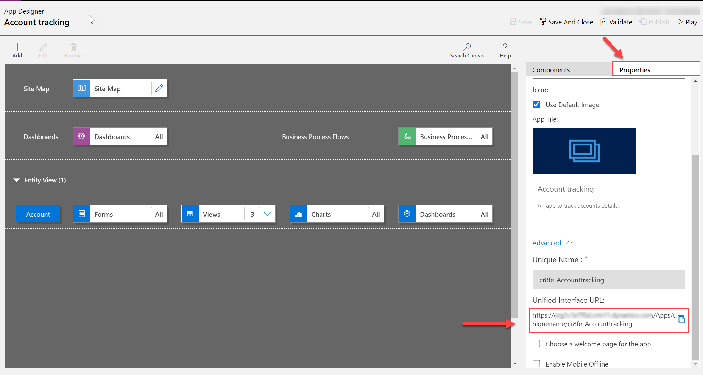

# How to run a model-driven app

[!INCLUDE [cc-data-platform-banner](../../includes/cc-data-platform-banner.md)]

## Running an app in a browser

To run an app the user you need to have a had a [security role](../model-driven-apps/model-driven-app-glossary.md#security-role) assigned to you in addition to having the URL for the app.

Learn how to create a [custom security role](../model-driven-apps/share-model-driven-app.md#create-a-custom-security-role)

To get the direct link to an app:

1. Go to make.powerapps.com
2. Select  the **environment** in which the app is located
3. Select Apps, or select the **solution** in which the App is located.
4. Select the three dots next to the app.
5. Select edit.  The classic app designer will open.
6. Select the **Properties** tab.
7. Scroll down until the **Unified Interface URL** is visible.
8. Copy the **Unified Interface URL**.
Paste the app URL in a location so that your users can access it, such as by posting it on a SharePoint site or send via email.
6. To play the app simply navigate the URL in a web browser.

## Running an app on a tablet or mobile

Whilst it is possible to use a URL to run a model-driven app on a mobile device or a tablet the broad guidance consists of downloading the app from the relevant app store, signing into the app using your credentials and then navigating to the specific app required.

[Run a model-driven app on a mobile device](/dynamics365/customerengagement/on-premises/basics/dynamics-365-phones-tablets-users-guide-onprem)

### See also

[Create and edit columns for Microsoft Dataverse using Power Apps portal](../data-platform/create-edit-field-portal.md)

[!INCLUDE[footer-include](../../includes/footer-banner.md)]
