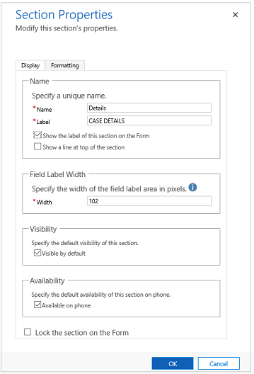

# Model-driven app form section properties

 A section in a form occupies the space available in a tab column. Sections have a label that can be displayed and a line may be shown below the label.  
  
 Sections can have up to 4 columns and includes options for displaying how labels for fields in the section are displayed.  
  
 Headers and footers are similar to sections but cannot be removed. If they don’t contain anything they will not be shown. 

You can access **Section properties** from the PowerApps site. 
1.  On the [PowerApps](https://web.powerapps.com/?utm_source=padocs&utm_medium=linkinadoc&utm_campaign=referralsfromdoc) site, select **Model-driven** (lower left of the navigation pane).  

     

2.  Expand **Data**, select **Entities**, select the entity that you want, and then select the **Forms** tab. 

3.  In the list of forms, open the form of type **Main**. Then double-click inside one of the sections to see the section properties. 

    
  
|Tab|Property|Description|  
|---------|--------------|-----------------|  
|**Display**|**Name**|**Required**: The unique name for the section that is used when referencing it in scripts. The name can contain only alphanumeric characters and underscores.|  
||**Label**|**Required**: The localizable label for the section visible to users.|  
||**Show the label of this section on the form**|Sections are frequently used without labels to control formatting of the fields within them.|  
||**Show a line at top of the section**|A line at the top of a section can help break up the form layout.|  
||**Field Label Width**|**Required**: Set a value between 50 and 250 to specify the space allowed for field labels.   Header and footer elements also have this property.|  
||**Visibility**|Showing the section is optional and can be controlled using scripts. More information: [Visibility options](visibility-options-legacy.md)|  
||**Availability**|Choose if you want the tab to be available on the phone.|  
||**Lock the section on the form**|This will prevent the section from accidentally being removed and prevents people from removing the contents.   Removing a section will not only remove the section, but also any fields within it.   Someone wanting to remove this section would need to change this setting before removing it.|  
|**Formatting**   Header and footer components also have this property.|**Layout**|Specify up to four columns to be in the section.|  
||**Field Label Alignment**|Labels for fields within the section can be aligned left, right, or center.|  
||**Field Label Position**|Labels for fields within the section can be positions on the side or on top of the fields.|  

A new type of section called **Reference panel** can also be added. A Reference panel is a single column section. You can insert sub-grids, quick view control, or a Knowledge Base Search control inside a reference panel section. Each control that you added in the reference panel appears as a vertical tab within the panel at the runtime. You can drag and drop the various controls within the Reference panel section. The default tab at runtime is the first control added in the reference panel. The other tabs appear in the order in which they are added in the form editor. To delete a tab, use the delete key on your keyboard.  
  
When you insert a reference panel, by default it’s added as a last section in the tab. You can add only one reference panel per form.  
  
> [!IMPORTANT]
>  By default, the reference panel section is locked in these standard forms: Cases, Accounts, and Contacts. To remove it or change it, you must unlock it. 

## Next steps

[Use the Main form and its components](use-main-form-and-components.md)
