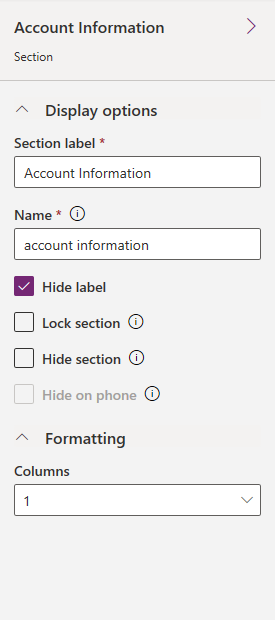

# Model-driven app form section properties

[!INCLUDE [cc-data-platform-banner](../../includes/cc-data-platform-banner.md)]

 A section in a form occupies the space available in a **tab column**. Sections have a label that can be displayed and a line may be shown below the label.  
  
 Sections can have up to 4 columns and includes options for displaying how labels for columns in the section are displayed.  
  
 Headers and footers are similar to sections but cannot be removed. If they don't contain anything then they will not be shown.

## Section properties in form designer

1.  Sign in to [Power Apps](https://make.powerapps.com/?utm_source=padocs&utm_medium=linkinadoc&utm_campaign=referralsfromdoc).  

2.  Expand **Data**, select **Tables**, select the table that you want, and then select the **Forms** tab. 

3.  In the list of forms, open a form of type **Main**. To open a form in another tab, select **More commands** , and then select **Edit form** > **Edit form in new tab**.

4.  Select one of the sections to see the section properties.

    > [!div class="mx-imgBorder"]
    > 

|Property|Description|  
|---------|--------------|  
|**Section label**|**Required**: The localizable label for the section visible to users.|  
|**Name**|**Required**: The unique name for the section that is used when referencing it in scripts. The name can contain only alphanumeric characters and underscores.|  
|**Hide label**|Sections are frequently used without labels to control formatting of the columns within them.|
|**Lock section**|This will prevent the section from accidentally being removed and prevents people from removing the contents.   Removing a section will not only remove the section, but also any columns within it.   Someone wanting to remove this section would need to change this setting before removing it.|  
|**Hide section**|Showing the section is optional and can be controlled using scripts. More information: [Visibility options](visibility-options-legacy.md)|  
|**Hide on phone**|Choose if you want the tab to be available on the phone.|  
|**Formatting**|Specify up to four columns to be in the section.|  

## Next steps

[Use the Main form and its components](use-main-form-and-components.md)

[!INCLUDE[footer-include](../../includes/footer-banner.md)]