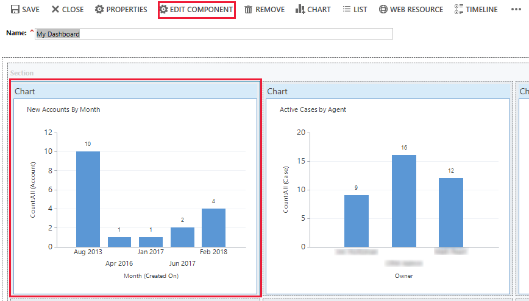
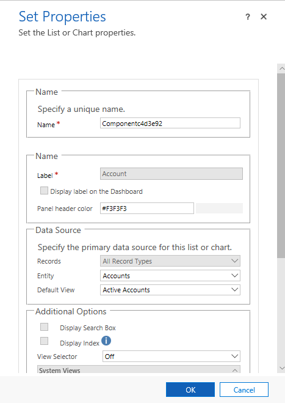

# Set properties for a model-driven app chart or list included in a dashboard

[!INCLUDE [cc-data-platform-banner](../../includes/cc-data-platform-banner.md)]

To edit a chart or list component from the dashboard designer, select the chart or list you want and then select Edit Component on the dashboard designer toolbar.   
  > [!div class="mx-imgBorder"] 
  > 

This opens the **Set Properties** dialog box.

  > [!div class="mx-imgBorder"] 
  >   
 
You can set the following chart properties from the **Set Properties** dialog box:  
  
- **Name**. Unique name for the chart. The system suggests a value, but you can change it.  
  
- **Label**. The label that appears at the top of the chart.  
  
- **Display label on the Dashboard**. Select or clear this check box to display or hide the chart label.  
  
- **Entity**. Select the table (row type) to base the chart on. This setting determines the available values for the Default View and Default Chart properties.  
  
- **Default View**. Select the view used to retrieve the data for the chart.  
  
- **Default Chart**. Select the default chart that you want to display when the dashboard is first opened. The available values are determined by the value set for the Table property. This property works together with the Display Chart Selection property. A user can change the type of chart if the **Display Chart Selection** option is turned on, but the chart will revert to Default Chart the next time the dashboard is opened.  
  
- **Show Chart Only**. Select this check box if you want to display just the chart. Clear this check box if you want to display the chart and its associated data.  
  
- **Display Chart Selection**. Select this check box to enable users to change the type of chart (column, bar, pie, etc.) when they use the dashboard. If the user changes the type of chart, the settings aren’t saved. The chart type reverts to the Default Chart setting when the dashboard is closed.  
  
You can set the following list properties from the **Set Properties** dialog box:  
  
- **Name**. Unique name for the list. The system suggests a value, but you can change it.  
  
- **Label**. The label that appears at the top of the list.  
  
- **Display label on the Dashboard**. Select or clear this check box to display or hide the list label.  
  
- **Table**. Select the table (row type) to base the list on. This setting determines the available values for the Default View property.  
  
- **Default View**. Select the view used to retrieve the data in the list. A user can change the view, but the list will revert to Default View the next time the dashboard is opened.  
  
- **Display Search Box**. Select this check box if you want to display a search box at the top of the list. If the search box is included, you or other users can search for rows in the list at runtime.  
  
- **Display Index**. Select this check box if you want to display the A to Z filters at the bottom of the list. When the A to Z filters are displayed, you or other users can select a letter to jump to rows that start with that letter.  
  
- **View Selector**. Select from the following values:  
  
    - **Off**. Don’t display the view selector. You or other users won’t be able to change views at runtime.  
  
    - **Show All Views**. Provide a full list of views associated with the value set in the Table property.  
  
    - **Show Selected Views**. Select this setting to limit the list of views available at runtime. To select the specific views to be displayed, hold down the Ctrl key and tap or select each view you want to include.  
 
## Next steps  
 [Create or customize dashboards](create-edit-dashboards.md)

[!INCLUDE[footer-include](../../includes/footer-banner.md)]