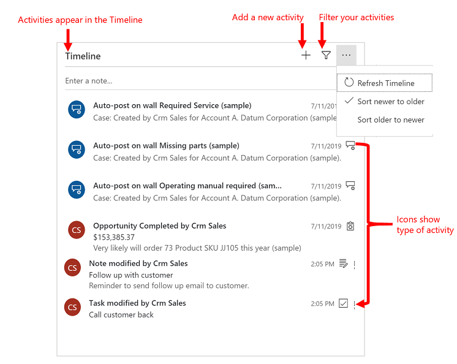
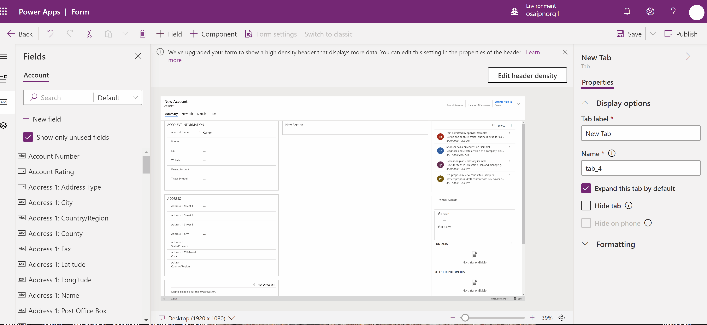
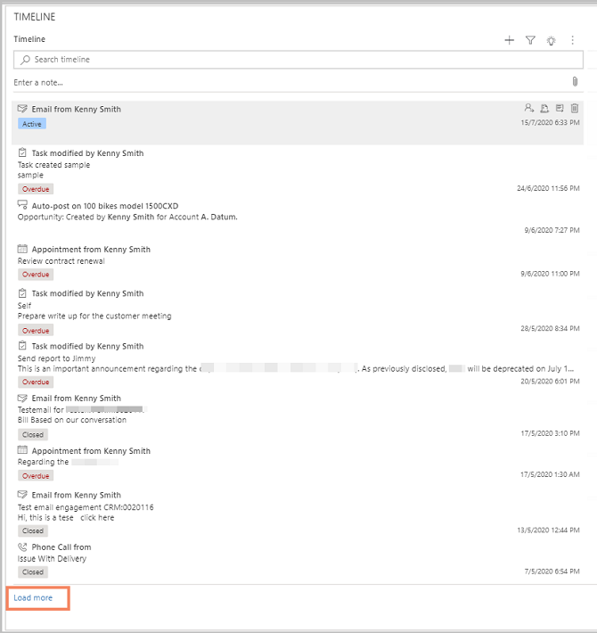
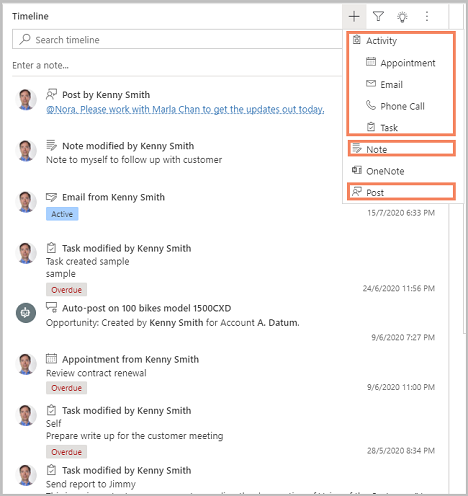
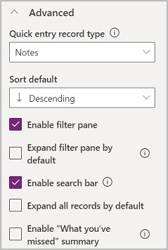
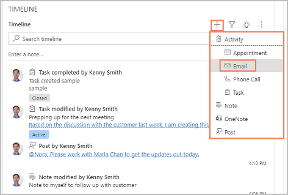
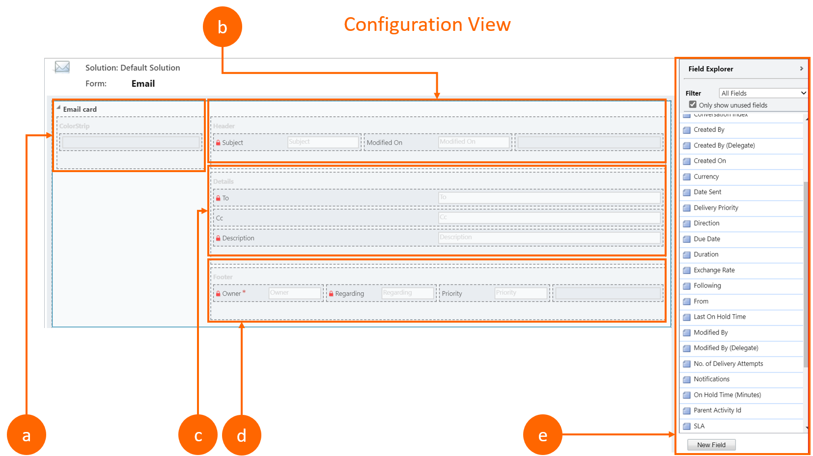
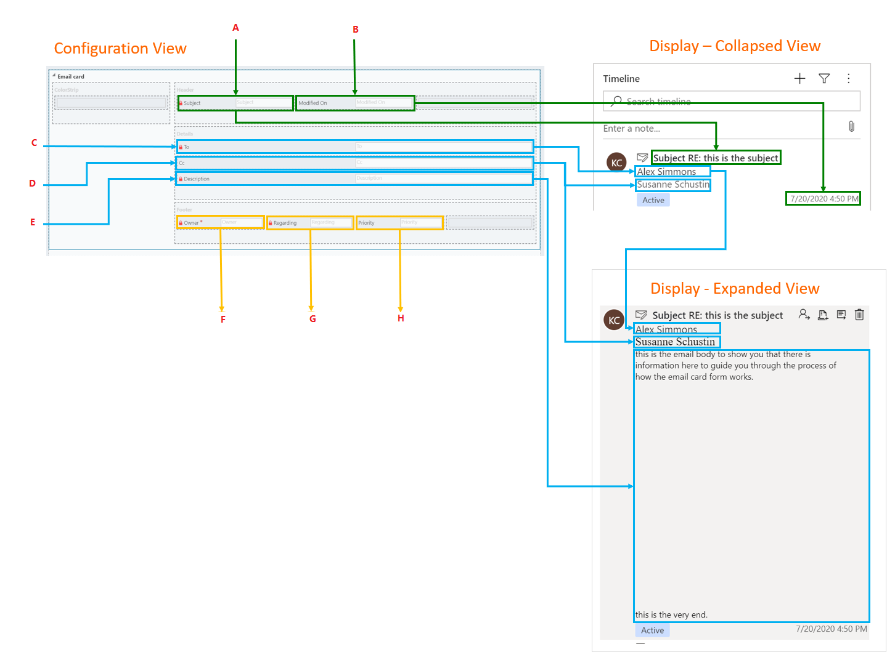
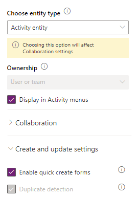
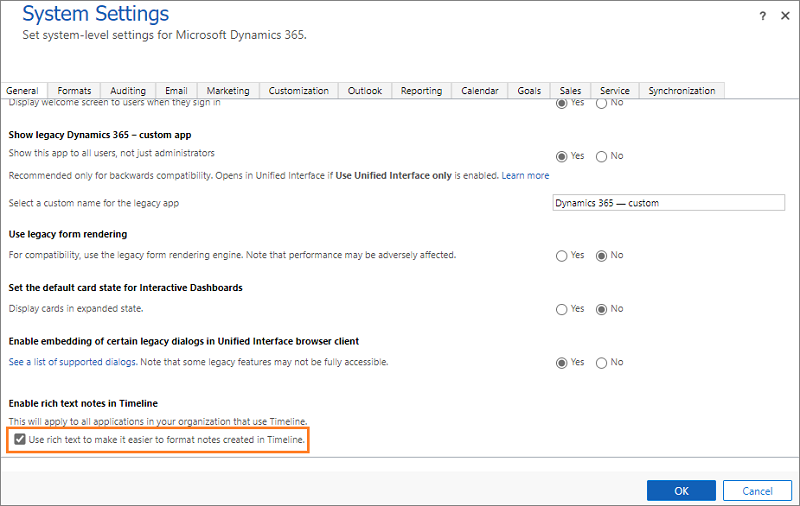

# Set up the timeline control

[!INCLUDE [cc-data-platform-banner](../../includes/cc-data-platform-banner.md)]

The timeline control provides an easy and immersive experience to view information related to a table, such as accounts or contacts, which gives users a better understanding and helps them deliver more personalized service in an efficient and effective manner.

This experience gives app makers the ability to configure the information displayed in each timeline to help users access information and create new activity rows, such as tasks and emails directly from the timeline quickly so they can deliver more personalized service.

  1. Search Records
  2. Take notes
  3. Add info and activities
  4. Filter
  5. More commands
  6. Activity status
  7. Activity icons
  8. Date and time

## Add the timeline control to a model-driven app main form

Timelines are located on forms within tables. By default, the account and contact standard table main forms already include a timeline control.

1. Sign in to [Power Apps](https://make.powerapps.com) and select your environment.
2. Select **Solutions**, and then open the solution that you want.
3. In the list of solution assets, select the table that you want, and then select the **Forms** tab where you want to add the timeline control. For example, select the **Account** table, and then select the **Forms** tab.
4. The **Forms** tab displays all the forms available for the table. Select the main form where you want to add a timeline control. Notice that, the timeline control can only be used with **Main** form types.
5. In the form editor, select **Components** on the command bar. Then, on the left navigation pane, scroll down to the **Timeline** control, and then drag and drop it to a section on the form.

    

6. Select **Save**, and then select **Publish**.

> [!Note] 
> - If the **Timeline** option is dimmed, it means it already exists on the form. You can only have one timeline per form.
> - Since the timeline control relies exclusively on underlying related data, when you add the timeline control, you'll always see the message **Almost there** in the timeline section. When you're creating or editing the form, there’s no underlying data, and therefore the area is blank.

## Configure properties of the timeline control

To configure the properties of the timeline control, in the form designer, select the timeline control inside the section. The properties appear in the right pane.

The timeline control can be configured and tailored to support specific business needs. The timeline form is composed of features and functionality you configure in the timeline control, which is then displayed in a model-driven app form at runtime.

The following sections describe how to configure display options, advanced settings, rows to show, and activity types to include.

### Display options 

- **Name**: Use this column to change the unique name of the timeline control. Changing this column doesn’t change the name displayed in the timeline at runtime. 

    This column has character limitations. For example, you can’t have spaces and you must use underscores (_).

- **Rows shown in page**: This column allows you to define the number of rows to show in the timeline section at runtime. If there are more rows than the number you define here, users will see an option to load more rows. By default, this column is set to 10.

  The following image shows the timeline at runtime when the **Rows shown on page** column is set to 10.

   

- **Row types shown**: Select which row types you want to show in the timeline. Users will also be able to create new rows of the row types you select here. You can select from: Activities and Notes. Both are selected by default.

    - **Activities**. There are multiple customizable activity types to support business needs. You can create, add, and display a number of different activity types under the **Activities** section of timeline properties.
      > [!IMPORTANT]
      > You only want to enable activities that you need on this form. When working with 10 or more **Activity types**, you will receive a warning that the number of activity types you have selected impacts the performance speed on the timeline. To improve timeline performance speed, consider limiting activity types to 10 or less. 
    - **Notes**. This allows users to capture notes related to the table row. Notes are typically used to grab thoughts, summary information, and provide feedback on a record—for example, a contact.

    > [!NOTE]
    > If you have a Dynamics 365 customer engagement app, such as Dynamics 365 Field Service installed, **Posts** will be another row type available. There are two types of posts, Auto and User.
    > - **Auto Posts**. These are system-generated and notify you of account activity that has occurred.
    > - **User Posts**. These are used to communicate with other users in your organization.

    The following image shows that because you selected **Activities**, **Notes**, and **Posts** in the **Row types to show** section of timeline properties, users will see an option to create these row types at runtime. The rows of these row types will also be shown in the timeline section at runtime.  

      
       
    The timeline shows an icon before the activity, note, post, and custom table making it easy for you to identify the row type. Dates and timestamps are shown for each activity, note, or post in the timeline. 

### Advanced section

Expand the **Advanced** section in the **Timeline** **Properties** for settings that span an activity or note, which are the primary row types that appear in the timeline section. This section is collapsed by default. When you enable or disable settings in the advanced section, you won't be able to see the changes at runtime until you save and publish your changes and refresh the form's web browser page in the app.

- **Quick entry row type**: Select the row type that you want to enable for quick create. For example, if **Notes** are selected in the drop-down list, users will see an option to quickly create a note from the timeline.

- **Sort default**: This setting controls the order of how the data must be sorted on the timeline. The default setting for this property is **Descending**.

- **Enable filter pane**: Define whether you want to enable filter options on the timeline. This setting is enabled by default.

    When the **Enable filter pane** check box is selected, a filter icon is shown on the timeline. More information: [Add an appointment, email, phone call, note, or task activity to the timeline](../../user/add-activities.md)

- **Expand filter pane**: This setting is used to display an expanded filter pane at the top of the timeline anytime a row is opened. This setting is disabled by default. The Expand filter pane feature provides quick access to filtering options for timeline rows. 

- **Enable search bar**: Define whether you want to enable or disable the search bar on the timeline. When you select this check box, a **Search timeline** box appears in the **Timeline** section allowing users to easily search for rows in the timeline. When you search for a phrase in the timeline, it searches in the title of the row or body and description columns of the row, and then displays the search results. This setting is enabled by default. More information: [Add an appointment, email, phone call, note, or task activity to the timeline](../../user/add-activities.md)

- **Expand all rows by default**: When this check box is selected, all rows in the timeline are shown in an expanded view. This option is disabled by default.

  > [!NOTE]
  > The rows in a timeline might contain images, but they won't display when the row is collapsed. Rows with images must be expanded to be viewed. Use the caret icons (˅ or ^) to expand or collapse a row. Rows with images will often display the message "The email has been blocked due to potentially harmful content. View full Email content." When you select this message, the warning goes away. If you don't see a message and still don't see the image displaying, see [FAQs for timeline control](faqs-timeline-control.md).

- **Enable "What you've missed" summary**: This setting lets users know there are new rows they haven't seen. The setting is disabled by default. To enable, select the check box. When enabled, a notification is displayed.

### Row settings section

The **Row settings** section allows you to define detailed settings for the row types that you selected in the **Row types to show** setting. For example, if you selected check boxes for **Activities** and **Notes** in the **Row types to show** section, the **Row settings** section will provide you with more settings related to those row types.

#### Configure activity row types

After you select **Activities** in the **Rows types to show** section, you can also select which type of activities, such as appointment, email, fax, and custom activities that you want to enable to be shown on the timeline.

1. Expand **Activities** under **Row settings**. A list of all the activity types that can be either enabled or disabled on the table form is shown.

2. Select the activity type that you want to enable—for example, select **Email**.  A fly-out menu appears.

3. Configure the following options:
    
    - **Enable**: To show the activity type in the fly-out menu that appears when you select **Create a timeline row** in the timeline section, select **Enable**. The activity type will appear as shown in the following image:

      
    
      The rows for this activity type will also be shown in the timeline.

      To prevent an activity type from appearing in the fly-out menu, clear the **Enable** check box. 

      > [!NOTE]
      > Additional settings for a row type are disabled until you enable the row type.  

    - **Enable status tags**: Status tags display in the timeline to help users to see at a glance whether an activity—for example, an email—is in the active, overdue, or closed state. Status tags are enabled by default.

    - **Create directly from timeline**: When you enable this setting, users can quickly create a row for this activity type from the timeline.

    - **Select form**: Rows are displayed using the default form for each activity type. However, for some activity type rows—for example, an appointment or email—you can either select the default form or a different card form if one is available.  
    
       You can't use the **Email card form** in the timeline unless you select and publish it first.

       > [!NOTE]
       > - Default is the only option available for activity types that do not support creating forms of type Form.
       > - If you create a new card form, you must go to the parent table and add the new form of type Card before it starts appearing in the configuration for timeline. If **Default** is displayed, you are not using the card form.

### Set date in the sort activities by feature in the timeline

How you view data is important and setting a default display view of your data varies based on the needs of your business. Makers can choose how data is sorted and create a default sort setting for **Activity types** in **Row settings**. **Last Updated** is on all activities, which is why it is set as the default in ascending order.

1. The **Sort activities by** feature in the **Activities row settings** allows you to control how data is sorted in the timeline.  
2. When you select the **Sort activities by** column, a list appears. You can select from this list how you want your data to be sorted and displayed on the timeline in the form.

    There are some unique date columns; for example:

    | Labels | Section | Description |
    |--------|---------|-------------|
    |a | **Date Sent** | This only occurs in email activities. If you sort by **Date Sent**, most activities will not contain a date sent and therefore will be grouped together without any ordering. |
    |b | **Sort Date** | You can't create a custom date column. If you create one, it will not display, so in answer to this, **Sort Date** was created. It does not have a value and therefore allows you to choose your own. It is empty by default. |

    > [!IMPORTANT]
    > - Sort date is intended for users to programmatically map each activity with a date of choice to have more control. It’s a customization option that allows you to sort activities any way you want by whatever date you want. You will have to populate each column and it requires that you update all activities to populate the **Sort date** with a value. However, after you complete the configuration, you have flexibility to sort any way you want.  
    > - Sort dates have to be configured for each timeline instance and setup must be completed in all three main forms for the account table in order to work.

### Set create activities using form type in the timeline

The **Create activities using** property allows you to choose which type of form you want to work in based on your business needs.  

- **Quick create form** if enabled, let's users create an activity row using a quick create form. There are some activities, such as email, that don't support quick create forms. For more information, see [Create or edit model-driven app quick create forms for a streamlined data entry experience](create-edit-quick-create-forms.md).

- **Main form** navigates you to the activity table main form. For more information, see [Create or edit a model-driven app main form for a table](create-edit-main-forms.md).

Select **Create activities using** to select either a **Quick create form** or **Main form**.

> [!NOTE]
> If a quick create form for an activity has not been created, then the main form will be used. If a quick create form is not supported, such as with email, the main form will always be used.

## Customize a card form in the timeline

All card forms are broken out into the following four sections:

| Labels | Section | Description |
|--------|---------|-------------|
|a | **ColorStrip** | This section does not appear on the timeline row. The **ColorStrip** is located on the left of the card form.|
|b | **Header** | This section is displayed on the timeline row; however, only the first two columns are displayed. For this example, only the **Subject** and **Modified On** columns are visible. |
|c | **Details** | This section is displayed on the timeline row; however, only the first three columns are displayed. For this example, only the **To**, **CC**, and **Description** columns are visible.|
| d | **Footer** | This section is not displayed on the timeline row. | 
| e | **Table Columns** | You can select which columns you want to add to your card form from the column options listed on the right.  You can customize your card form by dragging and dropping the columns you want to use into the sections you want that column to appear in on the timeline row. |

Each individual card form has to be customized for each activity row such as email, tasks, and so on.

**Header Section** 
This displays the title/subject in your timeline email form. You can have up to six columns in the **Header** section. Only the first two columns will be seen on the timeline row. Also, empty columns will be ignored by the form in all sections. 

<ol>
<b>a. Header - Column 1.</b> Regardless of the column you choose, it will appear as a bold header at the top of your timeline row. For this example we selected <b>Subject</b> for this column. 

**b.**	**Header - Column 2.** Again, regardless of the column you choose, this column appears in the bottom-right corner of the timeline row. For this example, we selected **Modified On** for this column.
</ol>

**Details Section**  
This displays in the body of the timeline email row. You can have up to four columns in the **Detail** section, but only the first three columns are seen on the timeline row.

<ol>
<b>c.	Details - Column 1.</b> As before, regardless of the column you choose, this column will always appear below the Header - Column 1 as a subheader on the timeline row. For this example we selected <b>To</b> for this column. 

**d.**	**Details - Column 2.** This column will display one line of text in a summary view on the timeline row. When you expand your timeline row, content in this column is fully displayed with format. In the diagram below, **CC** is selected for this column. 

**e.**	**Details - Column 3.** This column follows the content in Details - Column 2 and is part of the main body of your timeline row that is only viewable when you expand the row. For this example, **Description** is selected for this column.
</ol>

**Footer Section** 
This section is not visible on the timeline row.  

<ol>
<b>f.	Footer – Column 1.</b> For this example, we selected **Owner** for this column. 

**g.**	**Footer – Column 2.** For this example, we selected **Regarding** for this column. 

**h.**	**Footer – Column 3.** For this example, we selected **Priority** for this column.
</ol>

## Enable a custom activity in a timeline
When you create a custom table, you might want to show the custom table as an activity for your users in the timeline. 
1. To show the custom table as an activity, you need to enable these options when you create the table. 
   - Table type: **Activity table**
   - **Display in Activity menus**
   - **Enable quick create forms**
    
    

    More information: [Create a custom table](../data-platform/data-platform-create-entity.md)

2. Make sure the custom activity is enabled in the timeline properties. More information: [Configure activity row types](#configure-activity-row-types)

## Enable or disable rich-text editor for notes in timeline

Rich-text editor enables users to create rich and well-formatted content for the notes with emphasis. The editor brings common word processor features. To learn more, see [Take notes](/dynamics365/customer-service/customer-service-hub-user-guide-basics#take-a-note). 

The feature is enabled by default. If you want to disable and enable later for your users, follow the steps:

1.	Sign in to [Power Apps](https://make.powerapps.com) and select your environment.

2. Open a model-driven app, and then on the command bar select **Settings**  > **Administration** > **System Settings**.

3. In the **System Settings** dialog, under the **General** tab, scroll down and select or unselect the check box for the **Use rich text to make it easier to format notes created in Timeline.** column.

4. Select **OK**.

    > [!div class=mx-imgBorder] 
    > 

The rich-text editor is enabled or disabled for your users based on the check box selection.

## Use the timeline control in an app

For instructions about using the timeline control in a model-driven app, see [Add an appointment, email, phone call, note, or task activity to the timeline](../../user/add-activities.md).

### See also

[FAQs for timeline control](faqs-timeline-control.md) 

[!INCLUDE[footer-include](../../includes/footer-banner.md)]