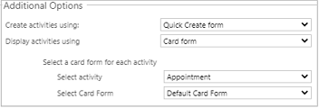
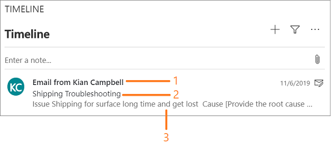
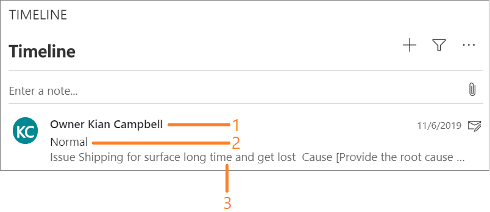

# Set up timeline section (control)

The activities in the Timeline that you use to keep track of all your communications with a customer or contact can be customized as per your business or organization requirements.

  > [!div class="mx-imgBorder"]
  >   

To learn more, see [Add an appointment, email, phone call, note, or task activity to the timeline](../../user/add-activities.md).

The customization is categorized into the following areas:

- Module
- Activity type
- Field

## Customize modules

The modules are Activities, Posts, and Notes. As a customizer, you can choose which modules you want to show to the users as per your business requirements.

1.	Sign in to your `https://<YourOrgURL>.dynamics.com/apps` environment.

2. Open a model-driven app, and then on the command bar select **Settings**  > **Advanced  Settings**.

3.	Go to **Settings** > **Customization** > **Customize the System**. The solution explorer page opens in a new browser window. 

4.	Expand **Entities** under **Components** in the default solution pane.

5.	Select an entity and select **Forms**. For example, select the Account entity.

6.	Select the **Account for Interactive experience** record that is of **Main** form type. The **Account Account for Interactive experience** form opens in a new browser window.

   > [!div class=mx-imgBorder] 
   > 

   For Unified Interface, you need to use the form name that has `<Entity> for Interactive experience`. The form names for other entities are as follows:

   | Entity | Name |
   |--------------------------|----------------------------------|
   | Account | Account for Interactive experience |
   | Case | Case for Interactive experience |
   | Contact | Contact for Interactive experience |

7.	Double-click the **Conversation Tabs** field in the **Timeline** section. The **Activities Tab Properties** dialog is displayed.

    > [!div class=mx-imgBorder] 
    >    

8.	Select **Show selected** option for the **Show these modules** field in the **Filter by** container.

9.	Select the modules you want to display to the users.

10.	Specify the following in the **Additional Options** container.

    | Field/option | Description | Value |
    |------------------------------------------|--------------------------------------------------------------|---------------------------|
    | Default Module for Create Experience | Select the module for which you want the default create experience in the timeline.    The default value is **Notes**.  | Notes |
    | Show filter pane | Select the checkbox if you want to display the filter icon for the users. If you leave the check box empty, then there will be no filters for the users. |  |
    | Expand filter pane by default | Select the checkbox, by default, if you want to show the filter pane in the expanded mode. |
    | Sort | Select the sorting order based on which the records are displayed on the timeline. The sorting is based on the field you choose for Activities. If a field doesn’t exist for the Post, Notes or activity then the sorting is done based on the **Last Updated** field.   The default sort order is **Descending**.  | Descending |
    | Number of results | The maximum number of records that are displayed on the timeline before selecting the **More** option. Each time you select the **More** option, timeline displays the configured number of records. You can configure a value ranging from 1 to 50.    The default value is **10**. | 10 |

    > [!div class=mx-imgBorder] 
    > 

11.	Select **OK**, and then select **Save**.

12.	Select **Publish** to publish the customizations.

## Customize activity

As a customizer, you can choose for which entities you want to show the activities to the users as per your business requirements.

1.	Sign in to your `https://<YourOrgURL>.dynamics.com/apps` environment.

2. Open a model-driven app, and then on the command bar select **Settings**  > **Advanced  Settings**.

3.	Go to **Settings** > **Customization** > **Customize the System**. The solution explorer page opens in a new browser window.  

4.	 Expand **Entities** under **Components** in the default solution pane.

5.	Select an entity and select **Forms**. For example, select the Account entity.

6.	Select the **Account for Interactive experience** record that is of **Main** form type. The **Account Account for Interactive experience** form opens in a new browser window.

    > [!div class=mx-imgBorder] 
    > 

    For Unified Interface, you need to use the form name that has `<Entity> for Interactive experience`. The form names for other entities are as follows:

    | Entity | Name |
    |--------------------------|----------------------------------|
    | Account | Account for Interactive experience |
    | Case | Case for Interactive experience |
    | Contact | Contact for Interactive experience |

7.	Double-click the **Conversation Tabs** field in the **Timeline** section. The **Activities Tab Properties** dialog is displayed.

    > [!div class=mx-imgBorder] 
    >  

8.	Select **Show selected** option for the **Show these activities** field in the **Filter by** container.

9.	Select the activities you want to display to the users.

10. Select an option from the list for the **Sort timeline by** option in the **Data** container. For example, select the **Last Updated** option.

11.	Specify the following in the **Additional Options** container.
    
    | Field/option | Description |Value |
    |------------------------------------------|------------------------------------------------------------|-------------------|
    | Display activity header using |  Possible values are **Default format** and **Field Labels**.    **Note:** <ul><li> If you select **Default format**, then you should always select **Default Fields** for the **Display activities using** field.    </li> <li> If you select **Field Labels**, then you can either select the **Default Fields** or **Card Form** for the **Display activities using** field.    </li> <li> When you select **Default format** and select **Card Form** for the **Display activities using** field, then the system ignores the **Card Form** value and uses the **Defaults Fields** to display the activities. </li> <ul>| Default format |
    | Create activities using | Select on how you want the users to create activities. Possible values are **Quick Create Form** and **Main Form**. | Quick Create Form |
    | Display activities using | Select how you want to display the activities. Possible values are **Default Fields** and **Card Form**.  If you select **Card Form**, then you need to select a card form for the activity.  | |
    | Select activity | Select an activity from the list.     **Note:** This field appears only when you select **Card Form** for the **Display activities using** field.| Email |
    | Select Card Form | Select a card form from the list.     **Note:** This field appears only when you select **Card Form** for the **Display activities using** field. | Email Card form |

    > [!div class=mx-imgBorder] 
    > 

12.	Select **OK**, and then select **Save**.

13.	Select **Publish** to publish the customizations.

Since, the example considered in this procedure is Account. Let us see the Email activity in the Timeline control of an account page.

   | Field | Value |
   |---------------------------|---------------------------|
   | Display activity header using | Default format |
   | Display activities using | Default fields |

   > [!div class=mx-imgBorder] 
   > 

   The default fields for an email activity in the collapsed mode contains the following:

   1. Email from \<Owner\>
   2. Subject
   3. Description

After modifying the **Email card** form (from the Email entity), and updating the options in the **Account for Interactive experience** form in the Account entity, you can view see the changes.

   | Field | Value |
   |---------------------------|---------------------------|
   | Display activity header using | Field labels |
   | Display activities using | Card form |
   | Select activity | Email |
   | Select card form | Email Card form |

   > [!div class=mx-imgBorder] 
   > 

   The default fields for an email activity in the collapsed mode contains the following:

   1. Owner \<Name\>
   2. Priority
   3. Description

## Customize field sections

In the timeline section, users see a card for each activity (based on the enabled activities). Each card displays certain fields in the collapsed and expanded mode. For example, see Task activity card in collapsed mode and expanded mode. 

Timeline card collapsed mode:

   > [!div class=mx-imgBorder] 
   > 

Timeline card expanded mode:

   > [!div class=mx-imgBorder] 
   > 

The card form contains sections that you can configure to show the fields that matter to your business.

In the card, if you want to show any fields that are important to your business, you can customize the fields. Also, you can move the fields from one section to another section, such as from the Header section to the Detail section. To learn more, see [Customize the card form](#customize-the-card-form).

### Customize the card form

The card form has the following sections:

   | Section annotation | Section name | Display columns |
   |------------------------------|--------------------------------------|---------------------------------------|
   | A | ColorStrip | ColorStrip section is never displayed to the user. |
   | B | Header | Fields 1 and 2 in from the two columns are displayed to the user. |
   | C | Details | Fields 3, 4, and 5 from the single column are displayed to the user. The field 5 is displayed only when the user expands the card. |
   | D | Footer | Four | Footer section is never displayed to the user. |

For example, see **Task Card form**.

**Task Card configuration screen**

   > [!div class=mx-imgBorder] 
   > 

**Timeline card collapsed mode**

Fields **1**, **2** from the **Header** section and fields **3** and **4** from the **Details** section are displayed in the collapsed mode.

   > [!div class=mx-imgBorder] 
   > 

**Timeline card expanded mode**

Field **5** from the **Details** section are displayed in the collapsed mode.

   > [!div class=mx-imgBorder] 
   > 

To customize the card form, follow these steps:

1. Sign in to your `https://<YourOrgURL>.dynamics.com/apps` environment.

2. Open a model-driven app, and then on the command bar select **Settings**  > **Advanced  Settings**.

3.	Go to **Settings** > **Customization** > **Customize the System**. The solution explorer page opens in a new browser window.  

4.	 Expand **Entities** under **Components** in the default solution pane.

5.	Select an entity and select **Forms**. For example, select the **Task** entity.

6.	Select the **Task Card form** record from the list. The **Task Card form** opens in a new browser window.

7. Add, move, or delete the fields. To learn more, see [Add, configure, move, or delete fields on a form](add-move-or-delete-fields-on-form.md).

8.	Select **OK**, and then select **Save**.

9.	Select **Publish** to publish the customizations.

## Enable custom activities in timeline for mobile client

When you’ve custom activities that you want to show for users using mobile, then you must enable it. Follow these steps to enable.

### Enable for mobile 

1.	Sign in to your `https://<YourOrgURL>.dynamics.com/apps` environment.

2. Open a model-driven app, and then on the command bar select **Settings**  > **Advanced  Settings**.

3.	Go to **Settings** > **Customization** > **Customize the System**. The solution explorer page opens in a new browser window.  

4.	 Expand **Entities** under **Components** in the default solution pane.

5.	Select an entity form the list. For example, Account.

6.	Scroll down to Outlook & Mobile section, and select the check box for the following options:

    -	Enable for mobile (according to your requirements)
    -	Read-only in mobile (according to your requirements)

7.	Select **Save**.

8.	Select **Publish** to publish the customizations.

### Select the modules to display

After you select **Enable for mobile** and **Read-only in mobile** options (as per your requirement) for an entity, you need to select the module to display in the timeline. Select **Show all** if you want to show all the modules or select **Show selected** if you want to show one or more modules as per your business requirement. If you select **Show selected**, choose the modules you want to display.
Follow the steps 1-8 described in the [Customize modules](#customize-modules) section, and then save and publish the customizations.

   > [!div class=mx-imgBorder] 
   > 

## See also

[FAQs for timeline control](faqs-timeline-control.md)

[Timeline section in the Customer Service Hub app](https://docs.microsoft.com/dynamics365/customer-service/customer-service-hub-user-guide-basics#timeline)