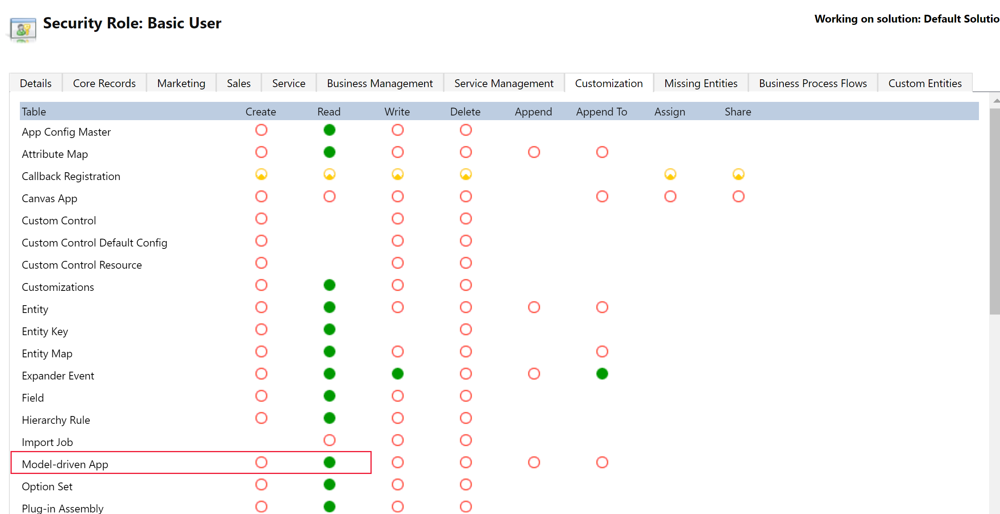

# Share a model-driven app using Power Apps

Model-driven apps use role-based security for sharing. The fundamental concept in role-based security is that a security role contains privileges that define a set of actions that can be performed on tables within the app. This approach means that while two people are able to use the app, one user might only be able to read records, or records that they themselves created. The other user might be able to see all records and have the rights to delete those records.

All app users must be assigned one or more predefined or custom security roles. Or, security roles can be assigned to teams. When a user or team is assigned to one of these roles, the person or team members are granted the set of privileges associated with that role.

The process for sharing a model-driven app is different from sharing a canvas app. Model-driven app sharing depends on how the Microsoft Dataverse data table privileges are assigned for the tables that are in the app.

## App sharing privilege and licensing requirements

There are a few key environment and licensing prerequisites required when sharing a model-driven app with a user.

- A Microsoft 365 user with Power Platform administrator rights or global admin rights must exist within the organization. [Learn how to assign Power Platform Administrator rights](/power-platform/admin/use-service-admin-role-manage-tenant).  This provides the user with administrator rights over all environments.
- The app sharer must have admin privileges to the specific environment (or be a Power Platform administrator). The app sharer must have a [security role](/power-platform/admin/security-roles-privileges) with equal or greater privileges than the security role they're assigning to the app and to other users. Usually, this takes the form of the app sharer having the Dataverse **System Administrator** or **System Customizer** security role.  These roles can be assigned by Power Platform administrators (who have rights over all Dataverse environments). The system administrator and system customizer security roles are standard roles that exist within all Dataverse environments.
- The user must exist as a user within the environment. It isn't enough to only be a Microsoft 365 user. This is because all users in an environment are accounted for and described within tables in the environment. [Learn how to add a user to an environment](/power-platform/admin/add-users-to-environment)
- The user must have the correct [license](/power-platform/admin/pricing-billing-skus) to be able to use the app. This may be assigned through a per app plan pass, a per user license, or a pay as you go license.

## Model-driven app sharing basics

Before you share an app, it's helpful to understand the following model-driven app sharing basics:
- The app must have at least one security role associated with it, such as **Basic User**. However, if your app has one or more custom tables, in order for users to work with your custom table's records, you must configure privileges to the custom tables in a security role. More information: [Create or edit a security role for your app](#create-or-edit-a-security-role-for-your-app)
- App users must be assigned a security role from the available roles. Alternatively, a team can be assigned a security role, and users can be made members of the team. A team can be an Owner, Access, Azure AD security group, or Microsoft 365 group. [Learn to manage a Dataverse team](/power-platform/admin/database-security).

## Assign security roles or people to a model-driven app

When you share a model-driven app, you can share it with all members of one or more security roles or a user or team.

1. Sign in to  the [Power Apps](https://make.powerapps.com/?utm_source=padocs&utm_medium=linkinadoc&utm_campaign=referralsfromdoc), on the left navigation pane select **Apps**, next to the app you want to share select **…**, and  then select **Share**.
1. From the **Share** *app name* pane, choose from the following options: 
   - Select the app, and then select the drop-down list to display all available security roles. Select the security roles you want from the security role dropdown list.
   :::image type="content" source="media/share-model-driven-app/assign-security-role-to-app.png" alt-text="Assign security roles to app":::

   > [!IMPORTANT]
   > If your app has one or more custom tables, in order for users to work with your custom table's records, you must configure privileges to the custom tables in a security role. More information: [Create or edit a security role for your app](#create-or-edit-a-security-role-for-your-app)
   - To assign an individual user or team, select the user name or team from the **People** list.
   :::image type="content" source="media/share-model-driven-app/share-user.png" alt-text="Assign specific users to a model-driven app":::
1. Select **Share**.

## Create or edit a security role for your app

Model-driven apps often contain custom tables and other custom configuration. It's important to first create a security role with the required level of privilege for all the components used in your app.

> [!NOTE]
> If your app contains custom tables that haven't had privileges assigned in a security role, you must do this for users to access those records in your app. However, you don't have to create a security role if existing roles grant access to the table data in your app.

### Create or configure a security role

Power Platform [!INCLUDE [powerapps](../../includes/powerapps.md)] environments with a Dataverse database include [predefined security roles](#about-predefined-security-roles) that reflect common user tasks with access levels defined to match the security best-practice goal of providing access to the minimum amount of business data required to use the app. The privileges in the standard security roles provide appropriate access to standard tables, such as account or contact.

Custom tables, or tables that are new to the environment, will not have any privileges associated with them, by default. The privileges for a custom table must be explicitly specified before users can work with it. To do this, you can choose to do one of the following.

- Copy an existing security role and edit the privileges accordingly. Copying is preferred to creating a security role from blank as there are a range of privileges that must be set to create a valid role that goes beyond setting privileges on specific tables. More information: [Copy a security role to create a new one](#copy-a-security-role-to-create-a-new-one)
- Create a new custom security role from scratch for the purpose of managing privileges for users of the app. Configure the new role for all tables in the app relevant for the user. More information: [Create a security role](/power-platform/admin/create-edit-security-role#create-a-security-role)
- Edit an existing predefined security role, such as **Basic User**, so that it includes privileges (to read, write, delete, and so on) for records based on the custom table. More information: [Edit a security role](/power-platform/admin/create-edit-security-role#edit-a-security-role)

> [!IMPORTANT]
> When you create a new security role from scratch, for users to run the model-driven app you must grant **Read** privilege with global scope for the **Model-driven App** privilege located on the **Customization** tab of the security role designer. Note that the Basic User security role already has this privilege.
> 
> Users granted **Read**, **Create**, and **Write** to the **Model-driven App** privilege have access to all apps in the environment, even when they're not part of any role that has access to the app.

For more information about access and scope privileges, see [Security roles](/dynamics365/customer-engagement/admin/security-roles-privileges#security-roles).

### Copy a security role to create a new one

The following steps describe how to create a new security role from a copy of an existing security role.

1. Sign in to  the [Power Apps](https://make.powerapps.com/?utm_source=padocs&utm_medium=linkinadoc&utm_campaign=referralsfromdoc), on the left navigation pane select **Apps**, next to the app you want to share select **…**, and  then select **Share**.

1. Select the app then expand the list of security roles.
1. Select **Manage Security Roles**.
   :::image type="content" source="media/share-model-driven-app/manage-security-roles.png" alt-text="Manage security roles link":::
1. A new browser tab opens that lists the security roles available in the environment. Select the security role you want to copy, such as **Basic User**.  Then select **More Actions** > **Copy Role**.

    :::image type="content" source="media/share-model-driven-app/copy-security-role.png" alt-text="Copy a Dataverse security role":::

1. Enter the role name, and then select **OK**.

    >[!Note]
    > If a new role is required, on the **All Roles** page select **New**.

1. The copied security role opens in the security role designer in a new browser window. From here you select the actions, such as read, write, or delete, and the scope for performing that action. Scope determines how deep or high within the environments hierarchy the user can perform a particular action.

   > [!TIP]
   > If the copied role doesn't open in the security role designer, make sure to disable your web browser pop-up blocker for the environment domain.

1. Select the **Custom Entities** tab, and then locate the custom table that you want. 

1. Select the privileges and scope you want for the custom table. This example shows the *Pet Schedulers* security role has been configured for organization wide read, write, and append privileges for the custom *Pet* table. For detailed information about each privilege and scope, go to: [Security roles and privileges](/power-platform/admin/security-roles-privileges)

   :::image type="content" source="media/share-model-driven-app/custom-security-role.png" alt-text="Custom security role example for a custom table":::

1. Select **Save and Close**.
1. Now that you have created a custom security role and configured the appropriate privileges, you assign users to the security role. More information: [Assign a security role to a user](/power-platform/admin/assign-security-roles)

### Add the security role to a solution

To ensure application lifecycle management, we recommend that you make custom security roles a part of a Power Platform solution.

To add a security role to your solution, follow these steps:
1. Go to [Power Apps](https://make.powerapps.com), and select the environment with the unmanaged solution.
1. Open the solution that requires the security role.
1. Select **Add existing** > **Security** > **Security Role**.
1. Select the newly created security role from the list provided.
1. Select **Add**.

This will ensure that the solution now contains the security role for import into other environments.

<!-- 
1. From the **Share Model-driven app** pane, under **Assign users to the security role** select **Security Users**.
1. In the list that is displayed, select the users who are pet groomers, and then on the command bar select **Manage Roles**.

1. Select **Manage security roles.**
    > [!div class="mx-imgBorder"]
    > 

1. On the **All Roles** page, select **Microsoft Dataverse user** then select **Actions** then **Copy Role.**

   > [!TIP]
   > You can also create a new blank role instead of copying an existing role.

6. In the Role Name box, provide a descriptive role such as *My custom app access*. Select **Ok.**

7. From the security role designer, you select the actions, such as read, write, or delete, and the [access levels](/power-platform/admin/security-roles-privileges#security-roles). Access levels determine how deep or high within the environments hierarchy the user can perform a particular action. 

8. Select the **Custom Tables** tab, and then locate the custom table used in your app.

9.  On the row for your custom table, set access levels for each privilege.  

10. Repeat for other tables used in your app.

11. Select the **Customization** tab, and ensure **Read** privilege is set for **Model-driven App** so that organization access level  is selected.

    > [!IMPORTANT]
    > Users granted **Read**, **Create**, and **Write** to the **Model-driven App** privilege have access to all apps in the environment, even when they're not part of any role that has access to the app.
    > 

12. Select **Save and Close**.   -->

<!--
1. Go to https://make.powerapps.com.
2. Select a model-driven app, and then select **Share**.
3. Select the app, and then choose a security role from the list. [Learn how to assign a security role to an app](#assign-a-security-role-to-a-model-driven-app)
    > [!div class="mx-imgBorder"]
    > 
4. Search for and select the user or team. Then select a security role from the list.
    > [!div class="mx-imgBorder"]
    > 
6. Select **Share**. -->

## Share the link to your app

Unlike sharing canvas apps, sharing model-driven apps doesn't currently send an email with a link to the app.

To get the direct link to an app:

1. Go to [Power Apps](https://make.powerapps.com).
1. Select **Solutions** from the left navigation pane, and then open the solution that contains the model-driven app.
1. Select the model-driven app, and then select **Edit** on the command bar.
1. In the classic designer, select the **Properties** tab, and then copy the **Unified Interface URL.**

    

1. Paste the app URL in a location so that your users can access it, such as by posting it on a SharePoint site or sending via email.

## About predefined security roles

These predefined roles are available with a [!INCLUDE [powerapps](../../includes/powerapps.md)] environment.

|Security role  |*Privileges  |Description |
|---------|---------|---------|
|Environment Maker     |  None       | Can create new resources associated with an environment including apps, connections, custom APIs, gateways, and flows using Power Automate. However, does not have any privileges to access data within an environment. More information: [Environments overview](https://powerapps.microsoft.com/blog/powerapps-environments/)        |
|System Administrator     |  Create, Read, Write, Delete, Customizations, Security Roles       | Has full permission to customize or administer the environment, including creating, modifying, and assigning security roles. Can view all data in the environment. More information: [Privileges required for customization](/dynamics365/customer-engagement/customize/privileges-required-customization)        |
|System Customizer     | Create (self), Read (self), Write (self), Delete (self), Customizations         | Has full permission to customize the environment. However, can only view records for environment tables that they create. More information: [Privileges required for customization](/dynamics365/customer-engagement/customize/privileges-required-customization)        |
|Basic User     |  Read, Create (self), write (self), delete (self)       | Can run an app within the environment and perform common tasks for the records that they own.        |
|Delegate     | Act on behalf of another user        | Allows code to run as another user or impersonate.  Typically used with another security role to allow access to records. More information: [Impersonate another user](/dynamics365/customer-engagement/developer/org-service/impersonate-another-user)        |

*Privilege is global scope unless specified otherwise.

## Use Azure Active Directory groups to manage access

Administrators can use their organization’s Azure Active Directory (Azure AD) groups to manage access rights for licensed Dataverse users. Both types of Azure AD groups—Microsoft 365 and Security—can be used to secure user-access rights to an app. More information: [About group teams](/power-platform/admin/manage-teams#about-group-teams)

### Next steps

[Discover more about creating users and assign security roles](/power-platform/admin/create-users-assign-online-security-roles)

[Run a model-driven app in a browser](../model-driven-apps/run-model-driven-app.md)

[Run a model-driven app on a mobile device](/dynamics365/customerengagement/on-premises/basics/dynamics-365-phones-tablets-users-guide-onprem)

[!INCLUDE[footer-include](../../includes/footer-banner.md)]