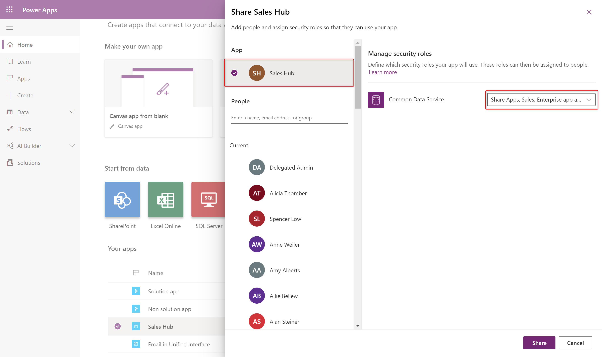
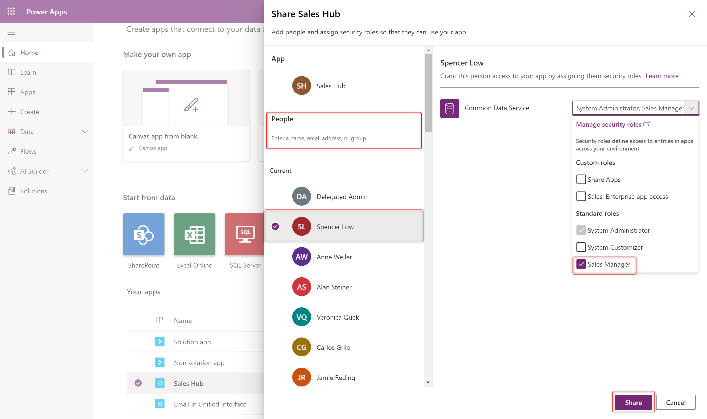
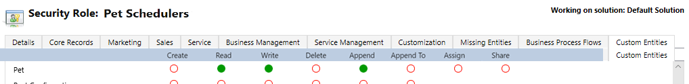
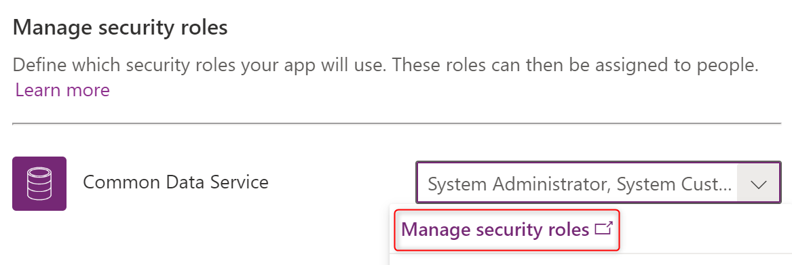
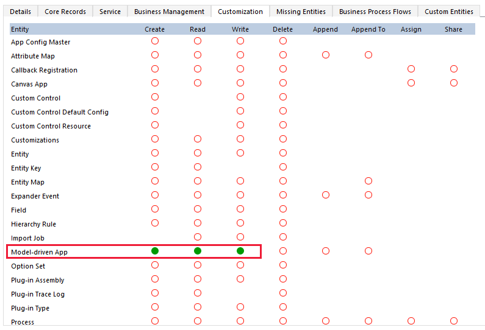

# Share a model-driven app using Power Apps

[!INCLUDE [cc-data-platform-banner](../../includes/cc-data-platform-banner.md)]

[!INCLUDE [powerapps](../../includes/powerapps.md)] apps use role-based security for sharing. The fundamental concept in role-based security is that a security role contains privileges that define a set of actions that can be performed within the app. All app users must be assigned to one or more predefined or custom roles. Or, roles can also be assigned to teams. When a user or team is assigned to one of these roles, the person or team members are granted the set of privileges associated with that role. 

## Prerequisites
Ensure you have a [security role](/power-platform/admin/security-roles-privileges) with equal or greater permissions than the role you're assigning to the app and to other users. 

## Create a security role for your app
Generally model-driven apps contain custom tables and other custom configuration. It's important to first create a security role with permission for all the components used in your app. More information: [Create a custom security role](#create-a-custom-security-role)
> [!NOTE]
> This step can be skipped if existing roles grant access to the data in your app. 

## Preview: Share a model-driven app 
Sharing a model-driven app involves two primary steps. First, associate a one or more security role(s) with the app then assign the security role(s) to users. 
1. Visit https://make.powerapps.com
2. Select a model-driven app and click **Share**.
3. Select the app then choose a security role from the list.
    > [!div class="mx-imgBorder"] 
    > 
4. Search for a user
5. Select the user then select a role from the list.
    > [!div class="mx-imgBorder"] 
    > 
6. Click **Share**.

### Share the link to your app
Unlike sharing canvas apps, sharing model-driven apps does not currently send an email with a link to the app.

To get the direct link to an app:
1. Edit the app and click the **Properties** tab
2. Copy the **Unified Interface URL.**
3. Paste the app URL in a location so that your users can access it, such as by posting it on a SharePoint site or send via email.

## Create or configure a security role
The [!INCLUDE [powerapps](../../includes/powerapps.md)] environment includes [predefined security roles](#about-predefined-security-roles) that reflect common user tasks with access levels defined to match the security best-practice goal of providing access to the minimum amount of business data required to use the app. For example, if your app is based on a custom table, the table privileges must be explicitly specified before users may work in it. To do this, you can choose to do one of the following.
- Expand an existing predefined security role, so that it includes privileges on rows based on the custom table. 
- Create a custom security role for the purpose of managing privileges for users of the app. 

For more information about access and scope privileges, see [Security roles](/dynamics365/customer-engagement/admin/security-roles-privileges#security-roles).

### Create a custom security role
1. On the [!INCLUDE [powerapps](../../includes/powerapps.md)] site select **Apps**, next to the app you want to share select **…**, and  then select **Share**.

2. Select the app then expand the list of security roles.

3. On the **All Roles** page, select **New**.  

4. From the security role designer, you select the actions, such as read, write, or delete, and the scope for performing that action. Scope determines how deep or high within the environments hierarchy the user can perform a particular action. In the **Role Name** box enter *Pet Grooming Technicians*.

5. Select the **Custom Tables** tab, and then locate the custom table that you want. For this example, the custom table named **Pet** is used. 

6. On the **Pet** row, select each of the following privileges four times until organization scope global  has been selected: **Read, Write, Append**

   > [!div class="mx-imgBorder"] 
   > 

7. Because the pet grooming app also has a relationship with the account table, select the **Core Rows** tab, and on the **Account** row select **Read** four times until organization scope global  has been selected. 

8. Select the **Customization** tab, and then in the privileges list select the **Read** privilege next to **Model-driven App** so that organization scope  is selected.

    > [!div class="mx-imgBorder"] 
    > 

9. Select **Save and Close**. 

10. On the security role designer, in the **Role Name** box enter *Pet Grooming Schedulers*. 

11. Select the **Custom Tables** tab, and then locate the **Pet** table. 

12. On the **Pet** row, select each of the following privileges four times until organization scope global  has been selected:
    **Create, Read, Write, Delete, Append, Append To, Assign, Share**

13. Because the pet grooming app also has a relationship with the account table and schedulers must be able to create and modify account rows, select the **Core Rows** tab, and on the **Account** row select each of the following privileges four times until organization scope global  has been selected. 
    **Create, Read, Write, Delete, Append, Append To, Assign, Share**

14. Select **Save and Close**.

### Assign security roles to users
Security roles control a user’s access to data through a set of access levels and permissions. The combination of access levels and permissions that are included in a specific security role sets limits on the user’s view of data and on the user’s interactions with that data.

#### Assign a security role to Pet Grooming Technicians
1. From the **Share this app** dialog, under **Assign users to the security role** select **Security Users**.
2. In the list that is displayed, select the users who are pet groomers, and then on the command bar select **Manage Roles**.

3. Click **Manage security roles.**
    > [!div class="mx-imgBorder"] 
    > 

4. On the **All Roles** page, select **Microsoft Dataverse user** then click **Actions** then **Copy Role.** 

> [!TIP]
> You may also create a new blank role instead of copying an existing role. 

6. In the **Role Name** box provide a descriptive role such as *My custom app access*.  Click **Ok.**

7. From the security role designer, you select the actions, such as read, write, or delete, and the [access levels](/power-platform/admin/security-roles-privileges#security-roles). Access levels determine how deep or high within the environments hierarchy the user can perform a particular action. 

8. Select the **Custom Tables** tab, and then locate the custom table used in your app. 

9.  On the row for your custom table, set access levels for each permission.  

10. Repeat for other tables used in your app. 

11. Select the **Customization** tab, and ensure **Read** privilege is set for **Model-driven App** so that organization access level  is selected.

    > [!IMPORTANT]
    > Users granted **Read**, **Create**, and **Write** to the **Model-driven App** privilege have access to all apps in the environment, even when they're not part of any role that has access to the app.
    > 

12. Select **Save and Close**. 

## About predefined security roles
These predefined roles are available with a [!INCLUDE [powerapps](../../includes/powerapps.md)] environment.

|Security role  |*Privileges  |Description |
|---------|---------|---------|
|Environment Maker     |  None       | Can create new resources associated with an environment including apps, connections, custom APIs, gateways, and flows using Power Automate. However, does not have any privileges to access data within an environment. More information: [Environments overview](https://powerapps.microsoft.com/blog/powerapps-environments/)        |
|System Administrator     |  Create, Read, Write, Delete, Customizations, Security Roles       | Has full permission to customize or administer the environment, including creating, modifying, and assigning security roles. Can view all data in the environment. More information: [Privileges required for customization](/dynamics365/customer-engagement/customize/privileges-required-customization)        |
|System Customizer     | Create (self), Read (self), Write (self), Delete (self), Customizations         | Has full permission to customize the environment. However, can only view rows for environment tables that they create. More information: [Privileges required for customization](/dynamics365/customer-engagement/customize/privileges-required-customization)        |
|Basic User     |  Read, Create (self), write (self), delete (self)       | Can run an app within the environment and perform common tasks for the rows that they own.        |
|Delegate     | Act on behalf of another user        | Allows code to run as another user or impersonate.  Typically used with another security role to allow access to rows. More information: [Impersonate another user](/dynamics365/customer-engagement/developer/org-service/impersonate-another-user)        |

*Privilege is global scope unless specified otherwise.

## Use Azure Active Directory groups to manage access
Administrators can use their organization’s Azure Active Directory (Azure AD) groups to manage access rights for licensed Dataverse users. Both types of Azure AD groups—Office and Security—can be used to secure user-access rights to an app. More information: [About group teams](/power-platform/admin/manage-teams#about-group-teams) 

### See also
[Run a model-driven app on a mobile device](/dynamics365/customerengagement/on-premises/basics/dynamics-365-phones-tablets-users-guide-onprem)

[Create users and assign security roles](/power-platform/admin/create-users-assign-online-security-roles)

[!INCLUDE[footer-include](../../includes/footer-banner.md)]