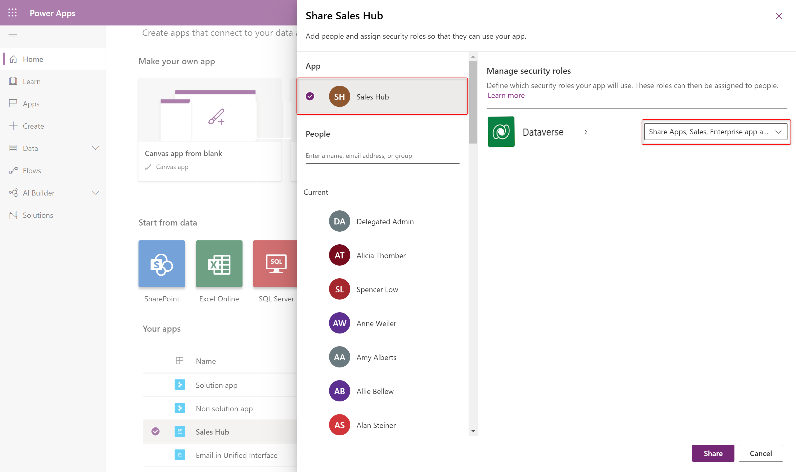

# Share a model-driven app using Power Apps

[!INCLUDE [cc-data-platform-banner](../../includes/cc-data-platform-banner.md)]

## Model-driven app sharing concepts

It is very easy to assume that the process of sharing model driven apps is the same as that of sharing canvas apps, however the way model-driven apps are shared is fundamentally tied to the sharing of the Dataverse data tables that underpin the app. 

Model-driven Power apps use **role-based security** for sharing. The fundamental concept in role-based security is that a security role contains privileges that define a set of actions that can be performed on tables within the app.  This approach means that whilst 2 people are able to use the app one might only be able to read records, or records that they themselves created, whilst another might be able to see all records and have the rights to delete those records.

This also has an impact on the user interface as users will

All app users must be assigned to one or more predefined or custom roles. Or, roles can also be assigned to teams. When a user or team is assigned to one of these roles, the person or team members are granted the set of privileges associated with that role.

## App sharing pre-requisites

There are a number of key gateways that must be observed when sharing a model-driven app to a user.

1. An office 365 user with **Power Platform Administrator rights** or global admin rights must exist within the organization. [Learn how to assign Power Platform Administrator rights](https://docs.microsoft.com/power-platform/admin/use-service-admin-role-manage-tenant).  This provides the user with administrator rights over **ALL** environments.
2. The app **sharer** must have admin rights on the specific **environment** (or be a Power Platform Administrator).  They effectively need to have a [security role](/power-platform/admin/security-roles-privileges) with equal or greater permissions than the role you're assigning to the app and to other users.  Usually this takes the form of the user being a Dataverse **System Administrator**, or **System Customizer**.   These roles can be assigned by Power Platform Administrators (who have rights over all Dataverse environments) noted in the previous step.  These roles are reserved roles that exist within all Dataverse enviroments.
3. The user must exist as a user within the environment.  It is not enough to simply be an office 365 user. This is because all users inside an environment are accounted for and described within tables in the environment. [Learn how to add a user to an environment](https://docs.microsoft.com/power-platform/admin/add-users-to-environment)
4. Security roles must exist that describe the create, read, write, update, share and delete permissions associated with the tables used in the app.  [Create or configure security role](share-model-driven-app.md#create-a-security-role-for-your-app)
5. The user must have the correct [license](https://docs.microsoft.com/power-platform/admin/pricing-billing-skus) to be able to use the app.  This may be through of a per app plan pass, a per user license or a pay as you go license.

## App sharing in the maker portal

Once the pre-requisites have been met the sharing process can then take place from within the app maker portal at https://make.powerapps.com and this consists of the following steps.

1. The app must have at lease one security role associated with it (e.g. Sales, Finance, HR).  This is established during the sharing process. [Learn how to assign a role to an app](#assign-a-security-role-to-a-model-driven-app)
1. The user(s) must be assigned a security role from the roles made available in the step above as part of the app sharing process. [Learn to assign an app security role to a user](#share-a-model-driven-app)
1. As an alternative a team can be also assigned a role, and the user can be made a member of the relevant team. In this context a team is an Owner, Access, Azure AD Security group, or Azure AD Office group. [Learn to manage a Dataverse team](https://docs.microsoft.com/power-platform/admin/database-security).

Once these are in place the app can be used by navigating to the app link.  [Learn how to find the app url](#share-the-link-to-your-app) 

## Create a security role for your app

Generally model-driven apps contain custom tables and other custom configuration. It is important to first create a security role with the required level of permission for all the components used in your app.

> [!NOTE]
> This step can be skipped if existing roles grant access to the data in your app.

### Create or configure a security role

The [!INCLUDE [powerapps](../../includes/powerapps.md)] environment includes [predefined security roles](#about-predefined-security-roles) that reflect common user tasks with access levels defined to match the security best-practice goal of providing access to the minimum amount of business data required to use the app. These will cover pre-configured tables such as Account or Contact.

Custom tables, tables that are new to the environment, will not have any permissions associated with them by default. The table privileges must be explicitly specified before users may work in it. To do this, you can choose to do one of the following.

- **Update** an existing predefined security role, such as **Basic User**, so that it includes privileges (to read, write delete etc) on rows based on the custom table.
- **Copy** an existing security role and **update** the privileges accordingly.  This is preferred to creating a security role from blank as there are a range of permissions that must be set to create a valid role that go beyond setting permissions on specific tables.
- Create a **new** custom security role for the purpose of managing privileges for users of the app and configure this for all tables relevant to the role.

For more information about access and scope privileges, see [Security roles](/dynamics365/customer-engagement/admin/security-roles-privileges#security-roles).

### Create a custom security role

1. On the [!INCLUDE [powerapps](../../includes/powerapps.md)] site select **Apps**, next to the app you want to share select **…**, and  then select **Share**.

2. Select the app then expand the list of security roles.
3. Select **Manage Security Roles**.  A new screen will open detailing the roles included in the environment.
4. Where the role is to be copied and edited (recommended approach) select the role, such as **Basic User**.  More Actions, Copy Role...

    :::image type="content" source="media/share-model-driven-app/copy-security-role.png" alt-text="Copy a dataverse security role":::

5. Give the role a name.

    >[!Note]
    > Where a new role is required on the **All Roles** page, select **New**.

6. From the security role designer, you select the actions, such as read, write, or delete, and the scope for performing that action. Scope determines how deep or high within the environments hierarchy the user can perform a particular action.

7. Select the **Custom Entities** tab (Note that entities are the same as tables), and then locate the custom table that you want. For this example, the custom table named **Pet** is used.

8. On the **Pet** row, select each of the following privileges four times until organization scope global  has been selected: **Read, Write, Append**

   > [!div class="mx-imgBorder"]
   > 

9.  Because the pet grooming app also has a relationship with the account table, select the **Core Rows** tab, and on the **Account** row select **Read** four times until organization scope global  has been selected.

10. Select the **Customization** tab, and then in the privileges list select the **Read** privilege next to **Model-driven App** so that organization scope  is selected.

    > [!div class="mx-imgBorder"]
    > 

11. Select **Save and Close**.

12. On the security role designer, in the **Role Name** box enter *Pet Grooming Schedulers*.

13. Select the **Custom Entities** tab, and then locate the **Pet** Entity.  

14. On the **Pet** row, select each of the following privileges four times until organization scope global  has been selected:
    **Create, Read, Write, Delete, Append, Append To, Assign, Share**

15. Because the pet grooming app also has a relationship with the account table and schedulers must be able to create and modify account rows, select the **Core Rows** tab, and on the **Account** row select each of the following privileges four times until organization scope global  has been selected. 
    **Create, Read, Write, Delete, Append, Append To, Assign, Share**

16. Select **Save and Close**.

## Assign a security role to a model-driven app

1. From the **Share this app** dialog, under **Assign users to the security role** select **Security Users**.
2. In the list that is displayed, select the users who are pet groomers, and then on the command bar select **Manage Roles**.

3. Click **Manage security roles.**
    > [!div class="mx-imgBorder"]
    > 

4. On the **All Roles** page, select **Microsoft Dataverse user** then click **Actions** then **Copy Role.**

> [!TIP]
> You may also create a new blank role instead of copying an existing role.

6. In the **Role Name** box provide a descriptive role such as *My custom app access*.  Click **Ok.**

7. From the security role designer, you select the actions, such as read, write, or delete, and the [access levels](/power-platform/admin/security-roles-privileges#security-roles). Access levels determine how deep or high within the environments hierarchy the user can perform a particular action. 

8. Select the **Custom Tables** tab, and then locate the custom table used in your app.

9.  On the row for your custom table, set access levels for each permission.  

10. Repeat for other tables used in your app.

11. Select the **Customization** tab, and ensure **Read** privilege is set for **Model-driven App** so that organization access level  is selected.

    > [!IMPORTANT]
    > Users granted **Read**, **Create**, and **Write** to the **Model-driven App** privilege have access to all apps in the environment, even when they're not part of any role that has access to the app.
    > 

12. Select **Save and Close**.

## Share a model-driven app

Once a model-driven app has had at least one [security role](model-driven-app-glossary.md#security-role) associated with it then the app can be shared with them using this role.

1. Visit https://make.powerapps.com
2. Select a model-driven app and click **Share**.
3. Select the app then choose a security role from the list.
    > [!div class="mx-imgBorder"]
    > 
4. Search for a user
5. Select the user then select a role from the list.
    > [!div class="mx-imgBorder"]
    > 
6. Click **Share**.

## Share the link to your app

Unlike sharing canvas apps, sharing model-driven apps does not currently send an email with a link to the app.

To get the direct link to an app:

1. Navigate to make.powerapps.com
2. Navigate to the solutions pane.
3. Locate the model driven app.
4. Edit the app and click the **Properties** tab
5. Copy the **Unified Interface URL.**
6. Paste the app URL in a location so that your users can access it, such as by posting it on a SharePoint site or send via email.

## Including the security role into a solution

To ensure good application life-cycle management it is generally preferred to make security roles a part of the Power Platform solution.

To introduce a security role into your solution follow these steps :-
1. Navigate to make.powerapps.com
2. Select the environment with the unmanaged solution.
3. Identify th solution that requires the security role.
4. Select **Add existing** from the top menu.
5. Select **Security**->**Security Role**.
6. Select the newly created security role from the list provided.
7. Select **Add**.

This will ensure that the solution now contains the security role when it is moved between environments.

## About predefined security roles

These predefined roles are available with a [!INCLUDE [powerapps](../../includes/powerapps.md)] environment.  This helps us to put the security roles into context, and understand the most important ones out of the many available.

|Security role  |*Privileges  |Description |
|---------|---------|---------|
|Environment Maker     |  None       | Can create new resources associated with an environment including apps, connections, custom APIs, gateways, and flows using Power Automate. However, does not have any privileges to access data within an environment. More information: [Environments overview](https://powerapps.microsoft.com/blog/powerapps-environments/)        |
|System Administrator     |  Create, Read, Write, Delete, Customizations, Security Roles       | Has full permission to customize or administer the environment, including creating, modifying, and assigning security roles. Can view all data in the environment. More information: [Privileges required for customization](/dynamics365/customer-engagement/customize/privileges-required-customization)        |
|System Customizer     | Create (self), Read (self), Write (self), Delete (self), Customizations         | Has full permission to customize the environment. However, can only view rows for environment tables that they create. More information: [Privileges required for customization](/dynamics365/customer-engagement/customize/privileges-required-customization)        |
|Basic User     |  Read, Create (self), write (self), delete (self)       | Can run an app within the environment and perform common tasks for the rows that they own.        |
|Delegate     | Act on behalf of another user        | Allows code to run as another user or impersonate.  Typically used with another security role to allow access to rows. More information: [Impersonate another user](/dynamics365/customer-engagement/developer/org-service/impersonate-another-user)        |

*Privilege is global scope unless specified otherwise.

## Use Azure Active Directory groups to manage access

Administrators can use their organization’s Azure Active Directory (Azure AD) groups to manage access rights for licensed Dataverse users. Both types of Azure AD groups—Office and Security—can be used to secure user-access rights to an app. More information: [About group teams](/power-platform/admin/manage-teams#about-group-teams)

### Next steps

[Discover more about creating users and assign security roles](/power-platform/admin/create-users-assign-online-security-roles)

[Run a model-driven app in a browser](../model-driven-apps/run-model-driven-app.md)

[Run a model-driven app on a mobile device](/dynamics365/customerengagement/on-premises/basics/dynamics-365-phones-tablets-users-guide-onprem)

[!INCLUDE[footer-include](../../includes/footer-banner.md)]