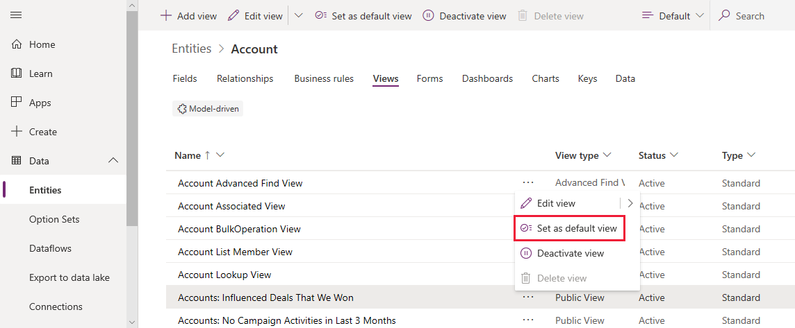
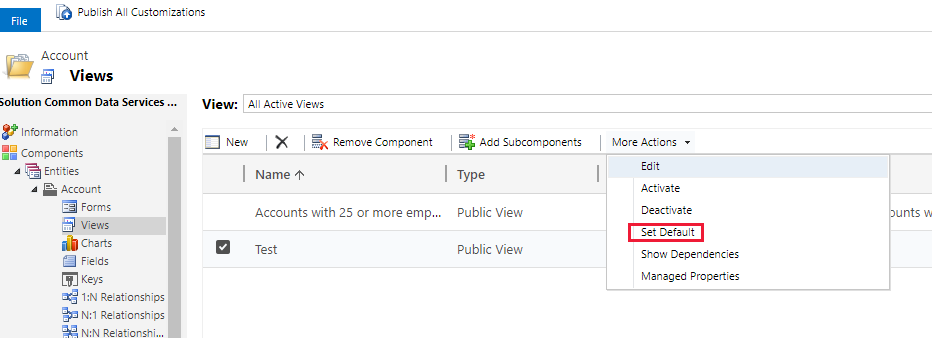

# Specify a model-driven app default view

[!INCLUDE [cc-data-platform-banner](../../includes/cc-data-platform-banner.md)]

   

Unless someone has 'pinned' a different view in your app as their personal default, they will see the default view specified by the  the app maker. Any of the public views can be set as the default view for a table.  
  
1.  Sign in to [Power Apps](https://make.powerapps.com/?utm_source=padocs&utm_medium=linkinadoc&utm_campaign=referralsfromdoc).  

2.  Select the **Solution** relevant to the table in the left hand menu.
3.  Select the required **Table** and then select the **Views** tab.

4.  Select **More commands**  next to the view required, and then select **Set as default view**. This can also be set on the menu bar.

    > [!div class="mx-imgBorder"] 
    > 

## Set the default view for a table in solution explorer
  
1.  Open [solution explorer](advanced-navigation.md#solution-explorer), expand **Entities**, select relevant table, and then select **Views**.
  
2.  Select one of the public views.  
  
3.  On the menu bar, select **More Actions** > **Set Default**.  

    > [!div class="mx-imgBorder"] 
    > 
  
4.  On the solution explorer toolbar, select **Publish All Customizations**.  

## Next steps
[Understand views](create-edit-views.md)

[!INCLUDE[footer-include](../../includes/footer-banner.md)]