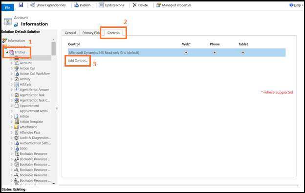
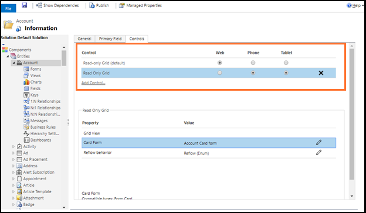
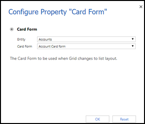
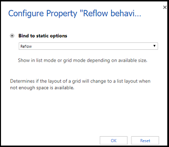

# Specify read only grid properties

Model-driven apps use responsive design principles to provide an optimal viewing and interaction experience for any screen size or orientation. As the size of the screen or the container decreases—for example, on phones and smaller viewports—the grid is transformed into a list.

The Read Only Grid control specifies how a grid should respond to different screen sizes. As an app maker working with a model-driven app, you can configure the Read Only Grid control and its properties for custom grids and lists.

- **Card Form** property: Use a card form for lists instead of the default list template. Card forms provide more information for list items than the default list template.
- **Reflow behavior** property: Use this parameter to specify a grid to reflow in to a list or not.

## Allow grid to reflow into list

Configure the following features after you add the Read Only Grid control to a table:

- Allow a grid to reflow into a list on small displays such as mobile.
- Specify the rendering mode as grid-only or list-only.  

1. Go to [Power Apps](https://make.powerapps.com)

1. Select **Tables** on the left navigation pane. Alternatively, select **Solutions**, and then open the [solution](model-driven-app-glossary.md#solution). [!INCLUDE [left-navigation-pane](../../includes/left-navigation-pane.md)]
1. Open the table, such as **Account**.

1. Select the **Forms** area, and select the form that you want to edit.
1. Select **Switch to classic**. The classic form editor opens as a new tab in your browser. (You may need to select **...** before selecting **Switch to classic**.)

1. In the navigation pane expand **Entities**, select the table (such as **Account** or **Contact**), and then on the **Controls** tab, select **Add Control**.

    

1. Select **Read Only Grid** from the list of controls, and then choose **Add**.

    The control is added to the list of available controls.

    

1. Select the devices (**Web**, **Phone**, or **Tablet**) for which you want to make the grid read-only.

    

1. Configure the **Card Form** property.

    You can use the Card Form property to show list items instead of the default list template. Card forms provide more information for list items than the default list template does.

    a. Choose the pencil icon next to **Card Form**.

    

    b.	Select the **Entity** and **Card Form** types.

    

    c. Choose **OK**.
1. Configure the **Reflow behavior** property.

    a. Choose the pencil icon next to **Reflow behavior**.

    

    b. Select the grid flow type from **Bind to static options** drop down.

    |Flow Type|Description|
    |--------------|--------------------|
    |**Reflow**|Allows the grid to render into list mode depending when there is not enough display space.|
    |**Grid Only**|Restricts the grid to reflow into list even when there is not enough display space.|
    |**List Only**|Displays only as a list even when there is enough space to display as grid.|

     

    c. Choose **OK**.

1.	Save and publish the changes.

## Conditional image

You can display a custom icon instead of a value in a list and establish the logic used to select them based on a column’s values by using JavaScript. For more information about conditional images, see [Display custom icons instead of values in list views](../data-platform/display-custom-icons-instead.md).

### Known issue

If the dataset displayed in the grid contains duplicate rows, the duplicates might not display in the grid. This can lead to the reported record count showing more records than are actually in the grid, or more records appearing when exporting the data to Excel or viewing the data in legacy Advanced Find. This behavior applies to all grid controls, not just the Read-only grid control.

## Next steps

[Model-driven app views overview](create-edit-views.md)

[!INCLUDE[footer-include](../../includes/footer-banner.md)]
