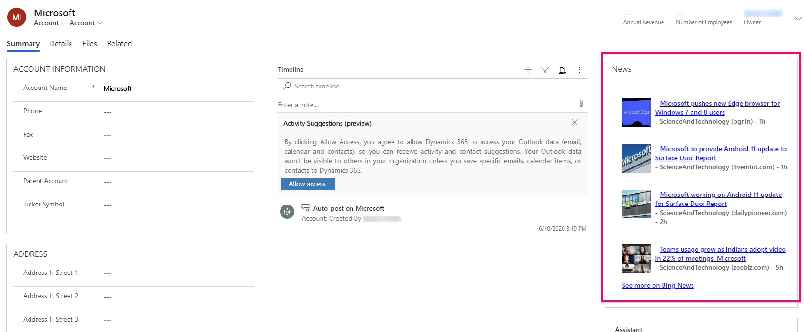
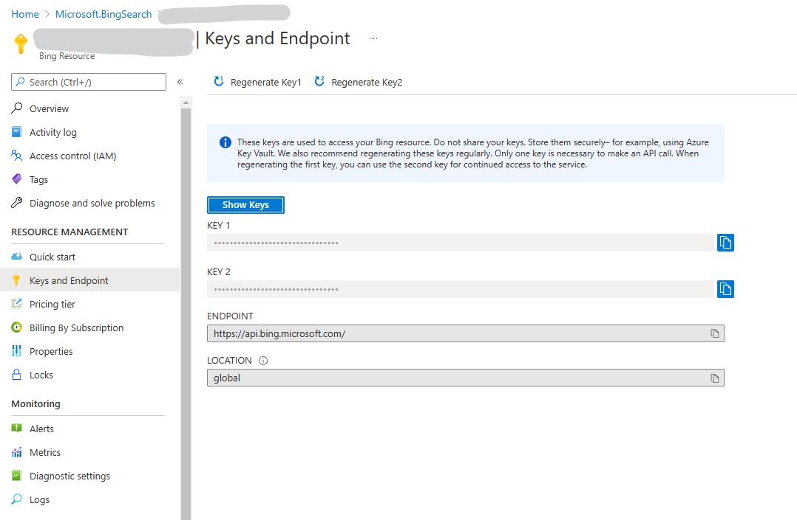
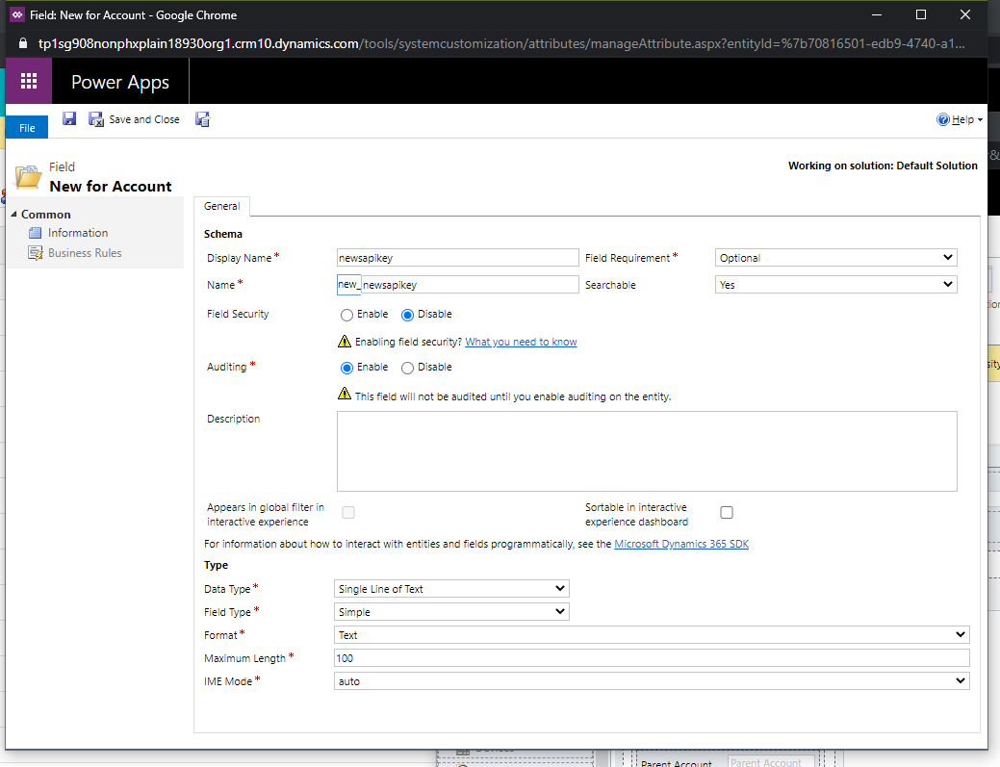
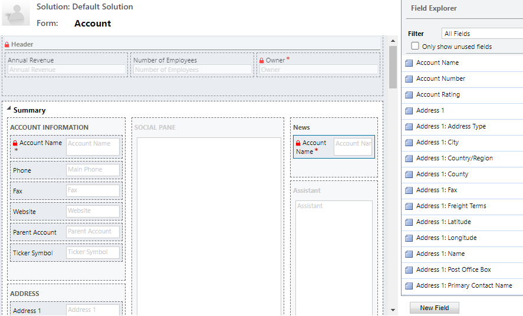
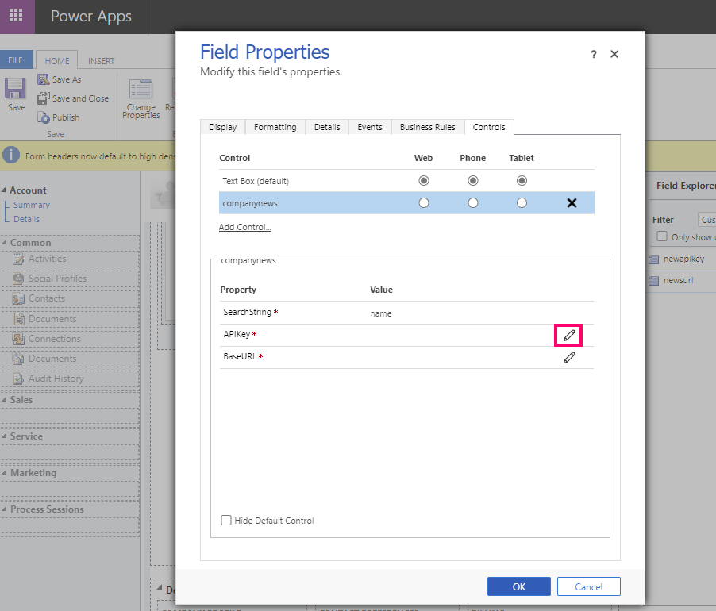
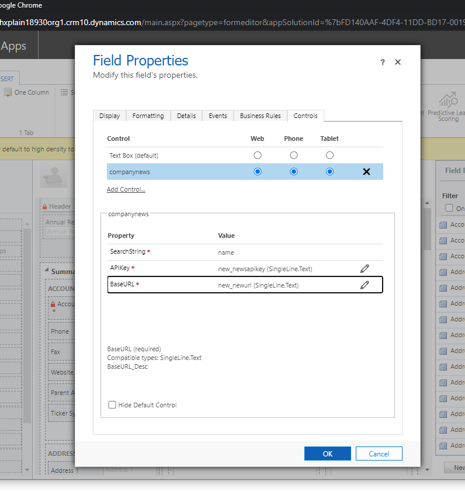
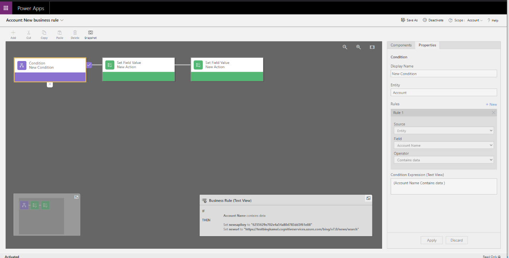

# Set up and use the news control

[!INCLUDE [cc-data-platform-banner](../../includes/cc-data-platform-banner.md)]

Gain valuable insights from the latest news about your customers, competitors,
and contacts. Staying on top of the news helps you stay ahead of your
competition by showing you real-time contextual information about your customers
and competitors. Install the news Power Apps component framework control, which
delivers relevant news from Bing News.

> [!div class="mx-imgBorder"] 
> 

You can customize to support additional news sources, the look and feel
and the behavior of the PCF control. For more information, see the [readme in the news control GitHub repo](https://github.com/microsoft/companynewspcfcontrol/blob/master/companynews/README.md). 

## Add the company news control to the account main form

The steps in this article add the company news control to the account main form
already configured to query news topics collected from Bing News. You can use
similar steps to add the control to the main form for other tables, such as
contact and competitor.

### Get the Bing News API key and URL

The news control requires a news API URL, API key, and more news URL. For Bing
News, the more news URL is preconfigured in the control to use
*https://www.bing.com/news/search*. For the News API URL, and API Key, you’ll
need to provide these by creating a [Bing Search azure resource](https://docs.microsoft.com/en-us/bing/search-apis/bing-web-search/create-bing-search-service-resource) under your Azure account. Once created, you will get the API key and API URL under the **Keys and Endpoint** section.

> [!div class="mx-imgBorder"] 
> 

### Import the company news solution 

1. Go to the [news control GitHub repo](https://github.com/microsoft/companynewspcfcontrol).

2. Download Solutions.zip. To do this, open the **Solutions** folder, open
    **Solutions.zip**, and then select **Download**.

3. Sign-in to [Power Apps](https://make.powerapps.com/?utm_source=padocs&utm_medium=linkinadoc&utm_campaign=referralsfromdoc), and then in the upper right select the environment where you want to install the company news control.

4. Select **Solutions** on the left pane, and then select **Import** on the    command bar.

5. In the Import solution wizard, select **Choose File**, browse to and select *Solutions.zip*, and then select **Open**.

6. Select **Next,** and then select **Next** again to complete the import.

### Add the control to the account main form

1. In Power Apps, select **Solutions** on the left pane, select **Settings** (gear) on the upper right, and then select **Advanced settings**.

2. Go to **Settings** > **Customizations** > **Customize the System**.

3. In the left navigation tree, expand **Tables** > **Account**, select **Forms**, and then open the **Account Main** form.

4. In the form editor, add two new text columns, which will be used to pass the key and base URL to the news component.

    a. Select **New Column** from the right navigation **Column Explorer**.

    b. For both **Display name** and **Name** enter *newsapikey*. Leave the rest of the settings as the default and then select **Save and Close**.

      > [!div class="mx-imgBorder"]
      > 

    c.  Repeat the previous two steps to create another text column. For both the
    **Display name** and **Name** enter *newsurl*. Leave the rest of the
    settings as the default and then select **Save and Close**.

5. In the form editor, select a place on the form where you want the company news control, and then select **Insert** tab > **Section** > **One Column**.

6. To show news by account name, drag and drop the **Account Name** column from the right **Column Explorer** pane to the newly created section.

   > [!div class="mx-imgBorder"] 
   > 

7. Select the section and then select **Change properties.** Enter a descriptive section a **Name**, such as *Company news*. You might want to check **Show the label of this section on the form** to provide heading to the section. Select **OK**.

8. Select the newly added **Account Name** column, and then select **Change   properties** on the **Home** tab. On the **Column Properties** page, select the **Controls** tab, select **Add Control**, select the **companynews** control, and then select **Add**.

9. Configure the following bindings for the apikey and baseurl columns.

    a.  Select **Configure property** (pencil icon) next to APIKey.

      

    b.  From **Bind to value on a column** the dropdown list, select **new_newsapikey
    (SingleLine.Text)**, and then select **OK**.

    c.  Select **Configure property** (pencil icon) next to **BaseURL**.

    d.  From **Bind to value on a column** the dropdown list, select **new_newsurl
    (SingleLine.Text)**, and then select **OK**.

      

    e. On the **Column Properties** page, select the **Web**, **Phone**, and **Tablet**, client options.

    f. On the **Column Properties** page, select the **Display** tab, clear the
    **Display label on form** option, and then select **OK**.

10. To provide API Key and Base URL default values, use business rules. Select     **Business Rules** from the form editor, and then select **New Business Rule** from the bottom of the right pane.

11. In the business rule designer, select **Condition** on the designer canvas,     set **Column** to **Account Name** and **Operator** to **Contains data,** and     then select **Apply**. Then, select the **Components** tab, drag a **Set Column Value** action, and provide a column value where **Column** is **newsapikey** and the value is the **Key** you copied from the Azure Cognitive Services properties. Create another **Set Column Value** action where **Column** is **newsurl** and add the value as the **Endpoint** you copied from the Azure Cognitive Services properties. Make sure to append *bing/v7.0/news/search* at the end of the news URL. The final URL should look like https://<yourservicename\>.cognitiveservices.azure.com/bing/v7.0/news/search. 

    

12. Save and activate the rule. Close the business rule designer.

13. Make sure you add the newly added columns, newsapikey and newsurl, to the account main form.

14. Clear **Visible by default** for the form tab properties where the newsapikey and newsurl columns are added.

15. In the form designer, select **Save** and then select **Publish**.

### See also 
[Use custom controls for model-driven app data visualizations](use-custom-controls-data-visualizations.md)

[!INCLUDE[footer-include](../../includes/footer-banner.md)]
