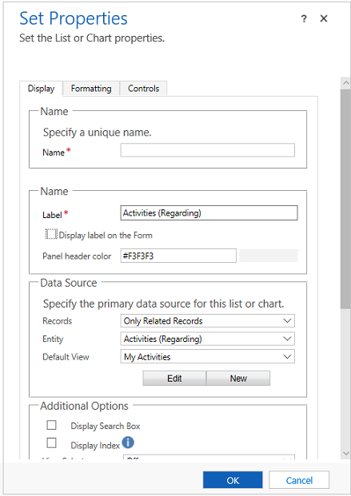

# Sub-grid properties for model-driven app main forms

This article describes the classic form editor. We recommend that you use the modern form designer to create and edit sub-grids for your model-driven app forms. More information: [Add and configure a subgrid component on a form](form-designer-add-configure-subgrid.md)

You can configure a sub-grid on a form using the classic form designer to display a list of rows or a chart. Select **Show Chart Only** on the **Display** tab to show a chart instead of a list.

  > [!div class="mx-imgBorder"] 
  > 

These are the properties available to configure when using a sub-grid component on a form using the classic form designer.

|Tab|Property|Description|  
|---------|--------------|-----------------|  
|**Display**|**Name**|**Required**: The unique name for the sub-grid that is used when referencing it in scripts. The name can contain only alphanumeric characters and underscores.|  
||**Label**|**Required**: The localizable label for the sub-grid visible to users.|  
||**Display label on the Form**|Whether the label should be displayed on the form. This is required if you enable **Display Search Box**. You can also choose to have the panel header color.|  
||**Records**|Choose from two options:   - **Only Related Records**: Sub-grid will display only rows related to the current row. - **All Row Types**: Sub-grid will display rows filtered only by the default view or, if the view selector is enabled, any views the user chooses.   The option you choose will affect the behavior of the show list control. More information: [Show list behavior](#show-list-behavior) |  
||**Table**|Depending on the option you choose for **Records**, this list displays either:   - **Only Related Records**: A list of tables that are related to this table with the name of the lookup column on that table which defines the relationship in parentheses. - **All Row Types**: A list of all tables.|  
||**Default View**|Choose the view that will be applied by default. If you do not enable any other views using the **View Selector** property. This will be the only view.   Use the **Edit** button to open the default view for editing. Use the **New** button to create a new view to use for this sub-grid.|  
||**Display Search Box**|Display the search box. When this option is chosen the **Display Label on the Form** option is required.|  
||**Display Index**|Only forms using the [Classic forms](main-form-presentations.md#classic-forms) support display index.   Select this check box if you want the alphabetical index to be available with the list. This lets you jump to rows starting with a particular letter or number.|  
||**View Selector**|You have three options:   - **Off**: Only the default view can be used. - **Show All Views**: Allow people to choose any view. - **Show Selected Views**: Use the Ctrl key with your cursor to select which of the available views to show.|  
||**Default Chart**|Select which chart to show if **Show Chart Only** is selected.|  
||**Show Chart Only**|Rather than a list of rows a chart will be displayed.|  
||**Display Chart Selection**|If **Show Chart Only** is selected, allow people to choose different charts.|  
||**Availability**|Specify whether the section should be available on phone.|
|**Formatting**|**Layout**|**Select the number of columns the control occupies**.   When the section containing the sub-grid has more than one column you can set the column to occupy up to the number of columns that the section has.|  
||**Row Layout**|**Number of Rows** will determine how many rows are shown on a page of a sub-grid.   If **Automatically expand to use available space** is chosen the form will allow space for two rows and will expand the space as the number of rows increases. If the number exceeds the **Number of Rows**, people can navigate to additional pages to view the rows.   If **Automatically expand to use available space** is not chosen the form will provide space for the number of rows defined by **Number of Rows** and people can navigate to additional pages to view any additional rows.|  
|**Controls**|**Controls**|Choose to add controls and select the radio button to have them for Web, Phone or Tablet.|
  
 In forms using the [Classic forms](main-form-presentations.md#classic-forms), actions performed on a sub-grid were available in the ribbon. Developers can customize the behavior of these actions or add additional actions by customizing the ribbon.  
  
 In forms using the [Updated forms](main-form-presentations.md#updated-forms) actions for sub-grids are placed near the sub-grid, making them easier to access. However the command bar does not allow for custom actions to be added. Developers can edit the ribbon to modify the actions for the remaining three actions: show list, add row, and delete row.  
  

## Show list behavior  
 When displaying a list in forms with the [Updated forms](main-form-presentations.md#updated-forms), each sub-grid displays the **Open View** button  in the top right corner when the table is also displayed as one of the tables included in the navigation area of the form editor. Choosing this button will open the view. The behavior will change depending on the option chosen for the **Rows** property.  
  
 When you select **Only Related Rows** the view will open using one of the associated views in the same window. To return to the form, use the back button or choose the current row primary name value in the navigation bar.  
  
 When you select **All Row Types** the view will open in a new window.  

## Add row behavior  
 When displaying a list in forms with the [Updated forms](main-form-presentations.md#updated-forms), each sub-grid displays the **Add row** button  in the top right side of the sub-grid. Choosing this button will allow you to add a row. This behavior will change depending on the option chosen for the **Rows** property and if the lookup is for activity rows.  
  
 When you select **Only Related Rows** the default behavior is the behavior to add existing rows. People see an in-line lookup to search for an existing row first. This helps prevent creating duplicate rows.  If they can't find an existing row, they can choose the **New** option. When a new row is created any of the column mappings defined in the relationship will be applied. More information: [Map table columns](../data-platform/map-entity-fields.md)   
  
 When you select **All Row Types** the default behavior is to add a new row. The quick create form will be shown if the target table has one. If not, the default table main form is shown.  
  
 If the sub-grid displays activities, people will first need to choose the type of activity and then they will see the "add new row" behavior.  
  
## Delete row behavior  
 When you select a row in a sub-grid the **Delete** button  appears on the right side of the row. The behavior of this delete action is different depending on the type of relationship with the current table.  
  
 When the sub-grid uses a 1:N (one-to-many) relationship, the normal row delete behavior is to show a confirmation dialog before deleting the row.  
  
 When the sub-grid uses a N:N (many-to-many) relationship, the row in the relationship (or intersect) table relating to two rows is deleted without a confirmation and the row will no longer be displayed in the sub-grid. But the row that was displayed is not deleted.  

## Next steps

[Use the Main form and its components](use-main-form-and-components.md)

[!INCLUDE[footer-include](../../includes/footer-banner.md)]