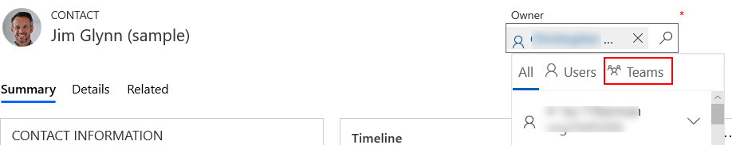
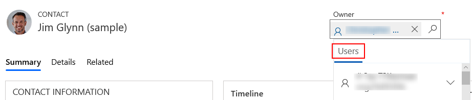
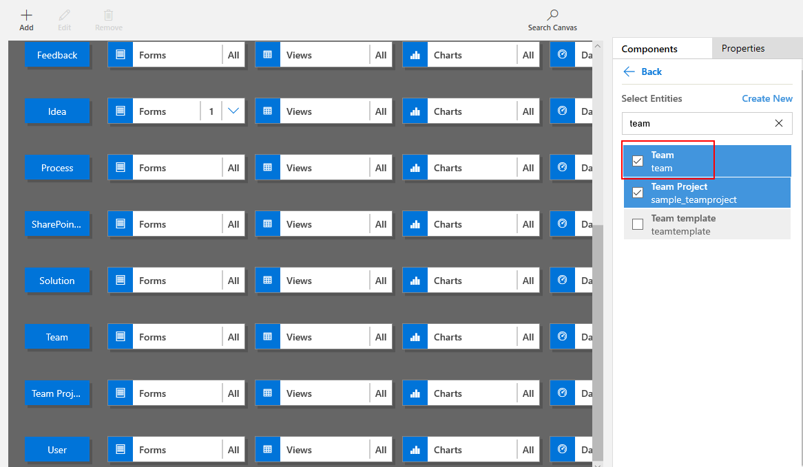

# Add a table as a lookup option in your app

[!INCLUDE [cc-data-platform-banner](../../includes/cc-data-platform-banner.md)]

## Lookup functionality
With model-driven apps, for a table to be available in a lookup it must be added to the app. 

For example, contact rows have the ability to be assigned to a user or a team.  Both of these tables have a relationship with the contacts table.

> [!div class="mx-imgBorder"] 
> 

However, if the **user** table is included in the app but the **team** table is not, only user rows will appear in a lookup.

> [!div class="mx-imgBorder"] 
> 

This can be easily resolved by adding the table to the app using the [App Designer](model-driven-app-glossary.md#app-designer).

## Add a related table to an app to enable the lookup

1. Navigate to the Power Apps portal found at [make.powerapps.com](https://make.powerapps.com/?utm_source=padocs&utm_medium=linkinadoc&utm_campaign=referralsfromdoc)
1. Select **Solutions**
1. Select the required solution
1. Select the model-driven app.  This will open the app in the **App Designer**.
1. Select the **Components** tab, select **Entities** (these are in effect tables), and then select **Team**.

    > [!div class="mx-imgBorder"]
    > 

1. Select **Save**, and then select **Publish** to make the change available to app users within the organization.

## Next Steps
[Share a model driven app](share-model-driven-app.md)

[!INCLUDE[footer-include](../../includes/footer-banner.md)]