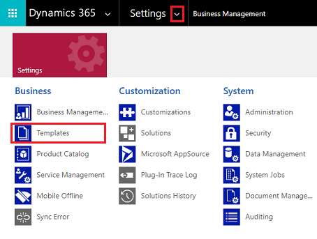
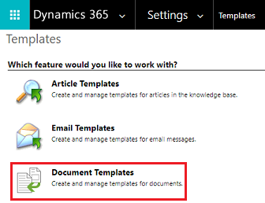

   
# Use Excel and Word templates

You can use templates in a variety of ways to speed your work and improve consistency. With Excel templates, you can easily create and share your customized analysis with others in your organization. You can use Word templates to create standardized documents automatically populated with Microsoft Dataverse data.

## Enable and work with Excel and Word templates

1. Sign in to [Power Apps](https://make.powerapps.com/?utm_source=padocs&utm_medium=linkinadoc&utm_campaign=referralsfromdoc) and in the upper-right corner, select the  (upper right), and then select **Advanced settings**.

2. Select **Settings** > **Templates**.

   > [!div class="mx-imgBorder"] 
   >  

3. On the **Templates** page, select **Document Template** to work with Excel or Word templates.

   > [!div class="mx-imgBorder"] 
   >  

For information on using templates, see the following documentation:

- Word templates:  [Use Word templates to create standardized documents](/dynamics365/customer-engagement/admin/using-word-templates-dynamics-365)
- Excel templates: [Analyze and share your data with Excel templates](/dynamics365/customer-engagement/admin/analyze-your-data-with-excel-templates)

[!INCLUDE[footer-include](../../includes/footer-banner.md)]