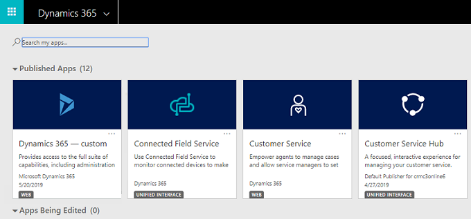

   
# Use Excel and Word templates

You can use templates in a variety of ways to speed your work and improve consistency. With Excel templates, you can easily create and share your customized analysis with others in your organization. You can use Word templates to create standardized documents automatically populated with Common Data Service data.

## Enable and work with Excel and Word templates

1. Go to [https://admin.powerplatform.microsoft.com](https://admin.powerplatform.microsoft.com). 

2. Select **Environments**, select an environment, and then select **Open environment**.

3. If you see published apps, select an app to open it. Otherwise, skip to Step 5.

   > [!div class="mx-imgBorder"] 
   >  

4. In the upper-right corner, select the gear icon, and then select **Advanced settings**. If you don't see **Advanced settings**, proceed to the next step.

5. Select **Settings** > **Templates**.

   > [!div class="mx-imgBorder"] 
   >  

6. On the **Templates** page, select **Document Template** to work with Excel or Word templates.

   > [!div class="mx-imgBorder"] 
   >  

For information on using templates, see the following documentation:

- Word templates:  [Use Word templates to create standardized documents](https://docs.microsoft.com/dynamics365/customer-engagement/admin/using-word-templates-dynamics-365)
- Excel templates: [Analyze and share your data with Excel templates](https://docs.microsoft.com/dynamics365/customer-engagement/admin/analyze-your-data-with-excel-templates)

