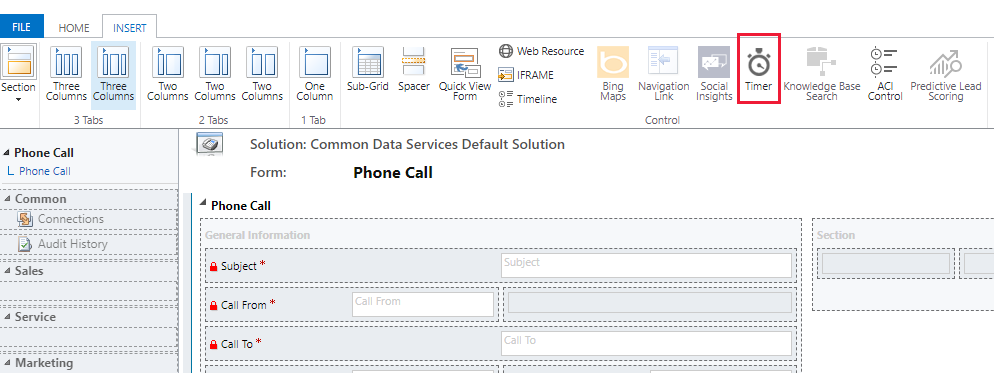

# Model-driven app timer control overview

[!INCLUDE [cc-data-platform-banner](../../includes/cc-data-platform-banner.md)]

Use a timer control with forms where rows need to meet a specific time-based milestone. A timer control shows people how much time is available to complete an action in the resolution of an active row or how much time has passed since the time to complete the action has passed. At a minimum, timer controls must be configured to show success or failure in completing the action. In addition, they can be configured to display warnings when the conditions are approaching failure.  
  
A timer control can be added to a form for any table, but they are most frequently used for the case table, especially when linked to columns that track service level agreements. You can add multiple timer controls in the body of a form. You can’t add them to the header or footer.

To add a timer control to a form:

1.  Sign in to [Power Apps](https://make.powerapps.com/?utm_source=padocs&utm_medium=linkinadoc&utm_campaign=referralsfromdoc).

2.  On the left navigation pane, expand **Data**, and then select **Tables**.

3.  Select a table, such as the account table, and then select the **Forms** tab.

4.  Select the form that you want.

5.  In the form designer, on the command menu, select **Switch to classic**.
  
6.  In the classic form designer, select the **Insert** tab, and then on the toolbar select **Timer**. 

    > [!div class="mx-imgBorder"] 
    > 

7.  On the Timer Control properties page, enter or select the properties that you want, and then select **OK**. 

Timer control **Data Source** properties use columns for the table.  
  
-   The **Failure Time Column** uses a date-time column to set the time.  
  
-   The three condition columns use one of the **Choice**, **Two Options**, **Status**, or **Status Reason** columns for the table.  

## Timer control properties  
 The following table describes the properties of a timer control.  
  
|Group|Name|Description|  
|-----------|----------|-----------------|  
|Name|Name|**Required**. A unique name for the control.|  
||Label|**Required**. The label to display for the timer control.|  
|Data Source|Failure Time Field|**Required**. Choose one of the date-time columns for the table to represent when a milestone should be successfully completed.|  
||Success Condition|**Required**. Select a column for the table to evaluate the success of the milestone, then choose which option indicates success.|  
||Warning Condition|Select a column for the table to evaluate whether the success of the milestone is at risk so that a warning should be displayed, then choose which option indicates that a warning should be displayed.|  
||Cancel Condition|Select a column for the table to evaluate whether the achievement of th milestone should be cancelled, then choose which option indicates that the milestone is cancelled.|  

## Next steps

[Overview of the form editor user interface](form-editor-user-interface-legacy.md)

[!INCLUDE[footer-include](../../includes/footer-banner.md)]