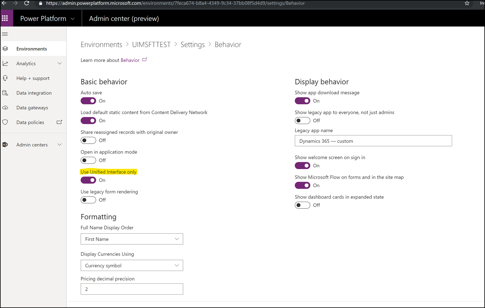
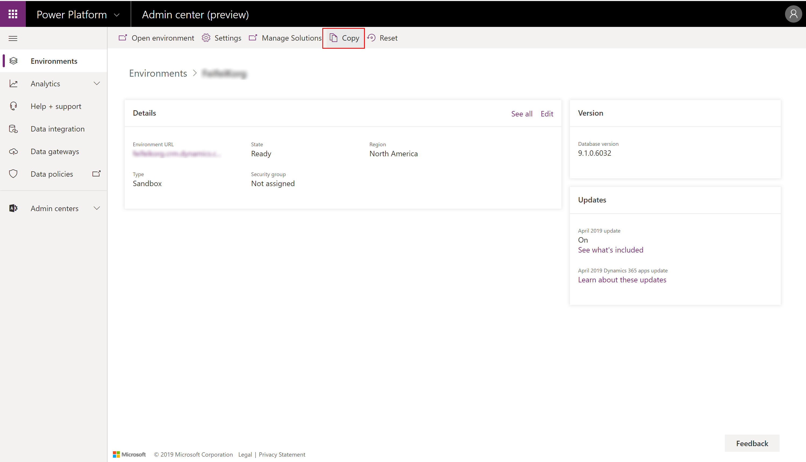
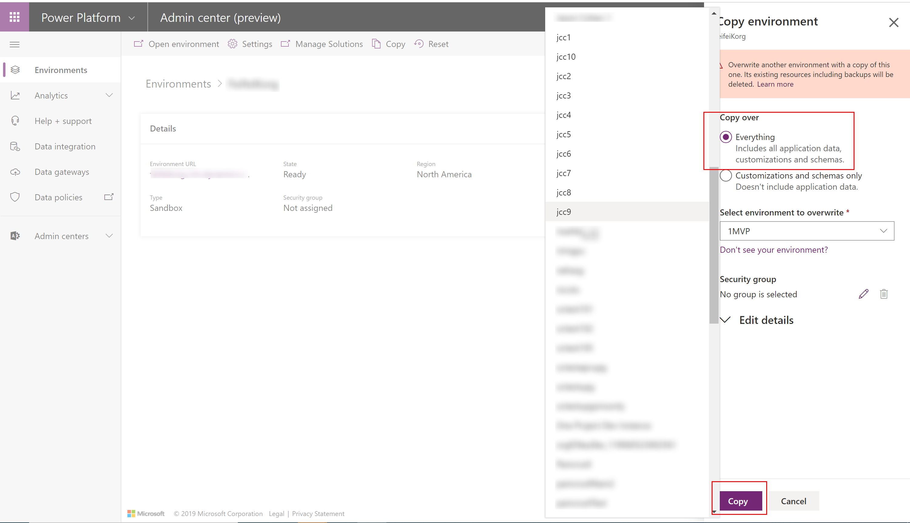
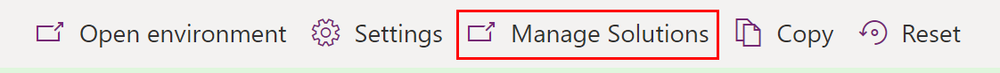
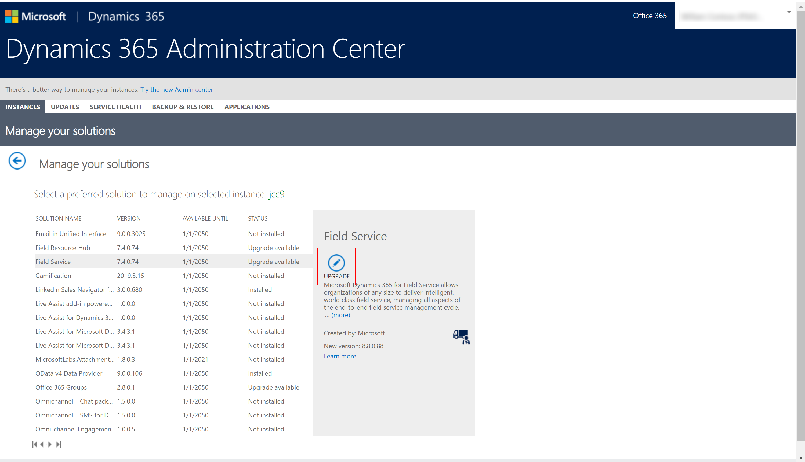

# Quick start for transitioning your legacy web client application to Unified Interface

The Unified Interface framework uses responsive web design principles to provide an optimal viewing and interaction experience for any screen size, device, or orientation. This quick-start topic explains how to transition your legacy web client application to Unified Interface by using a new non-production environment. 

> [!VIDEO https://www.microsoft.com/videoplayer/embed/RE3JwWU]

To use an existing non-production environment to transition your Web Client application, see [Quick start for using an existing environment to validate your legacy web client app with the Unified Interface](transition-web-app-existing.md). 
## Prerequisites
- A legacy web client application. 
- Although not required, we recommend a non-production environment to test your application and ensure it does not impact your current deployment or development cycles. More information: [Manage sandbox instances](/dynamics365/admin/manage-sandbox-instances)

## Prepare the environment
First, select a non-production environment and enable **Use Unified Interface only** mode, which will use Unified Interface for all model-driven apps in the environment. This also includes any Dynamics 365 application modules originally configured for the legacy web client.

1. Sign in to [Power Platform admin center](https://admin.powerplatform.microsoft.com/?utm_source=padocs&utm_medium=linkinadoc&utm_campaign=referralsfromdoc), select the **Environments** tab, and then select a sandbox environment. 

1. Select **Settings** > **Product** > **Behavior** and then turn on **Use Unified Interface only**.

   > [!div class="mx-imgBorder"] 
   > 

> [!NOTE]
> If you need to switch the environment back to its previous state, you can toggle the Unified Interface setting to revert to the original interface. More information: [Enable Unified Interface Only](/dynamics365/customer-engagement/admin/enable-unified-interface-only)

## Run and validate your application in Unified Interface
Run your applications that were originally web client applications. Notice that, after you turn on **Use Unified Interface only**, all available apps in the environment use Unified Interface even if the application was originally configured for the web client.

To run your app, sign in to [Power Apps](https://make.powerapps.com/?utm_source=padocs&utm_medium=linkinadoc&utm_campaign=referralsfromdoc), select **Apps**, and then select the application you want to run. Alternatively, you can go directly to the **My Apps** page, such as *https://contoso.crm.dynamics.com/apps/*.

### Validate your app, processes, and customizations 
We recommend that you test all use cases. You can start with the most critical use cases or group them into logical patterns of design. Since Unified Interface is based on responsive design, we recommend that you perform tests with different devices that have different screen resolutions. As you test the application you will be able to verify that your customizations are compatible with Unified Interface and whether there are any features that require a redesign or have missing functionality. Build a plan for reviewing these elements and post your questions and feedback on our community forum. 

> [!IMPORTANT]
> The current version of Microsoft Dataverse and customer engagement apps (Dynamics 365 Sales, Dynamics 365 Customer Service, Dynamics 365 Field Service, Dynamics 365 Marketing, and Dynamics 365 Project Service Automation) still include several deprecated features. You should review your application for any deprecated features and replace as necessary with new capabilities. More information: [Important changes (deprecations) coming](/dynamics365/get-started/whats-new/customer-engagement/important-changes-coming)

### Dynamics 365 apps
If you use the Dynamics 365 Field Service or Dynamics 365 Project Service Automation apps and want to test Unified Interface, you must set up a new sandbox environment and make a copy of your production environment to upgrade to the latest Field Service version and Project Service Automation version before validating these applications in Unified Interface. To do this, follow these steps:

1. Create a new sandbox environment from the [Power Platform Admin center](https://admin.powerplatform.microsoft.com/environments) or [Dynamics 365 admin center](https://port.crm.dynamics.com/). More information: [Add an instance to your subscription](/dynamics365/customer-engagement/admin/add-instance-subscription)

2. Copy your production environment that has the Dynamics 365 Field Service or Dynamics 365 Project Service Automation apps into the new sandbox environment. To do this, on the Power Platform Admin center open your production environment, and then select **Copy**.

    > [!div class="mx-imgBorder"] 
    > 

3. On the **Copy environment** page, select **Everything**, select your new sandbox environment from the **Select environment to overwrite** list, and then select **Copy**. 

    > [!div class="mx-imgBorder"] 
    > 

4. The **Overwrite environment** dialog box appears. Make sure you have selected the correct environment and that you have the right options selected, and then select **Confirm**. 

5. When the copy is successful, a confirmation notice appears. 

6. On the menu bar, select **Manage Solutions** to open the **Solutions** area. 

    > [!div class="mx-imgBorder"] 
    > 

    > [!IMPORTANT]
    > If **administration mode** is enabled, you must disable it so you can view the **Solutions** area. More information: [Administration mode](/power-platform/admin/sandbox-environments#administration-mode)

7. Find the Field Service or Project Service Automation solution and select it. The option to **Upgrade** should be available. Select it to upgrade the solution. 

    > [!div class="mx-imgBorder"] 
    > 
    
> [!NOTE]
> The latest versions of Field Service and Project Service Automation on Unified Interface are available by default for newly created instances. If you want to upgrade an existing environment with installed earlier versions, you must request the upgrade by contacting [Microsoft Customer Support](https://go.microsoft.com/fwlink/?LinkId=853505). 

More information: [Dynamics 365 for Field Service latest versions](/dynamics365/customer-engagement/field-service/version-history#latest-versions) and  [Dynamics 365 for Project Service Automation upgrade home page](/dynamics365/customer-engagement/project-service/upgrade-psa-home-page)

## Next steps
Based on your findings, your implementation team or partner can estimate the amount of effort needed to transition your application into Unified Interface and also identify potential usability improvements. With multiple new features and capabilities available in Unified Interface, there is opportunity to increase value for your application users. 

Transitioning to Unified Interface is a great opportunity for you to make a modern user interface and revisit your existing processes to verify that they're still valid or need improvement. This is also a good time to consider whether your application reflects your business requirements and whether the existing application could be spread across multiple apps for various teams and roles.

More information: [Design model-driven apps by using the app designer](design-custom-business-apps-using-app-designer.md)  

### See also
<!-- Unified Interface transition community (link tbd)    -->
[Unified Interface Playbook](unified-interface-playbook.md)  
[Approaching a user experience and Unified Interface transition](approaching-unified-interface.md)  
[About Unified Interface](/dynamics365/customer-engagement/admin/about-unified-interface)  
[What are model-driven apps in Power Apps?](model-driven-app-overview.md)  
[Update your apps to Unified Interface](/dynamics365/customer-engagement/admin/update-apps-to-unified-interface)  
[Configure model-driven app interactive experience dashboards](configure-interactive-experience-dashboards.md)  
[Use custom controls for model-driven app data visualizations](use-custom-controls-data-visualizations.md)  
[Power Apps component framework overview](/powerapps/developer/component-framework/overview)  
[Unified Interface for everybody](/power-platform-release-plan/2019wave2/microsoft-powerapps/unified-interface-app-everybody)

[!INCLUDE[footer-include](../../includes/footer-banner.md)]