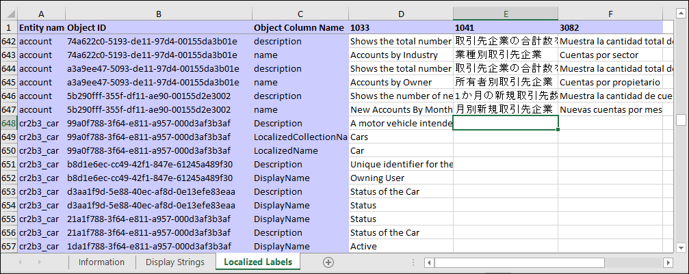

# Translate localizable text for model-driven apps

If you customize table or column text, such as column labels or drop-down list values, you can provide users in your environment who aren't working with the base language version of your environment with this customized text in their preferred languages.

The process has the following steps:

1. Enable other languages for your environment
1. Export the localizable text
1. Get the localizable text translated
1. Import the localized text

## Enable other languages for your environment

If you haven't already enabled the languages for your environment, use the steps described in [Enable the language](/power-platform/admin/enable-languages#enable-the-language) to enable them.

> [!IMPORTANT]
> Each language can take several minutes to enable. During this time, other users of the environment might not be able to use your app. Enable languages at a time that is least disruptive to users.

> [!TIP]
> While you enable the languages, note the LCID values used for each language. This value represents the language in the exported data for the localizable text. Language codes are four-digit or five-digit locale IDs. Valid locale ID values can be found at [Locale ID (LCID) Chart)](/previous-versions/windows/embedded/ms912047(v=winembedded.10)).

## Export the localizable text

The localizable text that you export comes from the unmanaged solution that contains the localizable text.

1. From [Power Apps](https://make.powerapps.com/?utm_source=padocs&utm_medium=linkinadoc&utm_campaign=referralsfromdoc), select **Solutions**. [!INCLUDE [left-navigation-pane](../../includes/left-navigation-pane.md)]

2. In the **All Solutions** list, select the unmanaged solution that contains the localizable text you want.

3. On the command bar, select **Translations** > **Export Translations**.

   :::image type="content" source="media/export-localizable-text.png" alt-text="Export Translations.":::

    You could see an alert:

    > Exporting customized labels for translation can take several minutes. Do not click the export link again until the first export has finished. Are you sure that you want to export now?
    >
    > Select **OK** if you want to continue.

When the export is completed, save the translations zip file. The file is named something like `CrmTranslations_{0}_{1}.zip`, where `{0}` is the unique name of the solution and `{1}` is the version number of the solution.

## Get the localizable text translated

You can send this file to a linguistic expert, translation agency, or localization firm.

If you have the knowledge to translate the text, or if you just want to see the format, you can extract the zip file that you exported you see that it contains two XML files.

- `[Content_Types].xml`
- `CrmTranslations.xml`

You can open the CrmTranslations.xml file with Microsoft Office Excel.

> [!TIP]
> Unless you normally open XML files with Excel, it might be easier to open Excel, then choose to open the file by pasting in the path to the extracted CrmTranslations.xml file.

> [!IMPORTANT]
> Don't change the file format. If you save the file in another format, you can't import it back.

When you view the data in Excel, look at the **Localized Labels** tab.

Any custom tables or columns have empty cells for the localizable text. Add the localized values for those items.

> [!NOTE]
> If you have changed the display name or description for any standard table or table column, the localized strings will still reflect the translations for the original value. Those should be localized to reflect the new value.

The **Display Strings** tab contains text that is displayed for other UI elements such as ribbon commands, error messages, and form labels.

### Update localizable text in the base language

If you change the display name for any standard table or table column, which is included in any special message, update the information in the **Display Strings** tab to use the customized name.

> [!TIP]
> Although the UI exposed to edit system table messages includes many references to table names, it doesn't include all of them. Using this technique might find more. More information: [Edit system table messages](../data-platform/edit-system-entity-messages.md)

For example, if you change the display name for the Account table to *Company*, search through the base language column in the  **Display Strings** for the following matches: `account`, `accounts`, `Account`, and `Accounts` then make appropriate replacements to `company`, `companies`, `Company`, and `Companies` respectively.

> [!IMPORTANT]
> Don't do a general find and replace in the file for this. Make sure that the matching text actually refers to the names that you changed.

## Import the localized text

Importing the text requires compressing the files and importing them into the system.

### Compress the files

After you make changes to the `CrmTranslations.xml` file, compress the file together with the `[Content_Types].xml` file into the zip format. Select *both files* and then right-click to open the context menu. In the context menu, choose **Send to** > **Compressed (zipped) folder**.

### Import the files

From the same unmanaged solution that you exported the translations from, in the menu choose **Translations** > **Import Translations**.

:::image type="content" source="media/import-translated-text-dialog.png" alt-text="Import selected file.":::

Select the file that contains the compressed translated text and select **Import**.

After you import the translated text, publish all customizations to see the changes in your apps.

## Next steps

[Regional and language options for your organization](/dynamics365/customer-engagement/admin/enable-languages)

[Edit system table messages](../data-platform/edit-system-entity-messages.md)

[!INCLUDE[footer-include](../../includes/footer-banner.md)]
