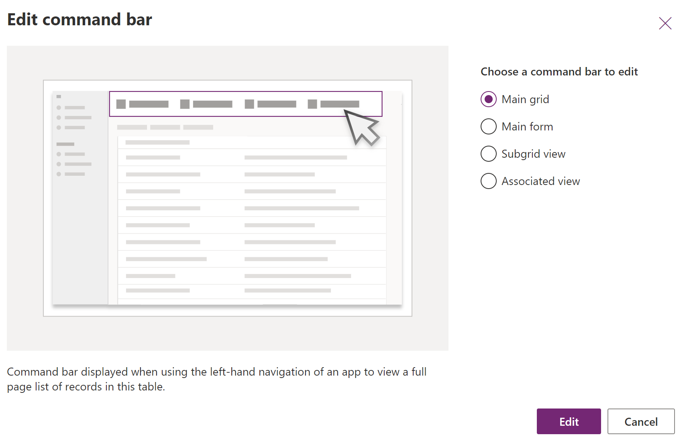

# Customize the command bar using command designer (preview)

[!INCLUDE [cc-beta-prerelease-disclaimer](../../includes/cc-beta-prerelease-disclaimer.md)]

This topic guides you through creating and editing modern commands using the new low-code designer and Power Fx.

  > [!IMPORTANT]
  > - This is a preview feature, and may not be available in all regions.
  > - This is a new infrastructure that stores metadata separately from classic commands. However, classic and modern commands can run side-by-side.
  > - [!INCLUDE[cc_preview_features_definition](../../includes/cc-preview-features-definition.md)]
  
## Open the app designer

Either [Create a new model-driven app using modern app designer](#create-a-new-model-driven-app-using-modern-app-designer) or [Open an existing model-driven app using modern app designer](#open-an-existing-model-driven-app-using-modern-app-designer).

### Create a new model-driven app using modern app designer

1. Sign into [Power Apps](https://make.powerapps.com/?cds-app-module-designer.isCustomPageEnabled=true)

1. On the left navigation pane, select **Solutions** and then open or create a solution to contain the new model-driven app.

1. Select **New** > **App** > **Model-driven app**

1. Select **Modern app designer**, and then select **Create**.

   > [!div class="mx-imgBorder"]
   > 

1. Enter a **Name** for your app, and then select **Create**. More information: [Create a model-driven app that has an account table page](create-a-model-driven-app.md)

   > [!div class="mx-imgBorder"]
   > 

### Open an existing model-driven app using modern app designer

1. Sign into [Power Apps](https://make.powerapps.com/?cds-app-module-designer.isCustomPageEnabled=true)

1. On the left navigation pane, select **Solutions**, and then open the solution containing the existing model-driven app.

1. Select the model-driven app, and then select **...** > **Edit** > **Edit in preview** to open the modern app designer.

   > [!div class="mx-imgBorder"]
   > 

## Create or edit modern commands

Once you are in the app designer, use the command designer to customize your command bars.

> [!NOTE]
> - Currently, the command designer can only be accessed through the modern app designer.
> - Currently, classic commands can't be edited within the command designer.
 
### Edit the command bar
 
Make sure you **Publish** your app before you work with the command designer.

#### Open the command designer to edit a command bar

1. Select any table from the **Pages** area in the app designer.

1. Select **...** (ellipsis), and then select **Edit command bar**.
    > [!div class="mx-imgBorder"]
    > 
 
1. Select the location of the command bar you want, and then select **Edit**. More information: [Command bar locations](command-designer-overview.md#command-bar-locations)
    > [!div class="mx-imgBorder"]
    > 
  
#### Create a new command

Unlike classic commands, modern commands are only displayed within the app you're editing. This prevents unwanted cross pollination within other apps as well as better runtime performance.

When you create a new command, a command component library is created on your behalf to store **Power Fx** formulas.

1. [Open the command designer to edit a command bar](#open-the-command-designer-to-edit-a-command-bar), and then select **+ New** on the command designer command bar.
   :::image type="content" source="media/commanddesigner-new.png" alt-text="Create a new command":::
1. On the right pane, enter or select from the following options:
   - **Label**. Enter a label that will be displayed on the command button. 
   - **Icon**. Select an icon for the command button. You may choose from any system icons or web resource SVG files. To upload your own icon, choose **Web resource** then upload an **SVG** format file. Then, select **Save** and **Publish** the web resource. For more information about how to create a web resource for the icon image you want, go to [Create or edit model-driven app web resources to extend an app](create-edit-web-resources.md).
   - **Tooltip title**. 
   - **Tooltip description**. 
   - **Accessibility text**. 
   - **Order number**. 
   - **Action**. Select from the following:
      - **Run formula**. Enter the Power Fx formula to run the command action. More information: [Use Power Fx for actions and visibility](#use-power-fx-for-actions-and-visibility)
      - **JavaScript**. Provide the JavaScript library and command to run the command action. More information: [Use JavaScript for actions](#use-javascript-for-actions)
   - **Visibility**. Select whether to **Always show** the command button or to **Show on condition from formula**. 

1. Drag and drop the command to the desired location. You can arrange modern commands amongst classic commands.
1. Select **Play** to run the command or **Save and Publish** to make the command available to app users.

## Use Power Fx for actions and visibility

You can use Power Fx for both actions (what happens when the command button is selected) as well as visibility (logic to control when the button is visible). Power Fx is not supported in classic commands.

You’ll notice the model-driven app command has a formula bar experience that is similar to canvas apps. For working with **Dataverse** data you can use Power Fx formulas just as you would in canvas apps. More information: [Using Power Fx with commands (preview)](commanding-use-powerfx.md)
  > [!NOTE]
  > - Dataverse is currently the only data source supported with commands in model-driven apps.
  > - You can't currently add additional tables as data sources directly from the command designer. However, you may **open the command component library in canvas studio and add additional tables as data sources** and then use them within the command designer. 
  > - Not all functions available within canvas apps are supported currently for model-driven app commands. Additionally, we've introduced some new functions specific to model-driven app commands.
  > - For more limitations with modern commands, see [Modern commanding known limitations (preview)](command-designer-limitations.md).
  
## Use JavaScript for actions
  
JavaScript is supported with both classic and modern commands. However, it's simpler to create commands and associate your JavaScript using the modern command designer.
  
1. For the **Action** select **Run JavaScript**.

1. Select **Add library** or select another one from the list. The list is populated with any libraries in use by the current command bar.
 
   > [!div class="mx-imgBorder"]
   > 

1. Select **Add** and search for existing JavaScript web resources or you can add your own.

    > [!div class="mx-imgBorder"]
    > 
 
1. Enter the **Function name**. For example, select the `Main_system_library.js` library then call this function: `XrmCore.Commands.Open.opennewrecord`.

1. Add parameters to pass to your function.

    > [!div class="mx-imgBorder"]
    > 
 
> [!NOTE]
> The use of calling multiple JavaScript libraries or calling multiple functions from a single command is not supported.
  
## See also

[Modern commanding overview](command-designer-overview.md)
