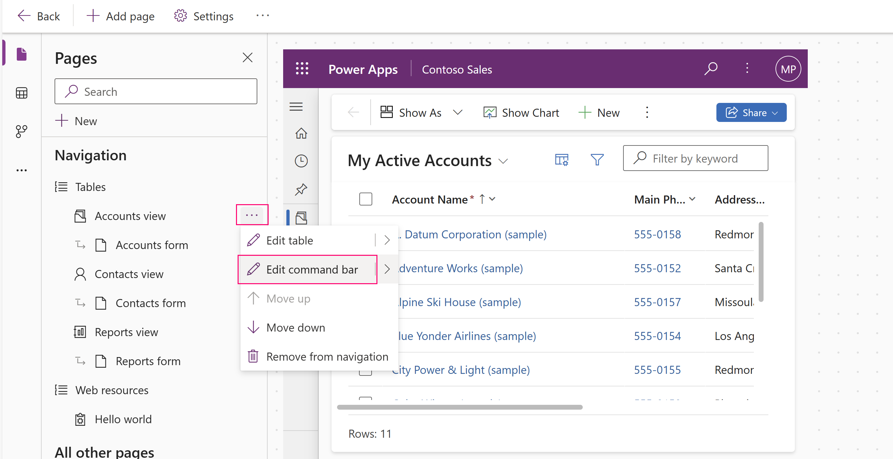

# Customize the command bar using command designer

This article guides you through creating and editing modern commands using the command designer and Power Fx.
  
## Open the app designer

Either [Create a new model-driven app using modern app designer](#create-a-new-model-driven-app-using-modern-app-designer) or [Open an existing model-driven app using app designer](#open-an-existing-model-driven-app-using-app-designer).

### Create a new model-driven app using modern app designer

1. Sign into [Power Apps](https://make.powerapps.com/?cds-app-module-designer.isCustomPageEnabled=true)
.
1. On the left navigation pane, select **Solutions**. [!INCLUDE [left-navigation-pane](../../includes/left-navigation-pane.md)]
1. Open or create a solution to contain the new model-driven app.
1. Select **New** > **App** > **Model-driven app**.
1. Enter a **Name** for your app, and then select **Create**. More information: [Build your first model-driven app](build-first-model-driven-app.md)

   > [!div class="mx-imgBorder"]
   > 

### Open an existing model-driven app using app designer

1. Sign into [Power Apps](https://make.powerapps.com/?cds-app-module-designer.isCustomPageEnabled=true)
1. On the left navigation pane, select **Solutions**. [!INCLUDE [left-navigation-pane](../../includes/left-navigation-pane.md)]
1. Open the solution containing the existing model-driven app.
1. Select the model-driven app, and then select **...** > **Edit** to open the modern app designer.

## Create or edit modern commands

Once you are in the app designer, use the command designer to customize your command bars.

> [!NOTE]
>
> - Currently, the command designer can only be accessed through the modern app designer or within solutions for existing commands.
> - Currently, classic commands can't be edited within the command designer.

### Edit the command bar

#### Open the command designer to edit a command bar

1. Next to any table view from the **Pages** area in the app designer, select **...**, and then select **Edit command bar**.
    > [!div class="mx-imgBorder"]
    > 
 
1. Select the location of the command bar you want, such as main grid (view) or main form, and then select **Edit**. More information: [Command bar locations](command-designer-overview.md#command-bar-locations)
    > [!div class="mx-imgBorder"]
    > 
  
#### Create a new command

Unlike classic commands, modern commands are only displayed within the app you're editing. This prevents unwanted command transferring to other apps as well as better runtime performance.

The first time command designer is opened for an app, a prompt to either use **JavaScript** only or **Power Fx** is displayed. Selecting Power Fx also allows you to use JavaScript if desired. Selecting **Power Fx** in the dialog creates a command component library to store **Power Fx** formulas.

1. [Open the command designer to edit a command bar](#open-the-command-designer-to-edit-a-command-bar), and then select **New** >  **Command**.
   :::image type="content" source="media/commanddesigner-new.png" alt-text="Create a new command":::
1. On the right pane, enter or select from the following options:
   - **Label (optional)**. Enter a label that displays on the command button.
   - **Icon**. Select an icon for the command button. You can choose from any system icons or web resource SVG files. To upload your own icon, choose **Web resource** then upload an **SVG** format file. Then, select **Save** and **Publish** the web resource. For more information about how to create a web resource for the icon image you want, go to [Create or edit model-driven app web resources to extend an app](create-edit-web-resources.md).
   - **Action**. Select from the following:
      - **Run formula**. Enter the Power Fx formula to run the command action. More information: [Use Power Fx for actions and visibility](#use-power-fx-for-actions-and-visibility)
      - **JavaScript**. Provide the JavaScript library and command to run the command action. More information: [Use JavaScript for actions](#use-javascript-for-actions)
   - **Visibility**. Select whether to **Show** the command button or to **Show on condition from formula**. 
   - **Tooltip title**. Optionally, enter a tooltip title. The title appears to the user when they hover their mouse over the command.
   - **Tooltip description**. Optionally, enter a tooltip description. The description appears for the user below the tooltip title when they hover their mouse over the command.

      :::image type="content" source="media/command-tooltip.png" alt-text="Example of a command tooltip title and description.":::
   - **Accessibility text**. Optionally, enter the text that will be read by screen readers.
   - **Order number**. The order the command displays in at runtime in relation to other commands within the same command bar.

1. Drag and drop the command to the desired location. You can arrange modern commands among classic commands.
1. Select **Save and Publish** to make the command available to app users.
1. Select **Play** to run the app and test your changes.

> [!NOTE]
> Publishing Power Fx formulas can take a few minutes to publish the command component library. This background operation might still be in-progress after command designer has completed the request and unlocks the designer.

## Use Power Fx for actions and visibility

You can use Power Fx for both actions (what happens when the command button is selected) as well as visibility (logic to control when the button is visible). Power Fx isn't supported in classic commands.

Notice the model-driven app command has a formula bar experience that is similar to canvas apps. For working with **Dataverse** data you can use Power Fx formulas just as you would in canvas apps. More information: [Using Power Fx with commands](commanding-use-powerfx.md)

> [!NOTE]
>
> - Dataverse is currently the only data source supported with commands in model-driven apps.
> - You can't currently add additional tables as data sources directly from the command designer. However, you can open the command component library in canvas studio and add additional tables as data sources and then use them within the command designer.
> - Not all functions available within canvas apps are supported currently for model-driven app commands. Additionally, we've introduced some new functions specific to model-driven app commands.
> - For more limitations with modern commands, go to [Modern commanding known limitations](command-designer-limitations.md).
  
## Use JavaScript for actions
  
JavaScript is supported with both classic and modern commands. However, it's simpler to create commands and associate your JavaScript using the modern command designer.
  
1. For the **Action** select **Run JavaScript**.

1. Select **Add library** or select another one from the list. The list is populated with any libraries in use by the current command bar.
 
   > [!div class="mx-imgBorder"]
   > 

1. Select **Add** and search for existing JavaScript web resources or you can add your own.

    > [!div class="mx-imgBorder"]
    > 
 
1. Enter the **Function name**. For example, select the `Main_system_library.js` library then call this function: `XrmCore.Commands.Open.opennewrecord`.

1. Add parameters to pass to your function. For more information about the available parameters, go to [Grid values](../../developer/model-driven-apps/pass-data-page-parameter-ribbon-actions.md#grid-values).

    > [!div class="mx-imgBorder"]
    > 

> [!NOTE]
> The use of calling multiple JavaScript libraries or calling multiple functions from a single command isn't supported.
  
## See also

[Modern commanding overview](command-designer-overview.md)
