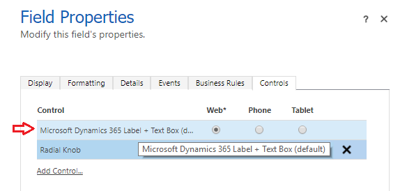

# Use custom controls for model-driven app data visualizations

[!INCLUDE [cc-data-platform-banner](../../includes/cc-data-platform-banner.md)]

In this topic you learn how to configure a custom control for a column.

To add a control using the Power Apps form designer, see [Add components to a form](add-move-configure-or-delete-components-on-form.md#add-components-to-a-form).

## Use a custom control using the classic form designer

Custom controls let you transform app user interface components, such as a column or view that traditionally contain text, into visualizations. Custom controls can be configured on columns, forms, dashboards, views, and grids. 
For example, a slider control can be configured on a number column.

   > [!div class="mx-imgBorder"] 
   > 

Or the editable grid control can be configured on a view. 

   > [!div class="mx-imgBorder"] 
   > 

You can set one type of custom control to appear in the web browser client while having a different custom control appear in your Dynamics 365 phone or  tablet mobile apps. For example, you could use a number input custom control for a column in web browser clients and a slider custom control for the phone app. After the customization is published, users can fully interact with the control to change the value, such as by sliding the control when using the linear slider custom control. Changes are automatically saved when the form is closed just as they are when the user changes a traditional  column on a form.  
  
### Use a custom control to add visualizations to a column  
 Following the steps in this procedure will change the default label and text box column  of the **Budget Amount** column to the slider custom control on the Opportunity table. You can use similar steps to replace an existing column with a custom control or configure a custom control for a custom column.  
  
1.  Sign in to [Power Apps](https://make.powerapps.com/?utm_source=padocs&utm_medium=linkinadoc&utm_campaign=referralsfromdoc).  

2.  Expand **Dataverse**, select **Tables**, select the table that you want, and then select the **Forms** tab.  
  
2.  Open a form such as the **Main** form for the opportunity table. 
  
3.  In the form editor, double-click the column where you want to add a custom control, such as the **Budget Amount** column on the opportunity main form. Alternatively, you can create a custom column. 
  
4.  On the **Column Properties** page, select the **Controls** tab, and then select **Add Control**.  
  
5.  On the Add Control page, select the control that you want, such as the **Linear Slider** control shown here, and then select **Add**.  

    > [!div class="mx-imgBorder"] 
    >   
  
6.  Choose the client where you want the control to appear.  
  
    - **Web**. To make the custom control available from any web browser, select the **Web** option next to the control. Notice that setting the **Web** option includes rendering the control in web browsers on PCs, Macs, and mobile devices.  
  
    - **Phone**. To make the custom control available on phones running Dynamics 365 for phones, select the **Phone** option next to the control.  
  
    - **Tablet**. To make the custom control available on tablet devices running Dynamics 365 for tablets, select the **Tablet** option next to the control.  
  
    > [!div class="mx-imgBorder"] 
    >   
  
7.  Select the  pencil icon next to **Min**, **Max**, and **Step**, set the property option described below, and then select **OK**.  
  
    > [!div class="mx-imgBorder"] 
    > 
  
   - **Min**. Set the minimum accepted value. You can bind a static value that you enter or bind the value to an existing column. In this example **Bind to static value** is **Currency** and the minimum value that can be entered is *zero*.  
  
       - **Bind to a static value**. Select the data type, such as a whole number (Whole.None), currency, floating point (FP), or decimal. Next, enter a number that represents the minimum accepted value for the column.  
  
       - **Bind to values on a column**. Select a column from the list that will be used as the minimum accepted value.  
  
   - **Max**. Set the maximum accepted value for the column. Similar to the Min value, you can bind a static value that you enter or bind the value to an existing column as described earlier. In this example, **Bind to static value** is **Currency** and the maximum value that can be entered is **1 billion**.  
  
   - **Step**. This represents the unit to increment or decrement when adding to or subtracting from  the current value. For example, for budget amount you can select 100 dollar increments\decrements.  
  
   - **Hide Default Control**. Selecting this option hides the control so neither the control or the data is displayed in any of the clients that don't support the custom control. Notice that  the classic Dynamics 365 web client doesn't support most custom controls. By default, this option is not selected and the classic Dynamics 365 web client displays the default, typically text based, control.  
  
       > [!NOTE]
       >  The default control is identified with **(default)** following the control name.  
       >   
       > > [!div class="mx-imgBorder"] 
       > >   
  
8.  Select **OK**, to close the **Column Properties** page.  
  
9. To activate the customization, on the table form select **Save**, and then select **Publish**.  
  
10. Select **Save and Close** to close the form editor.  
  
### See the custom control in action  
 Open a row that includes the column with the custom control, such as the opportunity form from the previous example, and view how the column is changed.  
  
   > [!div class="mx-imgBorder"] 
   >   
  
 The column is now rendered as a slider control instead of the text column. 

## Use the editable grid control on a view or sub-grid

With editable grids, users can do rich in-line editing directly from views and sub-grids whether they’re using a web app, tablet, or phone. More information: [Make grids (lists) editable using the Editable Grid custom control](make-grids-lists-editable-custom-control.md) 
  
## Next steps  
[Create and edit columns](../data-platform/create-edit-fields.md)

[!INCLUDE[footer-include](../../includes/footer-banner.md)]