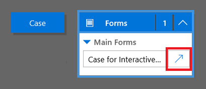
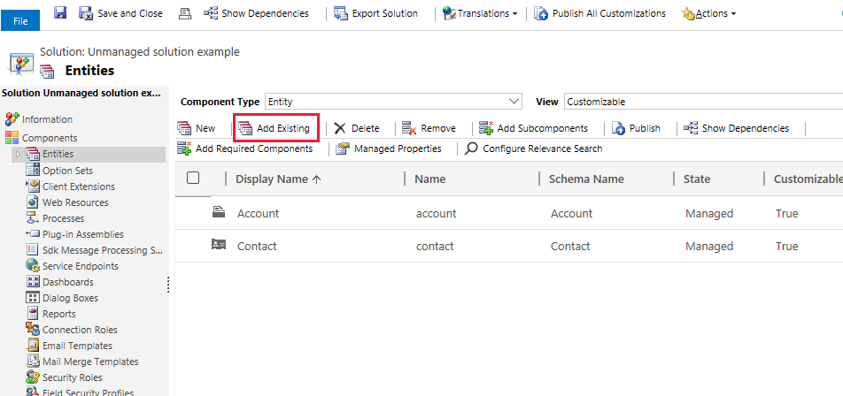

# Use the model-driven app main form and its components

[!INCLUDE [cc-data-platform-banner](../../includes/cc-data-platform-banner.md)]

Forms in Unified Interface apps provide improved user experience for optimum agent productivity and help maintain context while working on related rows. You can see the forms enlisted in the solution explorer. The form type of the new forms is **Main**.

This topic explains how to edit a main form, and add or change various elements of the form.

## Open the form editor

To edit a form or to add or change elements, use the form editor. The form editor lets you edit forms for all Unified Interface apps.

Follow the procedures given below to access the form editor. 

> [!NOTE]
> If you create any new solution components in the process of editing the form, the names of the components will use the solution publisher customization prefix for the default solution and these components will only be included in the default solution. If you want any new solution components to be included in a specific unmanaged solution, open the form editor through that unmanaged solution.

### Access the form editor through App designer in Power Apps

1.  Sign in to [Power Apps](https://make.powerapps.com/?utm_source=padocs&utm_medium=linkinadoc&utm_campaign=referralsfromdoc).  

2.  On the left navigation pane, select **Apps**, select the app you want, and then on the toolbar select **Edit**.  

3. On the app designer canvas, select the down arrow  next to a table to see the forms available for that table. 

4. Select the open designer button corresponding to the form to edit.

   
 
5. In the form designer, make your changes and then select **Save** to save the changes and select **Publish** to publish them for use in the app. 

> [!NOTE]
> If you have made other changes to the app, publish them using the app level publish option. See [Validate and publish an app using the app designer](validate-app.md) for more information.

<!-- > [!NOTE]
> The web client main form is also compatible with the Customer Service Hub and is available to be edited using the app designer. -->

### Access the form editor through the default solution

1.  Sign in to [Power Apps](https://make.powerapps.com/?utm_source=padocs&utm_medium=linkinadoc&utm_campaign=referralsfromdoc).  

2.  Expand **Data**, select **Tables**, select the table that you want, and then select the **Forms** tab.  

3. In the list of forms, open the form of type **Main**.

### Access the form editor for an unmanaged solution

1. Open [solutions](advanced-navigation.md#solutions).
2. Double-click the unmanaged solution you want to work with. The solution type, managed or unmanaged, is displayed in the **Package Type** column.
3. In the list of components, locate the table with the form you want to edit. If the table isn’t there, you’ll need to add it.

#### Add a table to an unmanaged solution

1. With the unmanaged solution opened in solution explorer, select the **Entities** node and, in the toolbar above the list, select **Add Existing**.

     > [!div class="mx-imgBorder"] 
     > 

2. In the **Select Solution Components** dialog box, with the **Component Type** selector set to **Entity**, select the table you want to add and select **OK**.

3. If the **Missing Required Components** dialog box appears, you can select **No, do not include required components** if you don’t intend to export this unmanaged solution to another organization. If you don’t want to include missing required components at this time, you can add them later. You’ll receive notification again if you export this solution in the future.

4. In the solution explorer expand the table with the form you want to edit and select **Forms**.

5. In the list of forms, open the form of type **Main**.

#### Publish the changes for use in the app

Certain customizations that make changes to the user interface require that they be published before people can use them in the application. To publish your customization, on the solution explorer toolbar, select **Publish All Customizations**.

## Form editor user interface

To understand in detail about the form editor user interface, see [Overview of the form editor user interface](form-editor-user-interface-legacy.md).

## Form properties

To know in detail about the form properties, see [Form properties](form-properties-legacy.md).

## Visibility options  
 Several types of form elements have the option to be shown or hidden by default. Tabs, sections, and columns all provide this option. Using form scripts or business rules, the visibility of these elements can be controlled to create a dynamic form to provide a user interface that adapts to conditions in the form. 
  
> [!NOTE]
>  Hiding form elements is not a recommended way to enforce security. There are several ways people can view all the elements and data in the form when elements are hidden. To learn more, see [Show or hide form elements](visibility-options-legacy.md). 
  
## Tab properties  

In the body of a form, tabs provide horizontal separation. Tabs have a label that can be displayed. If the label is displayed, tabs can be expanded or collapsed to show or hide their content by choosing the label. To know in detail about the tab properties, see [Tab properties](tab-properties-legacy.md).

## Section properties  

A section in a form occupies the space available in a tab column. Sections have a label that can be displayed and a line may be shown below the label. To know in detail about the section properties, see [Section properties](section-properties-legacy.md).
  
## Timeline  
 The Timeline shows related activities for a specific table.  
  
 The following types of activities are supported: Task, appointment, phone call, email, social activity, custom activity.  
  
 The Timeline also shows notes and, system and user posts. It shows those activities that have **Regarding** column set to the table you’re viewing. For notes, the **Regarding** column isn’t shown to the user; It is implicit when created from the Timeline.  
  
 Each activity that’s shown in the Timeline, will have the same quick actions that are available on the activity’s command bar.  

## Common column properties  

To know in detail about the common column properties, see [Common column properties](common-field-properties-legacy.md). 
  
## Special column properties  
 All columns have the properties listed in [Common column properties](common-field-properties-legacy.md), but certain columns have additional properties. To know more, see [Special Column Properties](special-field-properties-legacy.md).

  
## Sub-grid properties  

You can configure a sub-grid on a form to display a list of rows or a chart. To know in detail about the sub-grid properties, see [Sub-grid properties](sub-grid-properties-legacy.md).

## Quick view control properties  

A quick view control on a form displays data from a row that is selected in a lookup on the form. To explore the quick view control properties, see [Quick view control properties](quick-view-control-properties-legacy.md).
  
## Web resource properties  

You can add or edit web resources on a form to make it more appealing or useful to app users. Form enabled web resources are images, HTML files, or Silverlight controls. Know in detail about the Web resource properties. Go to [Web resource properties](web-resource-properties-legacy.md). 
  
## IFRAME properties  

You can add iFrames to a form to integrate content from another website within a form. To know more about the IFRAME properties, see [IFRAME properties](iframe-properties-legacy.md). 
  
## Edit navigation  
 Navigation within the form allows people to view lists of related rows. Each table relationship has properties to control whether it should be shown. More information: [Navigation Pane Item for Primary Table](../data-platform/create-edit-1n-relationships-solution-explorer.md#navigation-pane-item-for-primary-table)
  
 Any table relationships that are configured to be displayed can be overridden within the form editor.  
  
 For step-by-step instructions, see [Add form navigation for related tables](add-edit-form-navigation-related-entities.md).
  
 To enable editing navigation you must first select **Navigation** from the **Select** group on the **Home** tab.  
  
 In the **Relationship Explorer** you can filter by 1:N (one-to-many) or N:N (many-to-many) relationships, or view all available relationships. The **Only show unused relationships checkbox** is disabled and selected. So you can only add each relationship one time.  
  
 To add a relationship from the **Relationship Explorer** just double-click it and it will be added below the currently selected relationship in the navigation area. Double-click a relationship in the navigation area and you can change the label on the **Display** tab. On the **Name** tab, you can see information about the relationship. Use the **Edit** button to open the definition of the table.  
  
 There are five groups in the navigation area. You can drag them to reposition them and double-click them to change the label, but you can’t remove them. These groups are displayed only when there is something in them. If you don’t want a group to appear, just don’t add anything to it.  
  
## Configure event handlers  

An event handler consists of a reference to a JavaScript web resource and a function defined within that web resource that will execute when the event occurs. To know more about configuring event handlers, see [Configure event handlers](configure-event-handlers-legacy.md). 
  
## Next steps  
 [Create and design forms](create-design-forms.md)   
 [Create and edit quick create forms](create-edit-quick-view-forms.md)   
 [Create and edit quick view forms](create-edit-quick-view-forms.md)

[!INCLUDE[footer-include](../../includes/footer-banner.md)]