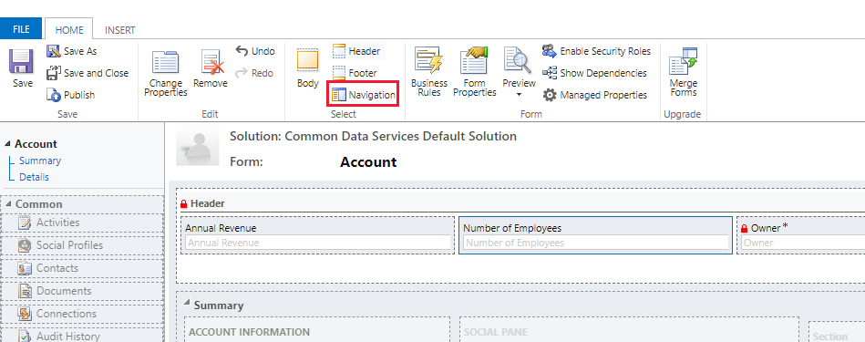
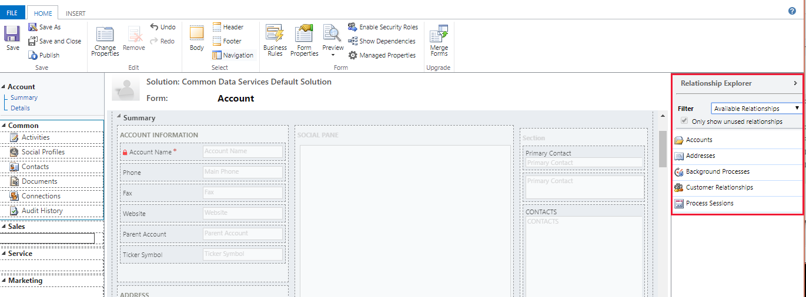
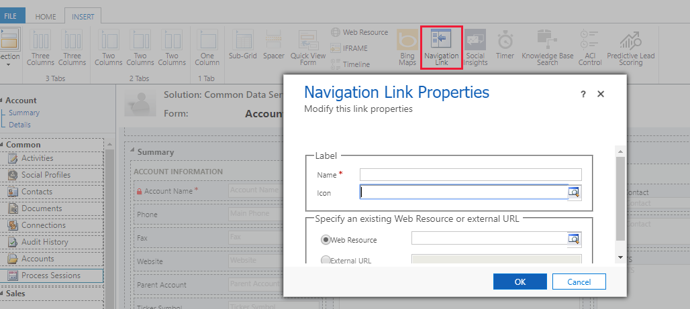

# Change navigation within a model-driven app form

 Navigation within a form allows app users to view lists of related rows. Each table relationship has properties to control whether it should be shown. More information: [Navigation pane item for primary table](../data-platform/create-edit-1n-relationships-solution-explorer.md#navigation-pane-item-for-primary-table)  
  
 Any table relationships that are configured to be displayed can be overridden within the form editor. You can also include navigation links to display web resources or other web sites via form navigation.  
  
 For step-by-step instructions, see [Create and edit table relationships for Microsoft Dataverse](../data-platform/create-edit-entity-relationships.md)  
  
 To enable editing navigation you must first select **Navigation** from the **Select** group on the **Home** tab of the form designer.  
 
> [!div class="mx-imgBorder"] 
> 
 
 In the right pane, from **Relationship Explorer** you can filter by 1:N (one-to-many) or N:N (many-to-many) relationships, or view all available relationships. The **Only show unused relationships checkbox** is disabled and selected. So you can only add each relationship one time.  
 
 > [!div class="mx-imgBorder"] 
 > 

 To add a relationship from the **Relationship Explorer** just double-click the relationship and it will be added below the currently selected relationship in the navigation area. Double-click a relationship in the navigation area and you can change the label on the **Display** tab. On the **Name** tab you can see information about the relationship. Use the **Edit** button to open the definition of the table.  
  
 There are five groups in the navigation area. You can drag them to reposition them and double-click them to change the label, but you can’t remove them. These groups will only display when there is something in them. So if you don’t want a group to appear, just don’t add anything to it.  
  
 Use the **Navigation Link** button in the **Control** group of the **Insert** tab to add a link to a web resource or external URL.  
 
 
 
   
### Navigation link properties  
 Navigation links have the following properties:  
  
|Property|Description|  
|--------------|-----------------|  
|Name|**Required**: Text to display as a label.|  
|Icon|Use a 32x32 pixel web resource. Use a PNG image with a transparent background is recommended.|  
|Web Resource|Specify a web resource to display in the main pane of the form.|  
|External URL|Specify the URL of a page to display in the main pane of the form.|  

   

## Privacy notices  
 [!INCLUDE[cc_privacy_crm_website_preview_control](../../includes/cc-privacy-crm-website-preview-control.md)]    
  
 [!INCLUDE[cc_privacy_multimedia_control](../../includes/cc-privacy-multimedia-control.md)]  

## Next steps

[Overview of the form editor user interface](form-editor-user-interface-legacy.md)

[!INCLUDE[footer-include](../../includes/footer-banner.md)]