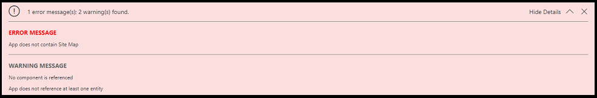
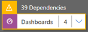
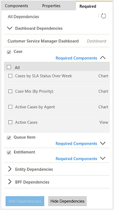

# Validate and publish a model-driven app using the app designer

[!INCLUDE [cc-data-platform-banner](../../includes/cc-data-platform-banner.md)]

## Why model-driven apps need to be validated

Model-driven apps cannot be published if they do not include all the required components.  Some components rely on others and this relationship between components is known as a [dependency](model-driven-app-glossary.md#dependency).

For example, the position table has been added to the site map, but is no longer showing in the app.

The process of checking for dependencies within a model-driven app is known as [validation].
  
When the app is validated, the app designer canvas shows details about the assets that are missing.  

## How to validate an app and add in dependencies

1.  Navigate to the maker portal at make.powerapps.com
2.  Select the environment in which the unmanaged model-driven app is located.
3.  Navigate to the model-driven app using the solution explorer.
4.  Select the three dots next to the app and edit.  The classic app designer will open.
    >[!Note]
    >This experience may change as the maker experience moves from a classic to a modern one.
5.  In the app designer, select **Validate**.  
  
    :::image type="content" source="media/validate-app.png" alt-text="validate app":::
  
     A notification bar appears and shows whether the app has any errors or warnings. The notification bar shows warnings in cases where, for example, a table has no forms or views, or the app doesn’t contain any components. An error might appear if a site map isn't configured for the app. The app can be saved without addressing warnings, but errors must be fixed before publishing.  
  
       
  
     The app designer also shows a warning symbol with the number of dependencies on each artifact or asset tile that is missing a required asset.  
  
     

     Additionally, the required tab will appear on the right side of the canvas and this will provide the opportunity to add the required elements.  The contents of the required tab will depend upon the nature of what is missing.

       :::image type="content" source="media/app-designer-add-dependencies.png" alt-text="add dependencies":::
  
6.  To add the required assets, select the **Required** tab on the right side of the canvas. The **Required** tab is visible when at least one required asset is missing from the app.  
  
     The tab shows an alternate list of required components.  
  
       
  
7.  Select the assets that to be added, and then select **Add Dependencies**. When the required asset has been added, the error count on the tile to which the asset has been added decreases.
  
    > [!NOTE]
    >  If a common asset is required across various app components-for example, a form is required for a dashboard and a table-and you add that asset only once from the dashboard dependency tree, the dependency count will decrease only on the dashboard tile, but not on the table tile. However, the dependency will be resolved for both.  
    >   
    >  Select **Get Latest Dependencies**  or select **Validate** again to get the latest set of dependencies. This buttons will only be visible after the app has been saved.  
  
     Select **Hide Dependencies** if you don't want to add the suggested required components. Any unresolved warnings will appear again when the app is opened in the app designer and select **Validate** or **Get Latest Dependencies** .  
  
    > [!NOTE]
    >  If the dependencies are hidden now and the app is exported later, all of these dependencies will appear again.  
  
## Publish an app using the app designer

Publish an app to make it available to users.  
  
 After the components have been added, validated, and saved the app,  on the command bar, select **Publish**. In the **Apps Being Edited** view, in the lower right corner of the app tile you want to publish, select the **More options** button (**...**), and then select **Publish**.  
  
 The app status changes to Published. This can be seen in the top-right corner of the app designer. The app moves from the **Apps Being Edited** view to the **Published Apps** view, and the published date is shown on the app tile.  
  
> [!NOTE]
> - If your app has a validation error, this will be seen in the notification bar. It will not be possible to publish the app until the error is resolved.  
> - The app cannot be published until it is saved.  

## Next steps  
[Share a model-driven app with Power Apps](./share-model-driven-app.md)  
 [Run a model-driven app on a mobile device](/dynamics365/customerengagement/on-premises/basics/dynamics-365-phones-tablets-users-guide-onprem)   
 

[!INCLUDE[footer-include](../../includes/footer-banner.md)]