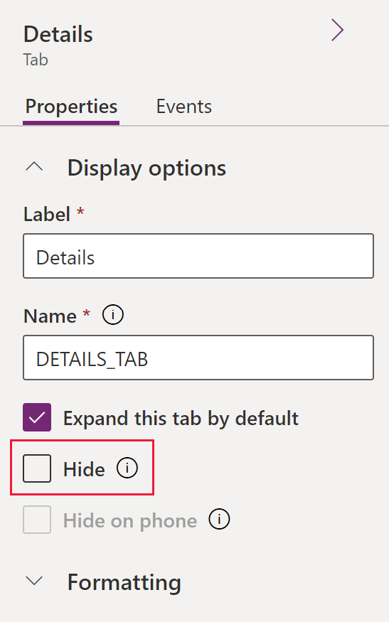

# Show or hide model-driven app form elements

Several types of form elements have the option to be shown or hidden at app runtime. Tabs, sections, columns, iFrames, and web resources all provide this option. You can change the default setting to view a form element in the form designer by selecting the **Hide** property.

Using form scripts or business rules, the visibility of these elements can be controlled to create a dynamic form to provide a user interface that adapts to conditions in the form.  
  
> [!IMPORTANT]
> Hiding form elements is not a recommended way to enforce security. There are several ways people can view all the elements and data in the form when elements are hidden. 
>
> Disabling, hiding, or locking a column, control, or form component using the form designer, manually in the form XML, or using a Client API only works to control data access in a Unified Interface or legacy web client app. It doesn’t strictly enforce data access by itself in the apps. Moreover, it doesn’t control data access using other ways to connect to Microsoft Dataverse such as using the Web service or a canvas app. It is also important to know that the app will not display an error message or block a save if a required column is null and has been disabled. This ensures that users are never blocked from completing a task. To control access, see [Set security roles for a form](control-access-forms.md#set-security-roles-for-a-form) or use [Field-level security](/power-platform/admin/field-level-security).
  
Rather than designing forms that depend on scripts to control visibility of options, consider whether a business process flow, a dialog, or switching to a different form may be better suited to meet your requirements. If you do use scripts, make sure that any element that might be hidden is hidden by default. Only show it with scripts when your logic calls for it. This way it will not be displayed in presentations that do not support scripts.

In Unified Interface, for sections where columns don’t span more than one column, hiding a column in the section moves the column below up on the form. If a column spans more than two columns in a section, hiding a column in the section that has a control across from it will not move the column below it up on the form. You will see additional white space where the hidden column is in the section.

## Client API methods for controlling the visibility of form elements

For information about how to change the form element show or hide status for the header, command bar, footer, and tabs at app runtime, see these client API reference articles:
- [formContext.ui.headerSection item (Client API reference)](../../developer/model-driven-apps/clientapi/reference/formContext-ui-headerSection.md)
- [formContext.ui.footerSection item (Client API reference)](../../developer/model-driven-apps/clientapi/reference/formContext-ui-footerSection.md)
- [formContext.ui.tabs (Client API reference)](../../developer/model-driven-apps/clientapi/reference/formContext-ui-tabs.md)

## Next steps

[Overview of the form editor interface](form-editor-user-interface-legacy.md)

[!INCLUDE[footer-include](../../includes/footer-banner.md)]