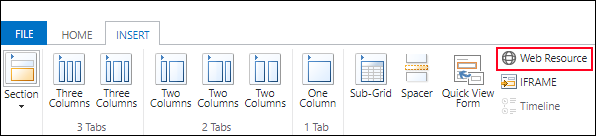
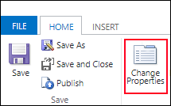
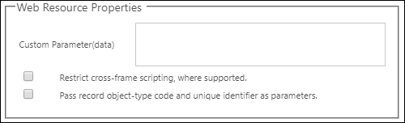
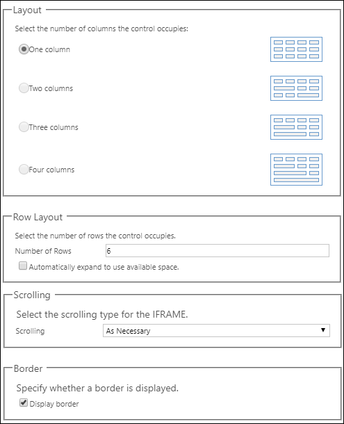
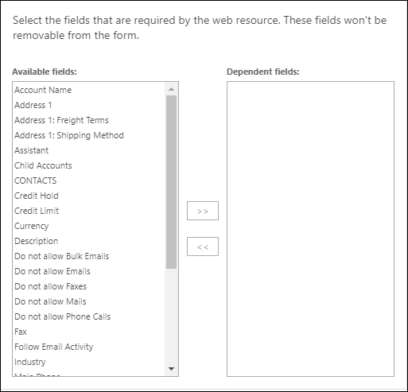

# Web resource properties for model-driven app forms

[!INCLUDE [cc-data-platform-banner](../../includes/cc-data-platform-banner.md)]

You can add or edit web resources on a form to make it more appealing or useful to app users. Form enabled web resources are images or HTML files controls.

> [!NOTE]
> Silverlight web resources are deprecated and will not work in the Unified Interface client.

## Access web resource properties

While viewing a form:
- **When adding a web resource:**: Select the tab (for example, **General** or **Notes**) you would like to insert it on, and then on the **Insert** tab, select **Web Resource**. 
- **When editing a web resource**: Select a form tab and the web resource that you want to edit, and then on the **Home** tab, select **Change Properties**.  

This will open the **Add Web Resource** or **Web Resource Properties** dialog box.

> [!IMPORTANT]
> You must select the **Visible by default** option for the web resource to appear on the form and be available to users.

## Web resource properties

 The **Add Web Resource** or **Web Resource Properties** dialog box will have two, sometimes three tabs depending on the type of web resource.

### General tab

These properties define the web resource to use and how it should behave.

|Column|Description|
|--|--|
|**Web resource**|*Required.* Look up an existing web resource or create a new one. Use the **Form Enabled Web Resource** view to include only HTML and image web resources that can be added as visual elements in a form.|
|**Name**|*Required.* Specify a name for the web resource control that will be added to the form. This value uniquely identifies the control in the form.|
|**Label**|*Required.* Automatically generated based on the **Name** column value. Specify localizable text for the web resource control that will be added to the form. Select **Display label on the form** if you want to make this visible.|
|**Visible by default**|While this is enabled the web resource will be visible when the form loads. If you have a business rule or form script that will show the web resource as needed, uncheck this column. More information: [Show or hide form elements](visibility-options-legacy.md)|
|**Enable for mobile**|Select this option to allow this web resource to be visible in mobile apps.|

Depending on the type of web resource you select, set additional properties.

For HTML web resources you will see these:

|Column|Description|
|--|--|
|**Custom Parameter(data)**|Usually configuration data that will be passed to the HTML web resource as a `data` query string parameter. Scripts associated with the HTML page can access this data and use it to change the behavior of the page.|
|**Restrict cross-frame scripting where supported**|Use this option if you don't fully trust the content in the HTML web resource. More information: [Developer Documentation: Select whether to restrict cross-frame scripting](/dynamics365/customer-engagement/developer/use-iframe-and-web-resource-controls-on-a-form#select-whether-to-restrict-cross-frame-scripting)|
|**Pass row object-type code and unique identifier as parameters**|Data about the current row visible in the form can be passed to the HTML web resource page so that script running in the page can access data about the row. More information:  [Pass parameters to web resources](#pass-parameters-to-web-resources) [Developer Documentation: Pass contextual information about the row](/dynamics365/customer-engagement/developer/use-iframe-and-web-resource-controls-on-a-form#pass-contextual-information-about-the-record)|

For Image web resources you have the option to specify **Alternative Text** that is important for assistive technologies that make the page accessible to everyone.

<!-- TODO: Why are Custom Parameters available to pass to image web resources? -->

### Formatting tab

On the **Formatting** tab, the options that display vary based on the type of web resource inserted and the context where it is inserted. These options include specifying the number of columns and rows display, whether a border displays, and the scrolling behavior.

|Property|Description|  
|--------------|-----------------|
|**Select the number of columns the control occupies**|When the section containing the web resource has more than one column you can set the column to occupy up to the number of columns that the section has.|  
|**Select the number of rows the control occupies**|You can control the height of the web resource by specifying a number of rows or select **Automatically expand to use available space** to allow the web resource height to expand to available space.|  
|**Select the scrolling type for the IFRAME**|An HTML web resource is added to the form using an IFRAME.   - **As Necessary**: Show scrollbars when the size of the web resource is larger than the available. - **Always**: Always show scrollbars. - **Never**:  Never show scrollbars.|  
|**Display border**|Display a border around the web resource.|  

### Dependencies tab

A web resource may interact with columns in the form using script. If a column is removed from the form the script in the web resource may break. Add any columns referenced by scripts in the web resource to the **Dependent columns** so that they cannot be removed accidentally.

  
 
 
## Pass parameters to web resources 

An HTML web resource can accept parameters to be passed as query string parameters.  
  
Information about the row can be passed by enabling the **Pass row object-type code and unique identifiers as parameters** option. If information is typed into the **Custom Parameter(data)** column it will be passed using the data parameter. The values passed are:  
  
|Parameter|Description|  
|---------------|-----------------|  
|`data`|This parameter is only passed when text is provided for **Custom Parameter(data)**.|  
|`orglcid`|The Organization default language LCID.|  
|`orgname`|The name of the organization.|  
|`userlcid`|The user’s preferred language LCID|  
|`type`|**Don't use this.** The table type code. This numeric value can be different for custom tables in different organizations. Use table type name instead.|  
|`typename`|The table type name.|  
|`id`|The id value of the row. This parameter has no value until the table row is saved.|  
  
Any other parameters are not allowed and the web resource will not open if other parameters are used. If you need to pass multiple values, the data parameter can be overloaded to include more parameters within it.

More information: [Developer Documentation: Pass contextual information about the row](/dynamics365/customer-engagement/developer/use-iframe-and-web-resource-controls-on-a-form#pass-contextual-information-about-the-record)

### See also

[Create or edit web resources to extend an app](create-edit-web-resources.md) 
[Use the main form and its components](use-main-form-and-components.md)

[!INCLUDE[footer-include](../../includes/footer-banner.md)]