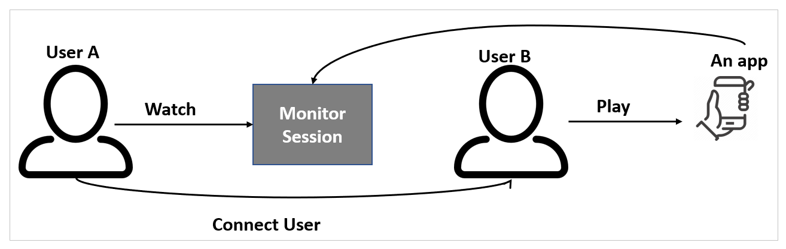
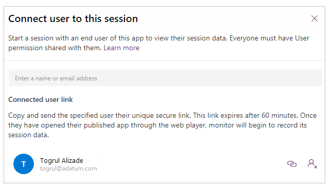
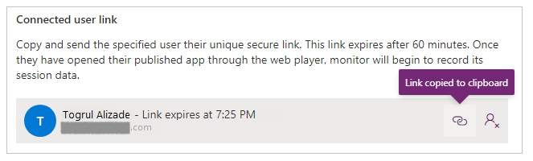

# Advanced monitoring concepts and scenarios

Earlier you learned about the overview of Monitor, and how to use Monitor to debug canvas apps and model-driven apps. Now let’s look at a few scenarios where Monitor can shed light and solve script errors, unexpected behavior, and slowdowns.

## Custom script errors

Sometimes, a bug in the custom JS causes a script error or functionality
problem when loading a page. While this usually produces a call stack in the
dialog, it’s hard to always know where it’s coming from or decode the error.
Monitor receives events from the app with more details about the errors, so you can debug more quickly, and easily.

Let’s say a user is experiencing a script error dialog on account form load.  We can use Monitor to get more details on the event.  Once the scenario is
reproduced, you can see the script error produces an error event highlighted in red. Selecting this row gives us not only the **call stack** but
the **publisher name**, **solution name/version**, **web resource name**,
and **type** (such as *onload*, *onchange*, *RuleEvaluation*, and *CustomControl*). In this example, it looks like a typo in the script.

## Slow performance

Browser developer tools can help profile slow page loads, but there is a lot of data to filter though and it’s not clear what is important to look at.  Monitor solves this problem by showing relevant events that contribute to page load performance.

Let’s say a user is experiencing slow account form loads, and the browser is
constantly freezing up. In this case, once we reproduce, we can immediately see a performance warning telling us that a synchronous **XMLHttpRequest** was sent during the load which degraded performance.

See [previous blog post](https://powerapps.microsoft.com/blog/turbocharge-your-model-driven-apps-by-transitioning-away-from-synchronous-requests/) for how to alleviate synchronous XHR performance problems.

For every page load, we send all KPI for the loading sequence as well as network request details as mentioned earlier.

## Collaborative troubleshooting using Monitor

Monitor tool offers two features to facilitate the collaborative troubleshooting, and debugging of Power apps problems. The **Invite** feature enables makers to share a monitoring session by inviting other members within the same organization to the same monitor session. For example, a maker troubleshooting a performance problem with Power Apps, can invite other technical support team to concurrently view all the flowing events through the same troubleshooting monitor session.

### Invite user

Maker can share real-time monitor session with others, such as a support technician, to help investigate problems. Inviting other users to your Monitor session enables you to quickly collaborate and debug an app together, without the need to share your screen. When you invite others to participate in a session, they see the exact same app events in their own browser, without having to open the app or the need to reproduce the specific scenario that you're debugging. This allows you and other participants to browse, view, and inspect the app events independently without stepping on each other or handing control back-and-forth to identify the problem.

When using **Invite user** feature for a published app:

1. User A plays the published app from [Power Apps](https://make.powerapps.com).
1. User A invites User B to a monitor session.
1. User B joins the monitor session with the link User A sent.
1. User A interacts with the app.
1. User B watches User A's interaction with the app. 
1. User B can also watch monitor.

> [!NOTE]
> You can invite any user in your organization to a Monitor session.
Users joining the session will see all the events generated by the app,
including any data.

To invite user to watch a monitoring session:

1. Select **Invite** from the top.

    

1. Enter Azure Active Directory user name or alias of the users that you want
    to invite to the Monitor session.

    

1. Select the user to generate a link to the current Monitor session.

    > [!NOTE]
    > The link is unique for each user. It can't be shared between users. The link expires after 60 minutes.

1. Select the link icon to copy the session link and send it to the users
    you've invited to the session.

    

Recipient users can use the link to open the Monitor and connect to your Monitor
session.

### Connect user (for only published canvas apps)

Maker can enable an end-user to launch a published canvas app, and connect using a monitoring session. This feature allows the maker to watch the sequence of events generated while interacting with the app, and help with problem investigation.

> [!NOTE]
> - The **Connect user** feature enable makers and support teams to share a link with end users to launch a published app and connect it to a monitor session so that, support teams can watch the sequence of events generated by end users’ interaction.
> - **Connect user** requires the app with Power Apps version 3.20042 or later. For earlier versions, publish the app again for this option to be available.

When using **Connect user** feature for a canvas app:

1. User B plays the published canvas app.
1. User A opens Monitor.
1. User A selects **Connect user** and to connect to User B.
1. User B interacts with the app.
1. User A watches the monitored session.

To connect a user to a monitoring session:

1. Open [Monitor for published app](monitor-canvasapps.md#open-monitor-for-published-app).

1. Select **Connect user**.

    

1. Search for, and select the user that you want to connect to.

    

1. Copy the link and share with the user to play the app.

    

1. Once you share the link with the user, the user uses the link to open the app, and gets notified of joining a monitoring session.

    

User can now interact with the app, and Monitor shows events for this interaction.

## Download and upload trace files

You can download the events that are shown in the table for offline analysis.
Events can be downloaded in a .json or a .csv format, and can be shared with
others. The .csv files can only be downloaded. But if you export the events
in .json format, you can them back into the monitor tool for analysis. You can
also attach a trace file to support service requests helping speed up the
solution to your problem.

Select **Upload** to load a .json trace file to Monitor. The upload option will remove any events currently displayed in the Monitor table, and replace the details with the events contained in the trace file.

## Supported Events

Monitor supports several events for canvas apps and model-driven apps. Here are some examples of the supported event categories and types:

| Canvas apps | Model-driven apps |
| - | - |
| <ul> <li> Data connectors </li> <li> Network events (error status codes highlighted) </li> <li> Screen load metrics </li> <li> Cross-screen dependency warning </li> <li> User actions such as *Navigate*, *Select*, *SetProperty* </li> <li> Custom Trace() </li> <li> Delegated versus non-delegated queries </li> <li> Verbose switch (internal telemetry) </li> <li> Delegation </li> <li> Function </li> <li> Network </li> <li> Parsing </li> <li> Performance </li> <li> Scenario </li> <li> ScreenLoad </li> <li> Telemetry </li> <li> UserAction </li> <li> Verbose </li> </ul> | <ul> <li>	Form load sequence, core boot </li> <li> Perf metrics </li> <li> XHR Sync versus Async </li> <li> Form rules (model) </li> </ul> |

## Unsupported scenarios for Monitor

The following scenarios aren't supported when using Monitor:

- Monitor connected to apps running on a mobile device (native players).
- Monitor connected to canvas app embedded in a model-driven app or custom page.
- Monitor connected to SharePoint custom form app.
- Monitor connected to Teams embedded app. As an alternative, play the app in a web player for diagnostics purposes.

### See also

- [Monitor canvas apps using Monitor](monitor-canvasapps.md)
- [Monitor model-driven apps using Monitor](monitor-modelapps.md)

