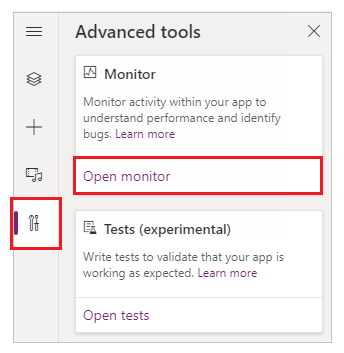

# Debugging canvas apps with Monitor

Monitor is available by default for all canvas apps. Using Monitor, you can trace events as they occur in a canvas app during the authoring experience in Power Apps Studio, or you can use Monitor to debug the published version of a canvas app. More information: [Monitor overview](monitor-overview.md)

## Get started with Monitor in canvas apps
<!--markdownlint-disable MD036-->
**To open Monitor when authoring an app**

1. Sign in to [Power Apps](https://make.powerapps.com/).

1. Create a [new app](canvas-apps/get-started-test-drive.md), or [edit an existing app](canvas-apps/edit-app.md).

1. On the left pane, select **Advanced tools**.

1. Select **Open monitor**.

    

This action opens Monitor in a new browser tab and connects it to your existing Power Apps Studio session.

A notification appears at the top to show the current monitoring session as a *Studio session*.

> [!TIP]
> Monitor has no impact on your app. You can use Monitor with any app in
a test environment or in production.

## Open Monitor for a published app

You can also use Monitor to debug the published app in the web player.

**To open Monitor for a published app**

1. Sign in to [Power Apps](https://make.powerapps.com/).

1. On the left pane, select **Apps**.

1. Select an app from the list.

1. Select **Monitor** from the menu. Or, you can select **More
    Commands** (**...**), and then select **Monitor**.

    

1. Select **Play published app**.

    

This action opens the published app in a new browser tab and connects it to your current Monitor session. You'll immediately see events in Monitor when the app is loaded in the web player, and as you interact with the published app.

Monitor also displays a notification that the monitoring session that's currently open is for the published version of the app.

### Setting: Debug published app

If you want to view the source expressions in Monitor for the published app, you need to turn on the setting to publish the expressions with the app. This setting is similar to generating a debug file in traditional development. Publishing source expressions with your app is optional. Even when this setting is off, you'll be able to see the events happening in your app, but you won't be able to map these events to specific expressions or formulas.

To enable this setting, go to **File** > **Settings**, and then turn on **Debug published app**.

### View events in Monitor

To view events from your app, play the app in Power Apps Studio. Monitor will then
display the table of events as they're occurring, along with specific details.

## Example: Using Monitor with canvas apps

In this example, you'll use the Northwind Sample Data app included with
the [Northwind sample solution](canvas-apps/northwind-install.md).

The *Northwind sample solution* is a canvas app that loads sample data into Microsoft Dataverse. You can also create a new app or use an existing app instead.

### Background

Consider the scenario where an app has been deployed, and the initial version of the app experiences performance degradation. The app also intermittently generates errors with no clear pattern. Loading data in the app succeeds most of the time, but fails sometimes.

When you check Monitor, you see data operations as expected. However, you also see several responses that have HTTP status code 429, indicating that there have been too many requests in a specific timeframe.

When you select such an event, you see the error as "Rate limit exceeded. Try again in XX seconds."

### **Analysis**

The problem needs further analysis to understand why requests are getting
throttled. In Monitor, you see that for each **createRow** call, there are
several **getRows** requests from the **ProgressCount.Text** property, each to a different entity. These entities aren't the entities the app is creating rows for. The **ProgressCount.Text** formula is seen in Monitor, as shown in the following image.

For each record added, the formula is evaluated again and **CountRows** is
called on several entities. This behavior results in **getRows** in the log,
because **CountRows** isn't delegated for Dataverse. For each single
request to add a record, you're potentially making 12 additional requests to
count the rows in each entity.

These extra requests intermittently cause errors because the Dataverse platform is throttling the requests to the service. This also explains the overall performance problem.

## Next steps

[Collaborative debugging with Monitor](monitor-collaborative-debugging.md)

### See also

[Advanced monitoring](monitor-advanced.md)  
[Debugging model-driven apps with Monitor](monitor-modelapps.md)

[!INCLUDE[footer-include](../includes/footer-banner.md)]