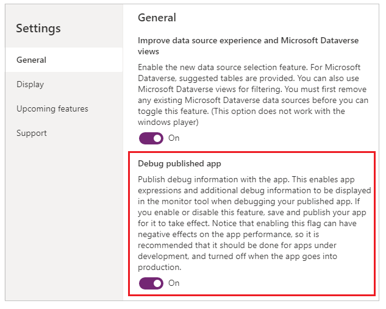

# Debugging canvas apps with Monitor

Monitor is available by default for all canvas apps. Using Monitor, you can trace events as they occur in a canvas app during the authoring experience using the Power Apps Studio, or use Monitor to debug a canvas app's published version. To learn more about Monitor, go to [Monitor overview](monitor-overview.md).

## Get started with Monitor in canvas apps

To open Monitor when authoring an app:

1. Sign in to [Power Apps](https://make.powerapps.com/).

1. Create a [new app](https://docs.microsoft.com/powerapps/maker/canvas-apps/get-started-test-drive) or [edit an existing app](https://docs.microsoft.com/powerapps/maker/canvas-apps/edit-app).

1. Select **Advanced tools** in the left pane.

1. Select **Open monitor** to open Monitor for this app.

    

This action opens Monitor in a new browser tab and connects it to your existing Studio session:

A notification appears at the top to show the current monitoring session as a *Studio session*.

> [!TIP]
> Monitor has no impact on your app. You can use Monitor with any app in
a test environment or in production.

## Open Monitor for published app

You can also use Monitor to debug the published app in the web player.

To open Monitor for a published app:

1. Sign in to [Power Apps](https://make.powerapps.com/).

1. Select **Apps** in the left pane.

1. Select an app from the list.

1. Select **Monitor** from the menu. You can also select **More
    Commands** (**...**), and then select **Monitor** instead.

    

1. Select **Play published app**.

    

This action opens the published app in a new browser tab and connects it to your current Monitor session. You'll immediately see events in the Monitor when the app loads in the web player, and as you interact with the published app.

Monitor also shows a notification to display that the monitoring session currently open is for the published version of the app.

### Advanced setting: Debug published app

If you want to view the source expressions in the Monitor for the published app, you need to turn on a new setting to publish the expressions with the app. This setting is similar to generating a debug file in traditional development. Publishing source expressions with your app is optional. Even when this setting is off, you can still see the events happening in your app, but you can't map these events to specific expressions or formulas.

To enable this setting, go to **File** > **Settings** > **Advanced settings** > Turn **Debug published app** to *On*.

### View events in Monitor

To view events from your app, play the app in the Studio. Monitor will then
display the table of events occurring along with specific details.

## Example: Using Monitor with canvas apps

In this example, you'll use the *Northwind Sample Data* app included with
the [Northwind sample solution](https://docs.microsoft.com/powerapps/maker/canvas-apps/northwind-install).

*Northwind sample solution* is a canvas app that loads sample data into Common
Data Service. You can also create a new app or use an existing app instead.

### Background

Consider the scenario where the app is deployed and the initial app version
experiences performance degradation. The app also intermittently generates
errors with no clear pattern. Loading data in the app succeeds mostly and fails sometimes.

When you check canvas app Monitor, you see data operations as expected. However, you also see several responses with HTTP status code 429 indicating too many requests in a specific timeframe.

When you select such an event, you see the error as *Rate limit exceeded. Try
again in XX seconds.*

### **Analysis**

The problem needs further analysis to understand why requests are getting
throttled. In Monitor, you see that for each **createRow** call, there are
several **getRows** requests from the **ProgressCount.Text** property, each to a different entity. These entities aren't the entities the app is creating rows for. The **ProgressCount.Text** formula is seen in Monitor:

For each record added, the formula is evaluated again and **CountRows** is
called on several entities. This behavior resulted in **getRows** in the log,
since **CountRows** isn't delegated for Common Data Service. For each single
request to add a record, you're potentially making 12 additional requests to
count the rows in each entity.

These extra requests intermittently cause errors because of the Common Data
Service platform throttling the requests to the service. And it also explains
the overall performance problem.

## Next steps

[Collaborative debugging with Monitor](monitor-collaborative-debugging.md)

### See also

- [Advanced monitoring](monitor-advanced.md)
- [Monitor model-driven apps using Monitor](monitor-modelapps.md)
