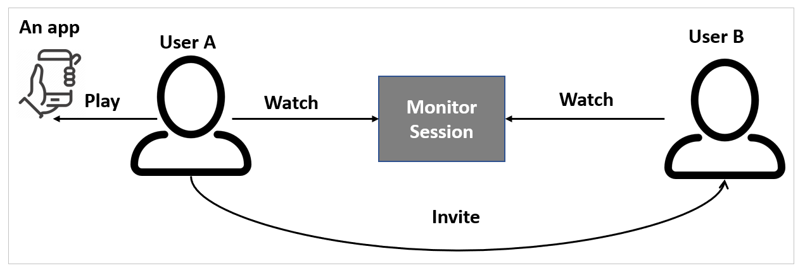
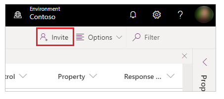
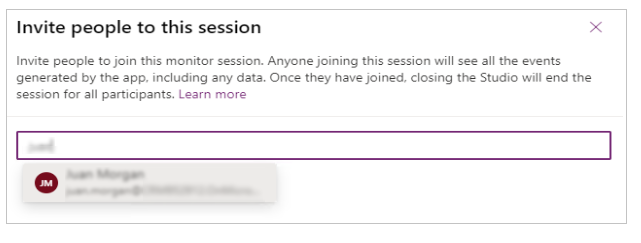
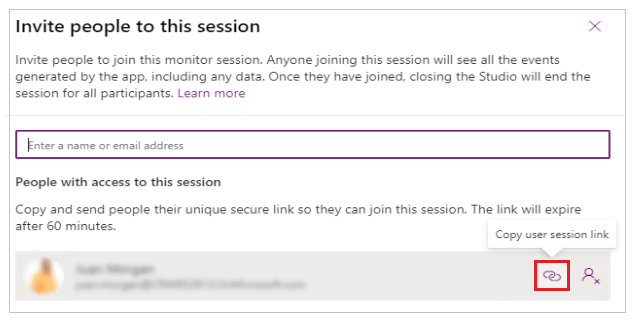
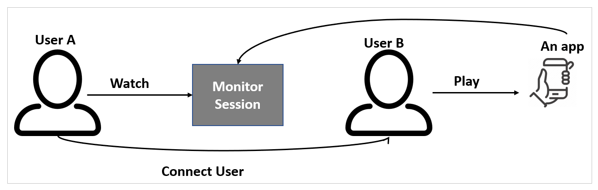
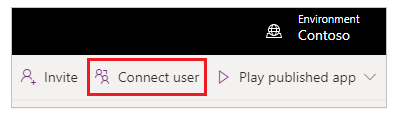
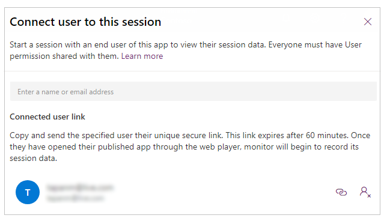
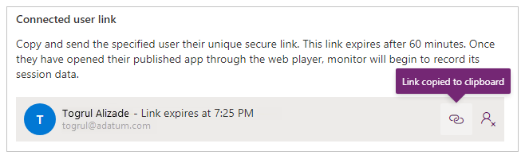
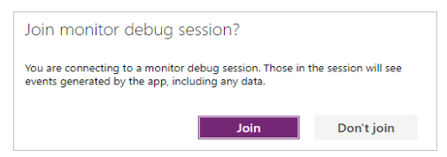

# Collaborative troubleshooting using Live Monitor

Live monitor offers two features to enable collaborative troubleshooting and debugging of canvas and model-driven app problems in Power Apps:

- **Invite** enables makers to share a monitoring session by inviting other members within the same organization to the same Live monitor session. For example, a maker troubleshooting a performance problem with Power Apps can invite a member from the technical support team to concurrently view all the events flowing through the same troubleshooting Live monitor session.
- **Connect user** enables makers and support teams to share a link with users to open a published app and connect it to a Live monitor session so that support teams can watch the sequence of events generated by the user's interaction.

## Invite user

With canvas apps and published model-driven apps, makers can share a real-time Live monitor session with others, such as support technicians, to help investigate problems. When you invite other users to your Live monitor session, you can quickly collaborate and debug an app together, without the need to share your screen. When you invite others to participate in a session, they see the exact same app events in their own browser without having to open the app or reproduce the specific scenario that you're debugging. You and other participants can browse, view, and inspect the app events independently, without stepping on each other or handing control back and forth to identify the problem.

When using the **Invite** feature for a published app:

1. User A plays the published app from [Power Apps](https://make.powerapps.com).
1. User A invites User B to a Live monitor session.
1. User B joins the Live monitor session with the link that User A sent.
1. User A interacts with the app.
1. User B watches the events generated from User A's interaction with the app in their own Live monitor window.

> [!NOTE]
> You can invite any user in your organization to a Live monitor session.
Users joining the session will see all the events generated by the app,
including any data.
<!--markdownlint-disable MD036-->
**To invite a user to watch a monitoring session**

1. Select **Invite** from the command bar.

    

1. Enter the Microsoft Entra user name or alias of the user whom you want
    to invite to the Live monitor session.

    

1. Select the user for whom you want to generate a link to the current Live monitor session.

    > [!NOTE]
    > The link is unique for each user. It can't be shared between users. The link expires after 60 minutes.

1. Select the link icon to copy the session link, and then send it to the user you've invited to the session.

    

Repeat steps 2 through 4 for each user you want to invite.

The users who have received the link can use it to open the Live monitor and connect to your Live monitor
session.

## Connect user

With **Connect user**, a maker can enable a user to open a published canvas or model-driven app and connect by using a monitoring session. You can watch the sequence of events the user generates while interacting with the app, and help with problem investigation.

> [!NOTE]
> - With **Connect user**, makers and support teams share a link with users to open a published app and connect it to a Live monitor session, so support teams can watch the sequence of events generated by the user's interaction with the app.
> - **Connect user** requires that the app be published with Power Apps version 3.20042 or later for canvas apps and client version 1.4.5973-2307.2 or later for model-driven apps. To make this feature available in earlier versions of a canvas app, publish the app again.

When using the **Connect user** feature for a published app:

1. User A chooses the app to monitor and opens Live monitor.
1. User A selects **Connect user**, and share the generated session link with User B.
1. User B plays the published app by selecting the link that was shared by User A.
1. User A watches the monitored session as User B interacts with the app.

**To connect a user to a monitoring session**

1. Open [Live monitor for the published app](monitor-canvasapps.md#open-monitor-for-published-app).

1. Select **Connect user**.

    

1. Search for and select the user who you want to connect to.

    

1. Copy the link, and share it with the user so they can play the app.

    

1. After you share the link, the user selects it to open the app and is notified that they're joining a monitoring session. The same link can be used to open the app in a monitored session on [Power Apps mobile](../mobile/run-powerapps-on-mobile.md).

    

The user can now interact with the app, and Live monitor will show events for this interaction.   

## Next steps

[Advanced monitoring](monitor-advanced.md)

### See also

[Troubleshoot form issues in model-driven apps](/powerapps/developer/model-driven-apps/troubleshoot-forms)  
[Debugging canvas apps with Live monitor](monitor-canvasapps.md)  
[Debugging model-driven apps with Live monitor](monitor-modelapps.md)  

[!INCLUDE[footer-include](../includes/footer-banner.md)]
