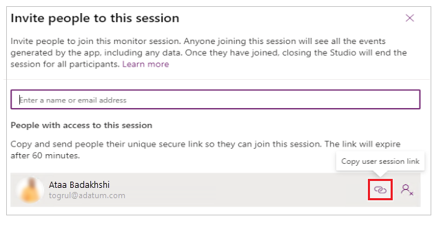

# Collaborative troubleshooting using Monitor

Monitor tool offers two features to facilitate collaborative troubleshooting, and debugging of Power Apps' problems. The first feature **Invite**, enables makers to share a monitoring session by inviting other members within the same organization to the same monitor session. For example, a maker troubleshooting a performance problem with Power Apps, can invite a memember from the technical support team members to concurrently view all the flowing events through the same troubleshooting monitor session. The second feature **Connect user** enables makers and support teams to share a link with end users to launch a published app and connect it to a monitor session so that, support teams can watch the sequence of events generated by end users’ interaction.

## Invite user

Makers can share real-time monitor session with others, such as a support technicians, to help investigate problems. Inviting other users to your Monitor session enables you to quickly collaborate and debug an app together, without the need to share your screen. When you invite others to participate in a session, they see the exact same app events in their own browser, without having to open the app or the need to reproduce the specific scenario that you're debugging. This allows you and other participants to browse, view, and inspect the app events independently without stepping on each other or handing control back-and-forth to identify the problem.

When using **Invite user** feature for a published app:

1. User A plays the published app from [Power Apps](https://make.powerapps.com).
1. User A invites User B to a monitor session.
1. User B joins the monitor session with the link User A sent.
1. User A interacts with the app.
1. User B watches the events generated from User A's interaction with the app in their own Monitor window. 

> [!NOTE]
> You can invite any user in your organization to a Monitor session.
Users joining the session will see all the events generated by the app,
including any data.

To invite user to watch a monitoring session:

1. Select **Invite** from the top.

    

1. Enter Azure Active Directory user name or alias of the users that you want
    to invite to the Monitor session.

    

1. Select the user to generate a link to the current Monitor session.

    > [!NOTE]
    > The link is unique for each user. It can't be shared between users. The link expires after 60 minutes.

1. Select the link icon to copy the session link and send it to the users
    you've invited to the session.

    

Recipient users can use the link to open the Monitor and connect to your Monitor
session.

## Connect user (published canvas apps only)

Maker can enable an end-user to launch a published canvas app, and connect using a monitoring session. This feature allows the maker to watch the sequence of events generated while interacting with the app, and help with problem investigation.

> [!NOTE]
> - The **Connect user** feature enable makers and support teams to share a link with end users to launch a published app and connect it to a monitor session so that, support teams can watch the sequence of events generated by end users’ interaction.
> - **Connect user** requires the app with Power Apps version 3.20042 or later. For earlier versions, publish the app again for this option to be available.

When using **Connect user** feature for a canvas app:

1. User A choose the desired app to monitor and open monitor.
1. User A selects **Connect user** and share the generated connect link with User B
1. User B plays the published canvas app by clicking the link shared by user A.
1. User A watches the monitored session as user B interacts with the app.

To connect a user to a monitoring session:

1. Open [Monitor for published app](monitor-canvasapps.md#open-monitor-for-published-app).

1. Select **Connect user**.

    

1. Search for, and select the user that you want to connect to.

    

1. Copy the link and share with the user to play the app.

    

1. Once you share the link with the user, the user uses the link to open the app, and gets notified of joining a monitoring session.

    

User can now interact with the app, and Monitor shows events for this interaction.

## Next steps

[Advaned monitoring](monitor-advanced.md)

### See also

- [Troubleshoot form issues in model-driven apps](https://docs.microsoft.com/powerapps/developer/model-driven-apps/troubleshoot-forms)
- [Monitor canvas apps using Monitor](monitor-canvasapps.md)
- [Monitor model-driven apps using Monitor](monitor-modelapps.md)
