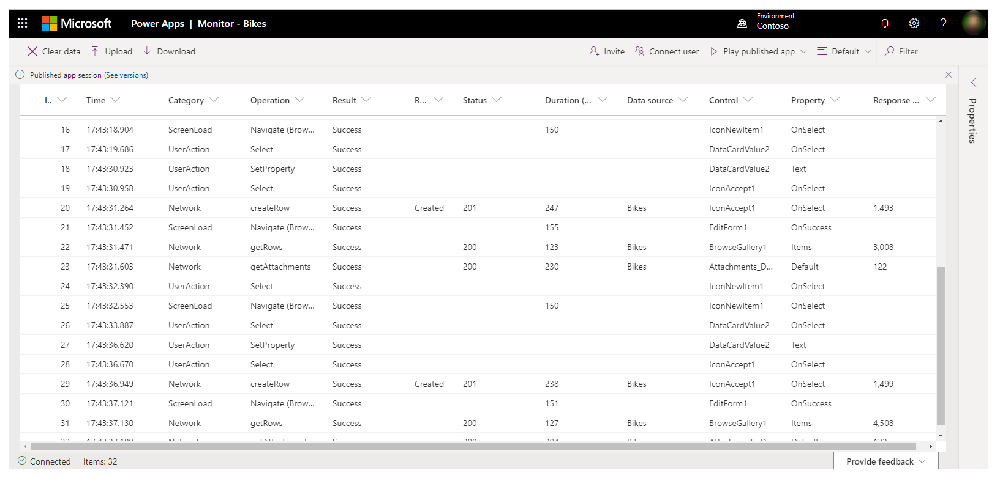
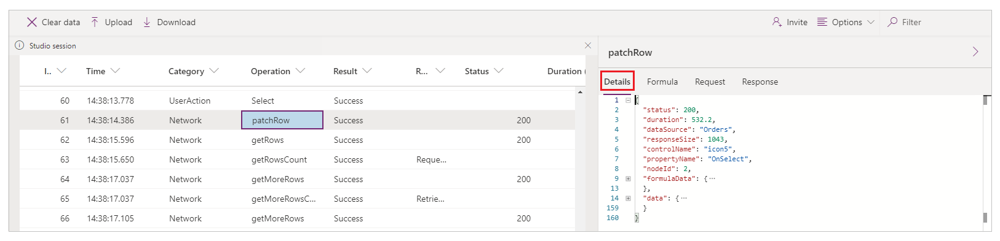
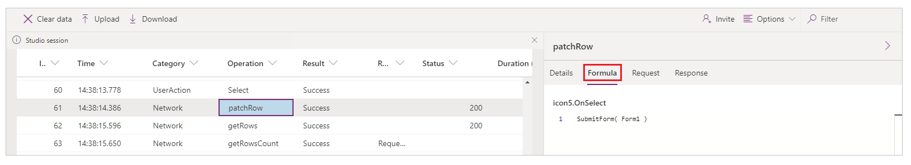
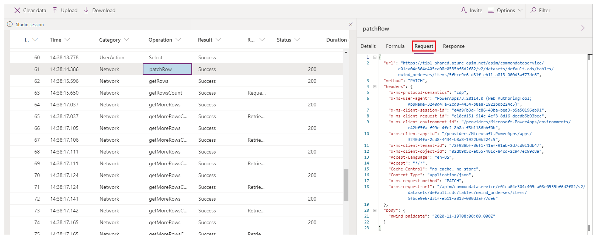
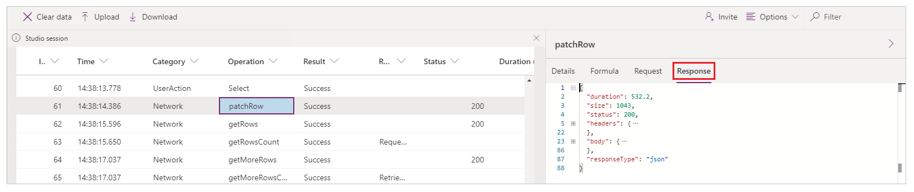

# Monitor overview

Monitor is a tool that offers makers the ability to view a stream of events from a user's session to diagnose and troubleshoot problems. Makers of canvas apps can use Monitor either to view events while building a new app in Power Apps Studio or to monitor published apps during runtime. Makers of model-driven apps can monitor page navigation, command executions, [form-related issues](/powerapps/developer/model-driven-apps/troubleshoot-forms), and other major actions to understand app behavior and make improvements.

## Benefits

Monitor can help you diagnose and troubleshoot problems faster, and build more reliable apps. It provides a deep view of your app by logging all the key activities that occur in the app as it runs. Monitor also provides a better understanding of how the events and formulas contained in your app work, so you can improve performance and identify any errors or problems.

## Debugging an app

The key to debugging a problem is to have a better understanding of what your app does, and how it does it. Sometimes it's difficult to isolate a problem by just looking at the app formulas, or even by reviewing runtime errors. Watching the events as they occur in your app can help you understand the order of events and how your app is performing, to spot errors and diagnose problems faster.

Some examples of problems and queries that you can uncover when using Monitor are:

- **A high number of network calls**
    - Is the app fetching data too frequently?
    - Can you optimize the app to only fetch data when required?
    - Are timer controls firing too often?
    - Are too many events occurring when the app starts? Can fetching some of the data be delayed?

-   **Retrieve data from the same data source**
    - Can you use different patterns such as caching data in collections or variables instead of fetching the same data multiple times?

-   **The response data size**
    - Can you use query filters to reduce the amount of requested data?

-   **The duration of the request**
    - Are connectors and plug-ins optimized?
    - Can you reduce the size of the response by using query filters?

-   **Errors**
    - Have you configured the required permissions to run the app correctly?
    - Are your requests throttled by the platform?

## Monitor dashboard

You can review various properties for each event inside Monitor. Depending on the event category, some of these properties might not contain data. The following image shows an example of the Monitor dashboard for canvas apps.

| Column name       | Description                                                                                                                                                                                                                                       |
|-------------------|-----------------------------------------------------|
| **Id**            | The sequence number for the events.        |
| **Time**          | The time the event occurred.                         |
| **Category**      | The type of event, such as *Network*.          |
| **Operation**     | The resulting internal operation name of the request inside the app. For example, *createRow* is the operation name from the **Patch** function.          |
| **Result**        | The text description of the status code. For example, a 429 status will appear as an *"Error"* in the result column. Row colors also help to identify any errors and warnings quickly.          |
| **Result Info**   | The detailed translation of error codes and results. For example, a 429 status code will appear as "Too many requests" in this column.         |
| **Status**        | The [HTTP status code](https://www.w3.org/Protocols/rfc2616/rfc2616-sec10.html) of a network request. For example, a 2XX code represents a successful request, whereas a 4XX code represents an error.            |
| **Duration**      | Duration can mostly be used to understand the performance of network calls in the app, but it also depends on the type of event. For example, for a network request, duration is the time taken for the request to be sent and a response to be received.  |
| **Data Source**   | The name of the data source accessed by the raised event operation (for example, the name of a Microsoft Dataverse table).             |
| **Control**       | The control name associated with this event          |
| **Property**      | The active control property of the raised event.         |
| **Response size** | For a network request event, represents the size of the response received from the sender to your app, in bytes.       |

When you select an event in the grid, a panel displays additional details about the event. The panel has four tabs:

- **Details**: Shows a high-level overview of the event that you select. Some
    of the data might be collapsed in the tree view. You can expand and drill
    down to view content.

    

- **Formula**: Shows the related formula from your app for the selected event. The
    name of the control property triggering the event is displayed on top of the tab and inside the event table.

    

- **Request**: Shows the HTTP request that was sent.

    

- **Response**: Shows the HTTP response that was received. You can view the response in
    JSON format.

    

## Unsupported scenarios for Monitor

To learn about unsupported scenarios for Monitor, go to [Advanced monitoring - unsupported scenarios](monitor-advanced.md#unsupported-scenarios-for-monitor).

## Next steps

- [Monitor canvas apps using Monitor](monitor-canvasapps.md)
- [Monitor model-driven apps using Monitor](monitor-modelapps.md)

### See also

[Troubleshoot form issues in model-driven apps](/powerapps/developer/model-driven-apps/troubleshoot-forms)  
[Collaborative debugging with Monitor](monitor-collaborative-debugging.md)  
[Advanced monitoring](monitor-advanced.md)

[!INCLUDE[footer-include](../includes/footer-banner.md)]