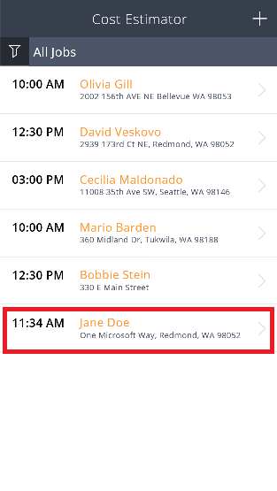
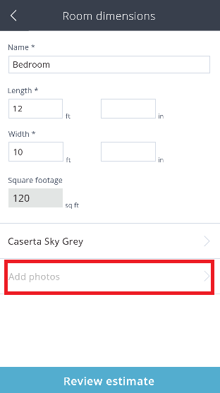
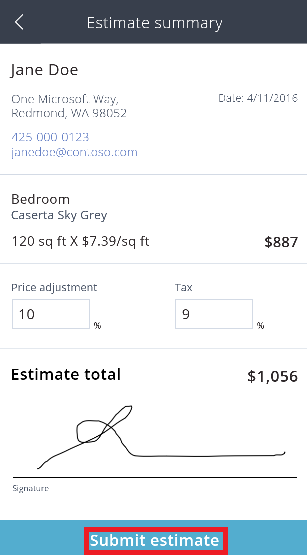

# Use a sample app
In [powerapps.com](http://web.powerapps.com), use a sample app to explore design possibilities and discover concepts that you can apply as you develop your own apps. Each sample app uses fictitious data to showcase a real-world scenario.

In **Cost Estimator**, for example, you can create an appointment for estimating the cost of installing a flooring product in a room of a particular size. Capture details such as address and square footage, and calculate the price based on discounts and tax rates. Filter a list of appointments to show those for which estimates have been created, for which estimates haven't been created, or all appointments.

## Open the app
1. Sign in to [powerapps.com](https://web.powerapps.com), and then click or tap **Cost Estimator** in the list of sample apps.

    
2. Click or tap **Open for phone** to show the app as it would look on a phone, and then click or tap **Allow** to give consent to use your device's camera.

    The app contains sample data for creating appointments and estimating the cost of installing a specific flooring product in a room of a particular size.

    

## Make and view an appointment
1. Click or tap **+** to make an appointment for an estimate.

    
2. Provide details, and then click or tap **Save job**.

    

    The appointment that you created appears in the list of appointments.

    
3. Click or tap an appointment, such as the one you created, to view its details, including a map of the location. You can delete an appointment by clicking or tapping the trash-can icon in the upper-right corner.

    

## Create an estimate
1. On the details page of an appointment, click or tap **Begin Estimate**.

    
2. Provide required information about the room, such as its **Name**, **Length**, and **Width**, and then click or tap **Select flooring style**.

    

    A list of categories for flooring products appears.

    
3. Click or tap **Carpet**, and then click or tap **Caserta Sky Grey**.

    
4. If you're using the app on a device that has a camera, click or tap **Add photos**.

    
5. Take one or more photos, and then click or tap **Done**.

    

## Finish and submit an estimate
1. Click or tap **Review Estimate**.

    
2. (optional) Specify a **Price adjustment** and a **Tax** rate.
3. Add a signature, and then click or tap **Submit estimate**.

    

    If your browser settings allow, your default mail client opens with a message that contains the estimate information.

    

    In PowerApps, the screen indicates that an estimate has been sent.

    
4. Click or tap **Done** to return to the list of appointments.

    The appointment for the estimate that you just completed appears in green, which indicates that it's closed.

    
5. (optional) Click or tap the filter icon in the upper-left corner, and then filter the list by status (open or closed) or show all appointments.
