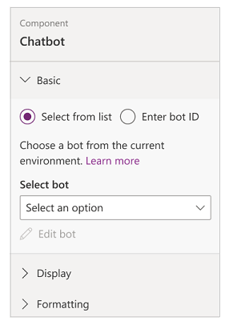

# Add chatbot to a page

Power Apps portals allows you to add a Power Virtual Agents chatbot to answer questions posted by visitor to your portal page. A bot can be configured with different topics and trigger phrases to automatically respond during a conversation with a visitor.

## Add chatbot component

To add a chatbot component to portal page:

1. Go to [Power Apps](https://make.powerapps.com).

1. Select **Apps** from the left pane.

1. Select your portal.

1. Select **Edit** to open the portals Studio.

1. Select **Components** from the left pane.

    

1. To add a bot from the current environment, select a bot from the list of available bots.

    

    If you want to add a bot from any other environment, select **Enter bot ID** and enter the bot ID.

    

1. Enter a display name.

1. 

## Next steps

[Work with templates](work-with-templates.md)

### See also

- [Create and manage web pages](create-manage-webpages.md)
- [Microsoft Learn: Integration with Power BI](https://docs.microsoft.com/learn/modules/portals-integration/3-power-bi)
