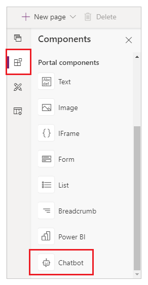
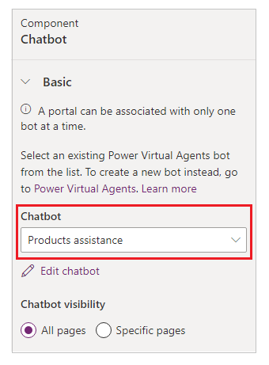
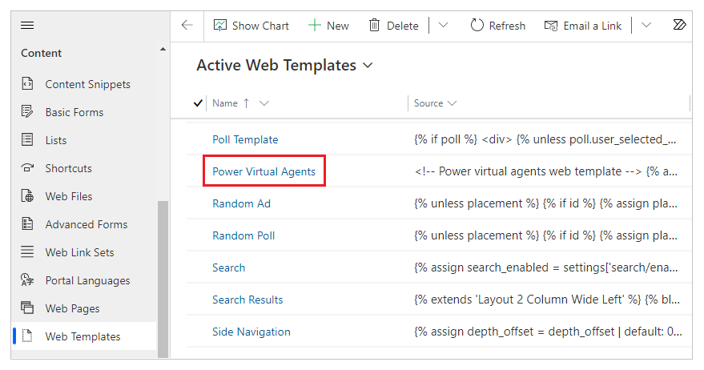

# Add chatbot to a page (preview)

[This article is pre-release documentation and is subject to change.]

Power Apps portals allow you to add a [Power Virtual Agents chatbot](/power-virtual-agents/fundamentals-what-is-power-virtual-agents) to answer questions posted by a visitor on your portals page. A chatbot (bot) configured with different topics and trigger phrases can automatically respond to questions posted by a visitor in a chat conversation.

> [!IMPORTANT]
> - This is a preview feature.
> - [!INCLUDE[cc_preview_features_definition](../../includes/cc-preview-features-definition.md)]

## Prerequisites

Before you can add a Power Virtual Agents bot to a Power Apps portals page, you must create a bot first. If you don't already have an available bot or one that fits your needs, you'll have the option in portals to go to Power Virtual Agents to create one. To learn how to create a bot, go to [Create and delete Power Virtual Agents bots](/power-virtual-agents/authoring-first-bot).

> [!IMPORTANT]
> This feature requires the following versions for starter portal package and portal host:
> - Portal host version [9.3.4.x](versions/version-9.3.4.x.md) or later.
> - Starter portal package version [9.2.2103.x](versions/package-version-9.2.2103.md) or later. More information: [additional considerations](#additional-considerations)

## Add chatbot component

Once you have a chatbot created, you can add this component to a portals page with the following steps:

1. Go to [Power Apps Preview](https://make.preview.powerapps.com).

1. Select **Apps** from the left pane.

1. Select your portal.

1. Select **Edit** to open the portals Studio.

1. Select **Components** from the left pane.

1. Select **Chatbot** component.

    

1. Select your bot.

    

    > [!NOTE]
    > If you don't have a bot already created, or want to create a new bot to use in portals, select **Power Virtual Agents**. After you create your bot, select **Sync configuration** inside portals Studio to reflect the bot changes.

1. Select whether the bot appears on all pages in your portal, or on specific pages.

1. If you select **Specific pages**, use **Manage bots in pages** to control the pages that can use this bot.

You can add more bots from your environment across different pages in a portal. For example, a bot that answers questions related to the workplace can be added to an HR page. Or a bot that answers basic payroll queries can be added to a Finance page. However, you can't have one page use more than one bot.

## Advanced configuration

The chatbot component is rendered using a web template called **Power Virtual Agents**.

You can change the values for the following parameters inside the "window.PvaEmbeddedWebChat.renderWebChat()" function.

:::image type="content" source="media/add-chatbot/chatbot-style.png" alt-text="Chatbot with each section numbered for reference."::: :::image type="content" source="media/add-chatbot/widget-style.png" alt-text="Chatbot Widget with each part numbered for reference.":::

| Parameter | Value | Annotation |
| - | - | - |
| width | Uses variable "chatWidth". To change, update the width in pixels:   `let chatWidth = "320px";` | 1 |
| height | Uses variable "chatHeight". To change, update the height in pixels:   `let chatHeight =  "480px";` | 2 |
| headerText | Title of the bot. By default, this uses the bot's name. To change, add "headerText" parameter with the bot header value:   `"headerText": 'Contoso chatbot';` | 3 | 
| webChatHeaderStyleOptions | Determines header style for the chatbot component, such as color of font and background. To change, update "webChatHeaderStyleOptions" parameter with the values for "fontColor" and "backgroundColor" properties:   `"webChatHeaderStyleOptions": {"fontColor":'black',"backgroundColor":'white'}` | 4: fontColor 5: backgroundColor  |
| webChatCanvasStyleOptions | Determines the chat canvas style for chatbot component, such as the background and bubble backgrounds from the chatbot and the user. To change, update "webChatCanvasStyleOptions" parameters with the values for "backgroundColor", "bubbleBackgroundcolor", "bubbleTextColor", "bubbleFromUserBackground", and "bubbleFromUserTextColor" properties:   `"webChatCanvasStyleOptions": {"backgroundColor": "#123FFF","bubbleBackground":"#2340F0","bubbleTextColor": "#323130","bubbleFromUserBackground": "#412644","bubbleFromUserTextColor": "#F345FF"}` | 6: backgroundColor 7: bubbleBackgroundcolor 8: bubbleTextColor 9: bubbleFromUserBackground 10: bubbleFromUserTextColor  |
| webChatWidgetStyleOptions | Determines the style for the ChatWidget component, such as color of the icon and background. To change, update "webChatWidgetStyleOptions" parameter with the values for "backgroundColor" and "iconColor" properties: `"webChatWidgetStyleOptions": {"backgroundColor": "#486744","iconColor": "#DF234F"}` | 11: backgroundColor 12: iconColor |

After changing the web template, ensure you select **Sync configuration** to update the configuration and reflect the changes.

> [!NOTE]
> Any changes to the Power Virtual Agents web template other than the parameters explained above are not supported.

## Additional considerations

Consider the following when using a Power Virtual Agents chatbot inside portals:

### Portal template version

This feature requires the starter portal package version [9.2.2103.x](versions/package-version-9.2.2103.md) or later. If your portal template isn't upgraded to add support for the chatbot component, you'll see following message when you try to add the component:

"**Portal upgrade required:** _An upgrade is required to use this feature on your portal. If you upgrade the portal, ensure you Sync Configuration to refresh your current portals Studio session with new portals package._"

When this message appears, upgrade your portal package. For more information, see [Update portals solution](admin/update-portal-solution.md).

> [!NOTE]
> Upgrading the starter portal package will enable any additional portals in your environment with the capability to use chatbot component. More information: [Starter portal package updates](release-updates.md#starter-portal-package-updates)

### Solution deletion

This feature comes with a portal solution called **MicrosoftPortalBot** with the display name of **Dynamics 365 Portals - Bot**. Your portal will stop working if you delete this solution and don't perform the following action.

If you delete the **MicrosoftPortalBot** solution, you must restart your portal to ensure the portal works correctly.

To restart your portal:

1. Open [Power Platform admin center](admin/admin-overview.md) for your portal.
1. On the left pane, select **Portal Actions**.
1. Select **Restart** to restart the portal.

    > [!IMPORTANT]
    > Restarting the portal will make it unavailable for several minutes and users won’t be able to access the portal URL during this time.

1. Select **Restart** to confirm restarting the portal.

### See also

- [Add the bot to your live website](/power-virtual-agents/publication-connect-bot-to-web-channels)

[!INCLUDE[footer-include](../../includes/footer-banner.md)]
