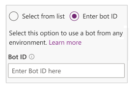
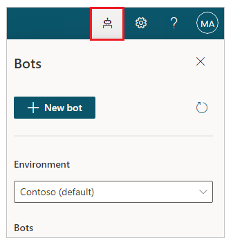
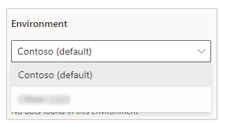
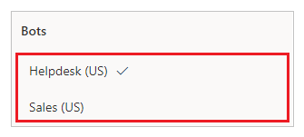
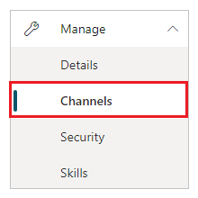
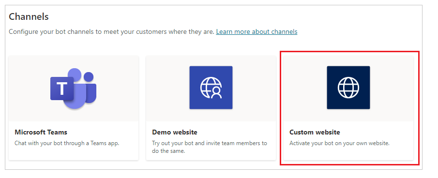
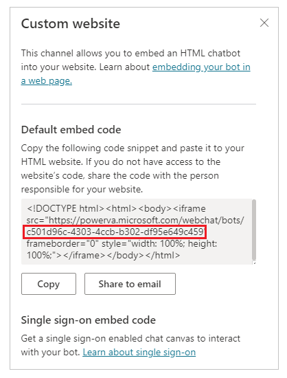

# Add chatbot to a page

Power Apps portals allows you to add a [Power Virtual Agents chatbot](https://docs.microsoft.com/power-virtual-agents/fundamentals-what-is-power-virtual-agents) to answer questions posted by visitor to your portal page. A bot can be configured with different topics and trigger phrases to automatically respond during a conversation with a visitor.

## Prerequisites

Before you add a Power Virtual Agents chatbot to a Power Apps portals page, you must create a chatbot first. To learn about how to create a chatbot, go to [Create and delete Power Virtual Agents bots](https://docs.microsoft.com/power-virtual-agents/authoring-first-bot).

## Add chatbot component

To add a chatbot component to portal page:

1. Go to [Power Apps](https://make.powerapps.com).

1. Select **Apps** from the left pane.

1. Select your portal.

1. Select **Edit** to open the portals Studio.

1. Select **Components** from the left pane.

1. Select **Chatbot** component.

    

1. Enter **Bot ID** in the chatbot component configuration pane that appears on the left.

    

    > [!NOTE]
    > To learn about how to get the bot ID, go to [Get a Power Virtual Agents bot ID](#get-the-power-virtual-agents-bot-id).

1. If necessary, update the display name.

1. If necessary, update the chat window height, width, header background color, and header text color.

Chatbot component is now added to your portal page. Browse your portal to interact with the chatbot.

## Get the Power Virtual Agents bot ID

To get the ID of a chatbot created using Power Virtual Agents:

1. Go to [Power Virtual Agents](https://powerva.microsoft.com).

1. From the top-right side of the screen, select the **Bots panel**.

    

1. Select the environment that the bot is created in.

    

1. Select the bot that you want to get the bot ID for.

    

1. Expand **Manage** from the left pane.

    

1. Select **Channels**.

    

1. Select **Custom website** channel.

    

1. Copy the bot ID from the embed code.

    

1. Paste the bot ID into the **Bot ID** text box inside Power Apps portals Studio while adding the [chatbot component](#add-chatbot-component).

### See also

- [Add the bot to your live website](https://docs.microsoft.com/power-virtual-agents/publication-connect-bot-to-web-channels)
