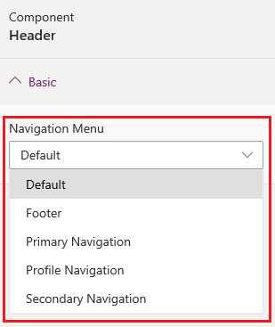

# Add custom menu

By default, the menu on the website is created automatically based on the hierarchy of the webpages. It's called the **default** menu. To create a custom menu, you must create the web link set in the Portal Management app. More information: [Manage web links](configure/manage-web-links.md)

After you create the web link set:

1. [Edit the portal](manage-existing-portals.md#edit) to open it in Power Apps portals Studio.

1. Select the header component. 

1. In the properties on the right side of the screen, select the web link set name from the **Navigation Menu** list.

    

### See also

- [Power Apps portals Studio](portal-designer-anatomy.md)
- [Create and manage webpages](create-manage-webpages.md)
- [WYSIWYG editor](compose-page.md)

[!INCLUDE[footer-include](../../includes/footer-banner.md)]